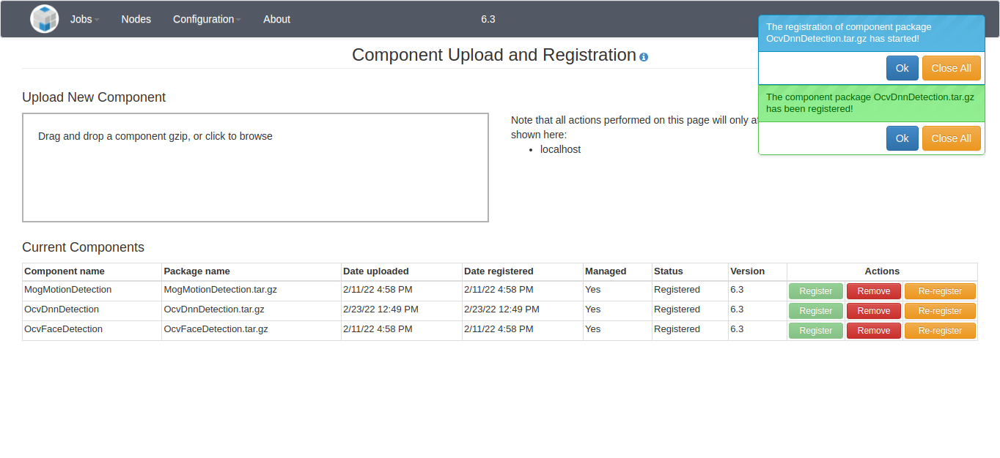

> **NOTICE:** This software (or technical data) was produced for the U.S. Government under contract, and is subject to the Rights in Data-General Clause 52.227-14, Alt. IV (DEC 2007).
Copyright 2019 The MITRE Corporation. All Rights Reserved.

> **IMPORTANT:** Please refer to the [User Configuration](#user-configuration) section for changing the default user passwords.

> **NOTE:** This release contains basic support for processing video streams. Currently, the only way to make use of that functionality is through the REST API. Streaming jobs and services cannot be created or monitored through the web UI.


# Web UI

The login procedure, as well as all of the pages accessible through the Workflow Manager sidebar, are the same for admin and non-admin users. Refer to the [User Guide](/User-Guide/index.html) for more information. The default account for an admin user has the username "admin" and password "mpfadm". 

We highly recommend changing the default username and password settings for any environment which is exposed on a network, especially production environments. The default settings are public knowledge, which could be a security risk. Please refer to the [User Configuration](#user-configuration) section below.

This document will cover the additional functionality permitted to admin users through the Admin Console pages.

## Dashboard

The landing page for an admin user is the Job Status page:



The Job Status page displays a summary of the status for all jobs run by any user in the past. The current status and progress of any running job can be monitored from this view, which is updated automatically.

## Node Configuration and Status

This page provides a list of all of the services that are configured to run on the OpenMPF cluster, and enables an admin user to start, stop, or restart them on an individual basis. Only an admin user can perform these actions. If a non-admin user views this page, the "Action(s)" column is not displayed. This page also enables an admin user to edit the configuration for all nodes in the OpenMPF cluster. A non-admin user can only view the existing configuration.



An admin user can add a node by using the "Add Node" button and selecting a node in the OpenMPF cluster from the drop-down list. You an also select to add all services at this time. A node and all if its configured services can be removed by clicking the trash can to the right of the node's hostname.

An admin user can add services individually by selecting the node edit button at the bottom of the node. The number of service instances can be increased or decreased by using the drop-down. Click the "Submit" button to save the changes.

Any node or service changes take effect immediately, no saving is required, except for adding services.

When making changes, please be aware of the following:

  - It may take a minute for the configuration to take effect on the server.
  - If you remove an existing service from a node, any job that service is processing will be stopped, and you will need to resubmit that job.
  - If you create a new node, its configuration will not take effect until the OpenMPF software is properly installed and started on the associated host.
  - If you delete a node, you will need to manually turn off the hardware running that node (deleting a node does not shut down the machine).

## Properties Settings

This page allows an admin user to view and edit various OpenMPF properties:



An admin user can click inside of the "Value" field for any of the properties and type a new value. Doing so will change the color of the property to orange and display an orange icon to the right of the property name.

Note that if the admin user types in the original value of the property, or clicks the "Reset" button, then it will return back to the normal coloration.

WARNING: Changing the value of these properties can prevent the workflow manager from running after the web server is restarted. Also, no validation checks are performed on the user-provided values. Proceed with caution!

At the bottom of the properties table is the "Save Properties" button. The number of modified properties is shown in parentheses. Clicking the button will make the necessary changes to the properties file on the file system, but the changes will not take effect until the workflow manager is restarted. The saved properties will be colored blue and a blue icon will be displayed to the right of the property name. Additionally, a notification will appear at the top of the page alerting all system users that a restart is required:



## Component Registration

This page allows an admin user to add and remove non-default components to and from the system:



A component package takes the form of a tar.gz file. An admin user can either drag and drop the file onto the "Upload a new component" dropzone area or click the dropzone area to open a file browser and select the file that way. In either case, the component will begin to be uploaded to the system. If the admin user dragged and dropped the file onto the dropzone area then the upload progress will be shown in that area. Once uploaded, the workflow manager will automatically attempt to register the component. Notification messages will appear in the upper right side of the screen to indicate success or failure if an error occurs. The "Current Components" table will display the component status.



If for some reason the component package upload succeeded but the component registration failed then the admin user will be able to click the "Register" button again to try to another registration attempt. For example, the admin user may do this after reviewing the workflow manager logs and resolving any issues that prevented the component from successfully registering the first time. One reason may be that a component with the same name already exists on the system. Note that an error will also occur if the top-level directory of the component package, once extracted, already exists in the /opt/mpf/plugins directory on the system.

Once registered, an admin user has the option to remove the component. This will unregister it and completely remove any configured services, as well as the uploaded file and its extracted contents, from the system. Also, the component algorithm as well as any actions, tasks, and pipelines specified in the component's descriptor file will be removed when the component is removed.

WARNING: Any actions, tasks, or pipelines created through the Create Custom Pipelines page that make use of the algorithm, actions, or tasks specified in the descriptor file of the component being removed will also be removed. This is to prevent pipelines from not working properly once the component is removed.

# User Configuration

Every time the Workflow Manager starts it will attempt to create accounts for the users listed in the `user.properties` file. At runtime this file is extracted to `$MPF_HOME/config` on the machine running the Workflow Manager. For every user listed in that file, the Workflow Manager will create that user account if a user with the same name doesn't already exists in the mySQL database. By default, that file contains two entries, one for the "admin" user with the "mpfadm" password, and one for a non-admin "mpf" user with the "mpf123" password.

We highly recommend modifying the `user.properties` file with your own user entries before attempting to start the Workflow Manager for the first time. This will ensure that the default user accounts are not created. 

The official way to deploy OpenMPF is to use the Docker container platform. If you are using Docker, please follow the instructions in the openmpf-docker [README](https://github.com/openmpf/openmpf-docker/blob/master/README.md#optional-configure-users) that explain how to use a `docker secret` for your custom `user.properties` file.