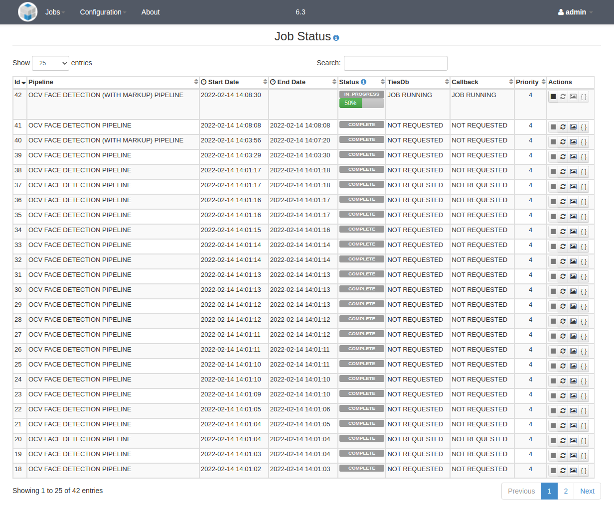

> **NOTICE:** This software (or technical data) was produced for the U.S. Government under contract, and is subject to the Rights in Data-General Clause 52.227-14, Alt. IV (DEC 2007).
Copyright 2016 The MITRE Corporation. All Rights Reserved.

# Web UI

The login procedure, as well as all of the pages accessible through the Workflow Manager sidebar, are the same for admin and non-admin users. Refer to the [User Guide](User-Guide/) for more information. The default account for an admin user has the username "admin" and password "mpfadm".

This document will cover the additional functionality permitted to admin users through the Admin Console pages.

## Dashboard

The landing page for an admin user is the Admin Console Dashboard page:



This page displays a simplified overview of node and service status. The system health and time of the most recent server operation is displayed in the first panel. The number of available nodes in the OpenMPF cluster is displayed in the second panel. The ratio of available services is displayed out of the total number of configured services in the third panel. If for any reason one of the services isn't running, then the second panel will be colored orange or red instead of green. It will be colored orange if at least one service is running or red if no services are running. Clicking on the Total Nodes or Running Services panels will direct the user to the Node and Process Status page.

## Node and Process Status

This page provides a list of all of the services that are configured to run on the OpenMPF cluster, and enables an admin user to start, stop, or restart them on an individual basis. Only an admin user can perform these actions. If a non-admin user views this page, the "Action(s)" column is not displayed.



## Node Configuration

This page enables an admin user to view and edit the configuration for all nodes in the OpenMPF cluster. A non-admin user can only view the existing configuration.



An admin user can add a node by using the "Add New Node" button and selecting a node in the OpenMPF cluster from the drop-down list. A node and all if its configured services can be removed by clicking the red "x" to the right of the node's hostname.

When a new node is added it will start with zero services and the "Add All Services" button will be displayed in the node area. Clicking it will add one instance of each service to that node.

An admin user can add services individually by dragging them from the "Catalog" area to the node area. The number of service instances can be increased or decreased by using the up and down arrows to the right of the service name in the node area. The admin user can also type in the number of desired instances. Setting the value to 0 will show a red strikethrough over the service name, which indicates that it will be completely removed from the node.

Services can be dragged from one node to another. For example, when dragging services from node A to node B, all instances of that service will be removed from node A and the same number of instances will be added to node B.

In order for any node or service changes to take effect, the admin user must click the "Save Config" button. Clicking the "Revert" button will undo all of the changes since the last time the configuration was saved.

When making changes, please be aware of the following:

  - It may take a minute for the configuration to take effect on the server.
  - If you remove an existing service from a node, any job that service is processing will be stopped, and you will need to resubmit that job.
  - If you create a new node, its configuration will not take effect until the OpenMPF software is properly installed and started on the associated host.
  - If you delete a node, you will need to manually turn off the hardware running that node (deleting a node does not shut down the machine).

## Properties Settings

This page allows an admin user to view and edit various OpenMPF properties:



An admin user can click inside of the "Value" field for any of the properties and type a new value. Doing so will change the color of the property to orange and display an orange icon to the right of the property name:



Note that if the admin user types in the original value of the property, or clicks the "Reset" button, then it will return back to the normal coloration.

WARNING: Changing the value of these properties can prevent the workflow manager from running after the web server is restarted. Also, no validation checks are performed on the user-provided values. Proceed with caution!

At the bottom of the properties table is the "Save Properties" button. The number of modified properties is shown in parentheses. Clicking the button will make the necessary changes to the properties file on the file system, but the changes will not take effect until the workflow manager is restarted. The saved properties will be colored blue and a blue icon will be displayed to the right of the property name. Additionally, a notification will appear at the top of the page alerting all system users that a restart is required:



## Component Registration

This page allows an admin user to add and remove non-default components to and from the system:



A component package takes the form of a tar.gz file. An admin user can either drag and drop the file onto the "Upload a new component" dropzone area or click the dropzone area to open a file browser and select the file that way. In either case, the component will begin to be uploaded to the system. If the admin user dragged and dropped the file onto the dropzone area then the upload progress will be shown in that area. Once uploaded, the workflow manager will automatically attempt to register the component. Notification messages will appear in the upper right side of the screen to indicate success or failure if an error occurs. The "Current Components" table will display the component status.



If for some reason the component package upload succeeded but the component registration failed then the admin user will be able to click the "Register" button again to try to another registration attempt. For example, the admin user may do this after reviewing the workflow manager logs and resolving any issues that prevented the component from successfully registering the first time. One reason may be that a component with the same name already exists on the system. Note that an error will also occur if the top-level directory of the component package, once extracted, already exists in the /opt/mpf/plugins directory on the system.

Once registered, an admin user has the option to remove the component. This will unregister it and completely remove any configured services, as well as the uploaded file and its extracted contents, from the system. Also, the component algorithm as well as any actions, tasks, and pipelines specified in the component's descriptor file will be removed when the component is removed.

WARNING: Any actions, tasks, or pipelines created through the Create Custom Pipelines page that make use of the algorithm, actions, or tasks specified in the descriptor file of the component being removed will also be removed. This is to prevent pipelines from not working properly once the component is removed.

# Command Line Tools

OpenMPF release 0.6.0 and later installs command line tools that can be accessed through a terminal on the master node of the OpenMPF cluster. All of the tools take the form of actions: `mpf <action> [options ...]`. Note that tab-completion is enabled for ease of use.

WARNING: These commands can be executed by anyone who has command line access to the master node.

Execute `mpf --help` for general documentation and `mpf <action> --help` for documentation about a specific action.

  - **Start / Stop Actions**: Actions for starting and stopping the OpenMPF system dependencies, including mySQL, ActiveMQ, Redis, Tomcat, and the node managers on the various nodes in the OpenMPF cluster.
    - `mpf status`: displays a message indicating whether each of the system dependencies is running or not
    - `mpf start`: starts all of the system dependencies
    - `mpf stop`: stops all of the system dependencies
    - `mpf restart` : stops and then starts all of the system dependencies
  - **User Actions**: Actions for managing workflow manager user accounts. If changes are made to an existing user then that user will need to log off or the workflow manager will need to be restarted for the changes to take effect.
    - `mpf list-users` : lists all of the existing user accounts and their role (non-admin or admin)
    - `mpf add-user <username> <role>`: adds a new user account; will be prompted to enter the account password
    - `mpf remove-user <username>` : removes an existing user account
    - `mpf change-role <username> <role>` : change the role (non-admin to admin or vice versa) for an existing user
    - `mpf change-password <username>`: change the password for an existing user; will be prompted to enter the new account password
  - **Clean Actions**: Actions to remove old data and revert the system to a new install state. User accounts, registered components, as well as custom actions, tasks, and pipelines, are preserved.
    - `mpf clean`: cleans out old job information and results, pending job requests, marked up media files, and ActiveMQ data, but preserves log files and uploaded media
    - `mpf clean --delete-logs --delete-uploaded-media`: the same as `mpf clean` but also deletes log files and uploaded media
