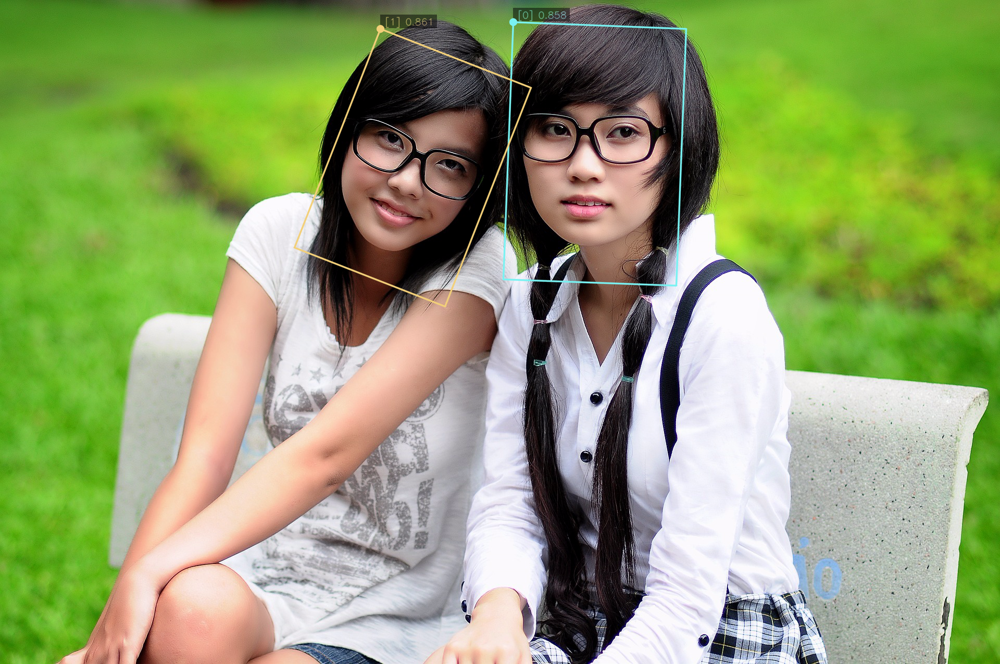

**NOTICE:** This software (or technical data) was produced for the U.S. Government under contract, and is subject to the
Rights in Data-General Clause 52.227-14, Alt. IV (DEC 2007). Copyright 2024 The MITRE Corporation. All Rights Reserved.

# Introduction

Artifact extraction is an optional behavior of OpenMPF that allows the user to save artifacts from a job onto disk. An
artifact is a frame region extracted from a piece of media. Extracting artifacts gives you a way to visualize representative
detections from the tracks found in a piece of media. For example, you might want to extract an artifact for the
exemplar in all tracks found in a piece of media. The exemplar for the track is the detection in the track that has the
highest value for the detection property chosen with the `QUALITY_SELECTION_PROPERTY`. (Refer to the [Quality Selection Guide](Quality-Selection-Guide/index.html) for documentation on quality selection.) In another scenario, you might want to extract
artifacts for the exemplar as well as a few other frames that come before and after the exemplar.

The Workflow Manager performs artifact extraction after all detection processing for a job is complete. Artifacts can be
written to local shared storage, or to a remote S3 storage location. Refer to the [Object Storage Guide](Object-Storage-Guide/index.html) for information on using object storage.

# Artifact Extraction Properties

The choice of which artifacts to extract is highly configurable using the following properties.

- `ARTIFACT_EXTRACTION_POLICY`: This property sets the high level policy controlling artifact extraction. It must have
one of the following values:
    - `NONE`: No artifact extraction will be performed.
    - `VISUAL_TYPES_ONLY`: Extract artifacts only for tracks associated with a "visual" data type. Visual data types
  include `IMAGE` and `VIDEO`.
    - `ALL_TYPES`: Extract artifacts regardless of data type.
    - `ALL_DETECTIONS`: Extract artifacts for all detections in the track.

The default value is `VISUAL_TYPES_ONLY`, which turns off artifact extraction for data types such as `MOTION`,
`SPEECH`, `SCENE`, and `SOUND`. [**NOTE:** Artifact extraction for anything other that `IMAGE` or `VIDEO` is not currently
supported and will result in an error for the job.]

With the `VISUAL_TYPES_ONLY` or `ALL_TYPES` policy, artifacts will be extracted according to the
`ARTIFACT_EXTRACTION_POLICY_*` properties described below. With the `NONE` and `ALL_DETECTIONS` policies, these
properties are ignored.

- `ARTIFACT_EXTRACTION_POLICY_CROPPING`: When set to true, causes the extracted artifact to
be cropped to the width and height of the bounding box of the detection, instead of extracting the entire frame.
Default value is `true`.

- `ARTIFACT_EXTRACTION_POLICY_EXEMPLAR_FRAME_PLUS`: This property may be set to an integer value N, which causes
the exemplar frame and N frames before and after the exemplar to be extracted. If N = 0, then only
the exemplar will be extracted. If N > 0, then the exemplar plus N frames before and after it will be extracted.
If N < 0, then this property is disabled. The default value is 0.

- `ARTIFACT_EXTRACTION_POLICY_FIRST_FRAME`: When set to true, then detections in the first frame in each track will
be extracted. The default value is `false`.

- `ARTIFACT_EXTRACTION_POLICY_MIDDLE_FRAME`: When set to true, then detections in the frame closest to the middle of
each track will be extracted. The middle frame is the frame that is equally distant from the start and stop frames,
but that frame does not necessarily contain a detection in a given track, so we search for the detection in the track
that is closest to that middle frame. The default value is `false`.

- `ARTIFACT_EXTRACTION_POLICY_LAST_FRAME`: When set to true, then detections in the last frame in each track will
be extracted. The default value is `false`.

- `ARTIFACT_EXTRACTION_POLICY_TOP_QUALITY_COUNT`: When this property is set to an integer value N greater than 0
the detections in a track will be sorted by the detection property given by the `QUALITY_SELECTION_PROPERTY` job
property, and then the N detections with the highest quality will be extracted, up to the number of available
detections. If N is less than or equal to 0, then this policy is disabled. The default value is 0. (Refer to the [Quality Selection Guide](Quality-Selection-Guide/index.html) for documentation on quality selection.)

- `ARTIFACT_EXTRACTION_POLICY_BEST_DETECTION_PROP_NAMES_LIST`: This property may be set to a string comprised of a
semi-colon delimited list of strings. The strings in this list define the detection property names to be used for
artifact extraction. If a detection in a track has a property that corresponds to any of the names in this list,
an artifact will be created for it. For example, you might have a component that finds the detection in each track that has the largest size (width x height), and adds a property to that detection named `BEST_SIZE`. You could then set this property to the string `BEST_SIZE` and artifacts for those detections will be extracted along with all others requested. If the string is empty, then this property is disabled. The default value is
the empty string.

#Combining Properties

The above properties can be combined to satisfy a set of criteria. For example, if `ARTIFACT_EXTRACTION_POLICY_FIRST_FRAME` is set to `true` and `ARTIFACT_EXTRACTION_POLICY_MIDDLE_FRAME` is set to `true`, then the first and middle frames will be extracted. If `ARTIFACT_EXTRACTION_POLICY_CROPPING` is also set to true then the detection crops for the first and middle frames will be extracted instead of the whole frames. If `ARTIFACT_EXTRACTION_POLICY_TOP_QUALITY_COUNT` is also set to 5, then the above still applies, and the 5 detection crops in a track with the highest quality values will also be extracted. Note that the top 5 may already include the first and middle frames. An artifact will only ever be extracted once, even if it is chosen according to more than one of the artifact extraction policies.

# Artifact Cropping and Rotation

If the `ARTIFACT_EXTRACTION_POLICY_CROPPING` job property is set to true, then the bounding box in the detection object is used to define the cropping. Here is an example showing an image where two detections were found. The two detections in the frame are illustrated with the bounding boxes added by markup. (Refer to the [Markup Guide](Markup-Guide/index.html) for documentation on how markup is added to images and videos.) The cropped artifacts are also shown below. Notice that the detection on the left in the image is rotated, but the cropped artifact has had the rotation removed.

## Image with Markup

## Left Detection

## Right Detection

