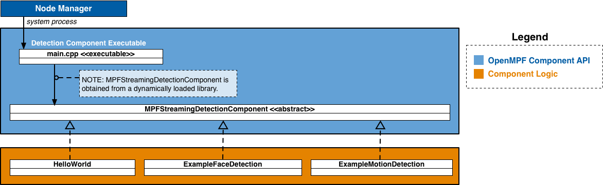

**NOTICE:** This software (or technical data) was produced for the U.S. Government under contract, and is subject to the
Rights in Data-General Clause 52.227-14, Alt. IV (DEC 2007). Copyright 2023 The MITRE Corporation. All Rights Reserved.

<div style="background-color:orange"><p style="color:white; padding:5px"><b>WARNING:</b> The C++ Streaming API is not complete, and there are no future development plans. Use at your own risk. The only way to make use of the functionality is through the REST API. It requires the Node Manager and does not work in a Docker deployment.</p></div>

# API Overview

In OpenMPF, a **component** is a plugin that receives jobs (containing media), processes that  media, and returns results.

The OpenMPF Streaming Component API currently supports the development of **detection components**, which are used detect objects in live RTSP or HTTP video streams.

Using this API, detection components can be built to provide:

* Detection (Localizing an object)
* Tracking (Localizing an object across multiple frames)
* Classification (Detecting the type of object and optionally localizing that object)

Each frame of the video is processed as it is read from the stream. After processing enough frames to form a segment (for example, 100 frames), the component starts processing the next segment. Like with batch processing, each segment read from the stream is processed independently of the rest. No detection or track information is carried over between segments. Tracks are not merged across segments.

## How Components Integrate into OpenMPF

Components are integrated into OpenMPF through the use of OpenMPF's **Component Executable**. Developers create component libraries that encapsulate the component detection logic. Each instance of the Component Executable loads one of these libraries and uses it to service job requests sent by the OpenMPF Workflow Manager (WFM).

The Component Executable:

1. Receives and parses job requests from the WFM
2. Invokes functions on the component library to obtain detection results
3. Populates and sends the respective responses to the WFM

The basic pseudocode for the Component Executable is as follows:

```c++
while (has_next_frame) {
    if (is_new_segment) {
        component->BeginSegment(video_segment_info)
    }
    activity_found = component->ProcessFrame(frame, frame_number) // Component logic does the work here
    if (activity_found && !already_sent_new_activity_alert_for_this_segment) {
        SendActivityAlert(frame_number)
    }
    if (is_end_of_segment) {
        streaming_video_tracks = component->EndSegment()
        SendSummaryReport(frame_number, streaming_video_tracks)
    }
}
```

Each instance of a Component Executable runs as a separate process. Generally, each process will execute a different detection algorithm that corresponds to a single stage in a detection pipeline. Each instance is started by the Node Manager as needed in order to execute a streaming video job. The Node Manager will monitor the process status and eventually stop it.

The Component Executable invokes functions on the Component Logic to get detection objects, and subsequently generates new track alerts and segment summary reports based on the output. These alerts and reports are sent to the WFM.

A component developer implements a detection component by extending [`MPFStreamingDetectionComponent`](#detection-component-interface).


## Getting Started

The quickest way to get started with the C++ Streaming Component API is to first read the [OpenMPF Component API Overview](Component-API-Overview/index.html) and then [review the source](https://github.com/openmpf/openmpf-cpp-component-sdk/tree/develop/detection/examples/HelloWorldComponent/) of an example OpenMPF C++ detection component that supports stream processing.

Detection components are implemented by:

1. Extending [`MPFStreamingDetectionComponent`](#detection-component-interface).
2. Building the component into a shared object library. (See [HelloWorldComponent CMakeLists.txt](https://github.com/openmpf/openmpf-cpp-component-sdk/blob/develop/detection/examples/HelloWorldComponent/CMakeLists.txt)).
3. Packaging the component into an OpenMPF-compliant .tar.gz file. (See [Component Packaging](#component-packaging)).
4. Registering the component with OpenMPF. (See [Component Registration](Development-Environment-Guide/index.html#component-registration)).

# API Specification

The figure below presents a high-level component diagram of the C++ Streaming Component API:




The API consists of a *Detection Component Interface* and related input and output structures.

**Detection Component Interface**

* [`MPFStreamingDetectionComponent`](#detection-component-interface) - Abstract class that should be extended by all OpenMPF C++ detection components that perform stream processing.

**Inputs**

The following data structures contain details about a specific job, and a video segment (work unit) associated with that job:

* [`MPFStreamingVideoJob`](#mpfstreamingvideojob)
* [`VideoSegmentInfo`](#videosegmentinfo)

**Outputs**

The following data structures define detection results:

* [`MPFImageLocation`](#mpfimagelocation)
* [`MPFVideoTrack`](#mpfvideotrack)


## Component Factory Functions

Every detection component must include the following macro in its implementation:

```c++
EXPORT_MPF_STREAMING_COMPONENT(TYPENAME);
```

This creator macro takes the `TYPENAME` of the detection component (for example, “StreamingHelloWorld”). This macro creates the factory function that the OpenMPF Component Executable will call in order to instantiate the detection component. The creation function is called once, to obtain an instance of the component, after the component library has been loaded into memory.

This macro also creates the factory function that the Component Executable will use to delete that instance of the detection component.

This macro must be used outside of a class declaration, preferably at the bottom or top of a component source (.cpp) file.

**Example:**

```c++
// Note: Do not put the TypeName/Class Name in quotes
EXPORT_MPF_STREAMING_COMPONENT(StreamingHelloWorld);
```

## Detection Component Interface

The `MPFStreamingDetectionComponent` class is the abstract class utilized by all OpenMPF C++ detection components that perform stream processing. This class provides functions for developers to integrate detection logic into OpenMPF.

[**See the latest source here.**](https://github.com/openmpf/openmpf-cpp-component-sdk/blob/develop/detection/api/include/MPFStreamingDetectionComponent.h)

### Constructor

Superclass constructor that must be invoked by the constructor of the component subclass.

* Function Definition:
```c++
MPFStreamingDetectionComponent(const MPFStreamingVideoJob &job)
```

* Parameters:

| Parameter  | Data Type  | Description  |
|---|---|---|
| job  | `const MPFStreamingVideoJob &`  | Structure containing details about the work to be performed. See [`MPFStreamingVideoJob`](#mpfstreamingvideojob) |

* Returns: none

* Example:
```c++
SampleComponent::SampleComponent(const MPFStreamingVideoJob &job)
        : MPFStreamingDetectionComponent(job)
        , hw_logger_(log4cxx::Logger::getLogger("SampleComponent"))
        , job_name_(job.job_name) {

    LOG4CXX_INFO(hw_logger_, "[" << job_name_ << "] Initialized SampleComponent component.")
}
```


### BeginSegment(VideoSegmentInfo)

Indicate the beginning of a new video segment. The next call to `ProcessFrame()` will be the first frame of the new segment. `ProcessFrame()` will never be called before this function.

* Function Definition:
```c++
void BeginSegment(const VideoSegmentInfo &segment_info)
```

* Parameters:

| Parameter  | Data Type  | Description  |
|---|---|---|
| segment_info  | `const VideoSegmentInfo &`  | Structure containing details about next video segment to process. See [`VideoSegmentInfo`](#videosegmentinfo) |

* Returns: none

* Example:
```c++
void SampleComponent::BeginSegment(const VideoSegmentInfo &segment_info) {
    // Prepare for next segment
}
```

### ProcessFrame(Mat ...)

Process a single video frame for the current segment.

Must return true when the component begins generating the first track for the current segment. After it returns true, the Component Executable will ignore the return value until the component begins processing the next segment.

If the `job_properties` map contained in the `MPFStreamingVideoJob` struct passed to the component constructor contains a `CONFIDENCE_THRESHOLD` entry, then this function should only return true for a detection with a quality value that meets or exceeds that threshold.  After the Component Executable invokes `EndSegment()` to retrieve the segment tracks, it will discard detections that are below the threshold. If all the detections in a track are below the threshold, then the entire track will be discarded. [NOTE: In the future the C++ Streaming Component API may be updated to support `QUALITY_SELECTION_THRESHOLD` instead of `CONFIDENCE_THRESHOLD`.]

Note that this function may not be invoked for every frame in the current segment. For example, if `FRAME_INTERVAL = 2`, then this function will only be invoked for every other frame since those are the only ones that need to be processed.

Also, it may not be invoked for the first nor last frame in the segment. For example, if `FRAME_INTERVAL = 3` and the segment size is 10, then it will be invoked for frames {0, 3, 6, 9} for the first segment, and frames {12, 15, 18} for the second segment.

* Function Definition:
```c++
bool ProcessFrame(const cv::Mat &frame, int frame_number)
```

* Parameters:

| Parameter  | Data Type  | Description  |
|---|---|---|
| frame  | `const cv::Mat &`  | OpenCV class containing frame data. See [`cv::Mat`](https://docs.opencv.org/3.3.0/d3/d63/classcv_1_1Mat.html) |
| frame_number  | `int`  | A unique frame number (0-based index). Guaranteed to be greater than the frame number passed to the last invocation of this function. |

* Returns: (`bool`) True when the component begins generating the first track for the current segment; false otherwise.

* Example:
```c++
bool SampleComponent::ProcessFrame(const cv::Mat &frame, int frame_number) {
    // Look for detections. Generate tracks and store them until the end of the segment.
    if (started_first_track_in_current_segment) {
        return true;
    } else {
        return false;
    }
}
```

### EndSegment()

Indicate the end of the current video segment. This will always be called after `BeginSegment()`. Generally, `ProcessFrame()` will be called one or more times before this function, depending on the number of frames in the segment and the number of frames actually read from the stream.

Note that the next time `BeginSegment()` is called, this component should start generating new tracks. Each time `EndSegment()` is called, it should return only the most recent track data for that segment. Tracks should not be carried over between segments. Do not append new detections to a preexisting track from the previous segment and return that cumulative track when this function is called.

* Function Definition:
```c++
vector<MPFVideoTrack> EndSegment()
```

* Parameters: none

* Returns: (`vector<MPFVideoTrack>`) The [`MPFVideoTrack`](#mpfvideotrack) data for each detected object.

* Example:
```c++
vector<MPFVideoTrack> SampleComponent::EndSegment() {
    // Perform any necessary cleanup before processing the next segment.
    // Return the collection of tracks generated for this segment only.
}
```

## Detection Job Data Structures

The following data structures contain details about a specific job, and a video segment (work unit) associated with that job:

* [`MPFStreamingVideoJob`](#mpfstreamingvideojob)
* [`VideoSegmentInfo`](#videosegmentinfo)

The following data structures define detection results:

* [`MPFImageLocation`](#mpfimagelocation)
* [`MPFVideoTrack`](#mpfvideotrack)

### MPFStreamingVideoJob

Structure containing information about a job to be performed on a video stream.

* Constructor(s):
```c++
MPFStreamingVideoJob(
  const string &job_name,
  const string &run_directory,
  const Properties &job_properties,
  const Properties &media_properties)
}
```

* Members:

| Member  | Data Type  | Description  |
|---|---|---|
| job_name | `const string  &` | A specific name given to the job by the OpenMPF framework. This value may be used, for example, for logging and debugging purposes. |
|  run_directory <a name="job-name"></a> | `const string  &` | Contains the full path of the parent folder above where the component is installed. This parent folder is also known as the plugin folder. |
| job_properties <a name="job-properties"></a> | `const Properties &` | Contains a map of `<string, string>` which represents the property name and the property value. The key corresponds to the property name specified in the component descriptor file described in the [Component Descriptor Reference](Component-Descriptor-Reference/index.html). Values are determined when creating a pipeline or when submitting a job. <br/><br/> Note: The job_properties map may not contain the full set of job properties. For properties not contained in the map, the component must use a default value. |
| media_properties <a name="media-properties"></a> | `const Properties &` | Contains a map of `<string, string>` of metadata about the media associated with the job. The entries in the map vary depending on the type of media. Refer to the type-specific job structures below. |

### VideoSegmentInfo

Structure containing information about a segment of a video stream to be processed. A segment is a subset of contiguous video frames.

* Constructor(s):
```c++
VideoSegmentInfo(
  int segment_number,
  int start_frame,
  int end_frame,
  int frame_width,
  int frame_height
}
```

* Members:

| Member  | Data Type  | Description  |
|---|---|---|
| segment_number | `int` | A unique segment number (0-based index). |
| start_frame | `int` | The frame number (0-based index) corresponding to the first frame in this segment. |
| end_frame | `int` | The frame number (0-based index) corresponding to the last frame in this segment. |
| frame_width | `int` | The height of each frame in this segment. |
| frame_height | `int` | The width of each frame in this segment. |

## Detection Job Result Classes

### MPFImageLocation

Structure used to store the location of detected objects in a single video frame (image).

* Constructor(s):
```c++
MPFImageLocation()
MPFImageLocation(
  int x_left_upper,
  int y_left_upper,
  int width,
  int height,
  float confidence = -1,
  const Properties &detection_properties = {})
```

* Members:

| Member  | Data Type  | Description  |
|---|---|---|
| x_left_upper| `int` | Upper left X coordinate of the detected object. |
| y_left_upper | `int` | Upper left Y coordinate of the detected object. |
| width | `int` | The width of the detected object. |
| height | `int` | The height of the detected object. |
| confidence | `float` | Represents the "quality" of the detection. The range depends on the detection algorithm. 0.0 is lowest quality. Higher values are higher quality. Using a standard range of [0.0 - 1.0] is advised. If the component is unable to supply a confidence value, it should return -1.0. |
| detection_properties | `Properties &` | Optional additional information about the detected object. There is no restriction on the keys or the number of entries that can be added to the detection_properties map. For best practice, keys should be in all CAPS. |

* Example:

A component that performs generic object classification can add an entry to `detection_properties` where the key is `CLASSIFICATION` and the value is the type of object detected.

```c++
MPFImageLocation detection;
detection.x_left_upper = 0;
detection.y_left_upper = 0;
detection.width = 100;
detection.height = 100;
detection.confidence = 1.0;
detection.detection_properties["CLASSIFICATION"] = "backpack";
```

### MPFVideoTrack

Structure used to store the location of detected objects in a video file.

* Constructor(s):
```c++
MPFVideoTrack()
MPFVideoTrack(
  int start_frame,
  int stop_frame,
  float confidence = -1,
  map<int, MPFImageLocation> frame_locations,
  const Properties &detection_properties = {})
```

* Members:

| Member  | Data Type  | Description  |
|---|---|---|
| start_frame| `int` | The first frame number (0-based index) that contained the detected object. |
| stop_frame| `int` | The last frame number (0-based index) that contained the detected object. |
| frame_locations| `map<int, MPFImageLocation>` | A map of individual detections. The key for each map entry is the frame number where the detection was generated, and the value is a [`MPFImageLocation`](#mpfimagelocation) calculated as if that frame was a still image. Note that a key-value pair is *not* required for every frame between the track start frame and track stop frame. |
| confidence | `float` | Represents the "quality" of the detection. The range depends on the detection algorithm. 0.0 is lowest quality. Higher values are higher quality. Using a standard range of [0.0 - 1.0] is advised. If the component is unable to supply a confidence value, it should return -1.0. |
| detection_properties | `Properties &` | Optional additional information about the detected object. There is no restriction on the keys or the number of entries that can be added to the detection_properties map. For best practice, keys should be in all CAPS. |

* Example:

>**NOTE:** Currently, `MPFVideoTrack.detection_properties` do not show up in the JSON output object or are used by the WFM in any way.

A component that detects text can add an entry to `detection_properties` where the key is `TRANSCRIPT` and the value is a string representing the text found in the video segment.

```c++
MPFVideoTrack track;
track.start_frame = 0;
track.stop_frame = 5;
track.confidence = 1.0;
track.frame_locations = frame_locations;
track.detection_properties["TRANSCRIPT"] = "RE5ULTS FR0M A TEXT DETECTER";
```

# C++ Component Build Environment

A C++ component library must be built for the same C++ compiler and Linux
version that is used by the OpenMPF Component Executable. This is to ensure
compatibility between the executable and the library functions at the
Application Binary Interface (ABI) level. At this writing, the OpenMPF runs on
Ubuntu 20.04 (kernel version 5.13.0-30), and the OpenMPF C++ Component
Executable is built with g++ (GCC) 9.3.0-17.

Components should be supplied as a tar file, which includes not only the component library, but any other libraries or files needed for execution. This includes all other non-standard libraries used by the component (aside from the standard Linux and C++ libraries), and any configuration or data files.

# Component Development Best Practices

## Throw Exceptions

Unlike the [C++ Batch Component API](CPP-Batch-Component-API/index.html), none of the the C++ Streaming Component API functions return an [`MPFDetectionError`](CPP-Batch-Component-API/index.html#mpfdetectionerror). Instead, streaming components should throw an exception when a non-recoverable error occurs. The exception should be an instantiation or subclass of `std::exception` and provide a descriptive error message that can be retrieved using `what()`. For example:

```c++
bool SampleComponent::ProcessFrame(const cv::Mat &frame, int frame_number) {
    // Something bad happened
    throw std::exception("Error: Cannot do X with value Y.");
}
```

The exception will be handled by the Component Executable. It will immediately invoke `EndSegment()` to retrieve the current tracks. Then the component process and streaming job will be terminated.

## Single-threaded Operation

Implementations are encouraged to operate in single-threaded mode. OpenMPF will parallelize components through multiple instantiations of the component, each running as a separate service.

## Stateless Behavior
OpenMPF components should be stateless in operation and give identical output for a provided input (i.e. when processing a segment with the same `VideoSegmentInfo`).

## GPU Support

For components that want to take advantage of NVIDA GPU processors, please read the [GPU Support Guide](GPU-Support-Guide/index.html). Also ensure that your build environment has the NVIDIA CUDA Toolkit installed, as described in the [Build Environment Setup Guide](Build-Environment-Setup-Guide/index.html).

## Component Structure
It is recommended that C++ components are organized according to the following directory structure:

```
componentName
├── config - Component-specific configuration files
├── descriptor
│   └── descriptor.json
└── lib
    └──libComponentName.so - Compiled component library
```

Once built, components should be packaged into a .tar.gz containing the contents of the directory shown above.


## Logging
It is recommended to use [Apache log4cxx](https://logging.apache.org/log4cxx/index.html) for
OpenMPF Component logging. Components using log4cxx should not configure logging themselves.
The Component Executor will configure log4cxx globally. Components should call
`log4cxx::Logger::getLogger("<componentName>")` to a get a reference to the logger. If you
are using a different logging framework, you should make sure its behavior is similar to how
the Component Executor configures log4cxx as described below.

The following log LEVELs are supported: `FATAL, ERROR, WARN,  INFO,  DEBUG, TRACE`.
The `LOG_LEVEL` environment variable can be set to one of the log levels to change the logging
verbosity. When `LOG_LEVEL` is absent, `INFO` is used.

Note that multiple instances of the same component can log to the same file.
Also, logging content can span multiple lines.

The logger will write to both standard error and
`${MPF_LOG_PATH}/${THIS_MPF_NODE}/log/<componentName>.log`.

Each log statement will take the form:
`DATE TIME LEVEL CONTENT`

For example:
`2016-02-09 13:42:42,341 INFO - Starting sample-component: [  OK  ]`
