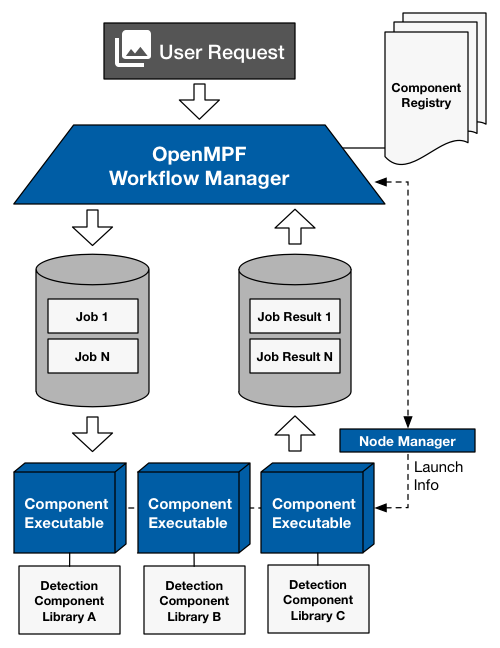

> **NOTICE:** This software (or technical data) was produced for the U.S. Government under contract, and is subject to the Rights in Data-General Clause 52.227-14, Alt. IV (DEC 2007). Copyright 2021 The MITRE Corporation. All Rights Reserved.

# Goals

The OpenMPF Component Application Programming Interface (API) provides a mechanism for integrating components into OpenMPF. The goals of the document are to:

*	Provide an overview of OpenMPF concepts
*	Define a *component* in the context of OpenMPF
*	Explain the role of the Component API

# Terminology

In order to talk about OpenMPF, readers should be familiar with the following key OpenMPF-specific terms:

* **Job** - An OpenMPF work unit. A job contains a list of media files and the pipeline that will be used to process that media.
* **Pipeline** - A logical flow of processes that will be performed on a piece of media. For instance, a pipeline may perform motion tracking on a video and feed the results into a face detection algorithm.
* **Component** - An OpenMPF plugin that receives jobs (containing media), processes that media, and returns results.
* **Detection Component** - A component that performs either detection (with or without tracking), or classification on a piece of media.
* **Node** - An OpenMPF host that launches components. There may be more than one node in an OpenMPF cluster, thus forming a distributed system. There is always a master node that runs the OpenMPF web application.
* **Service** - An instance of an OpenMPF component process. Each OpenMPF node may run one or more services at a time. Multiple services may run in parallel to process a job. For example, each service may process a different piece of media, or a segment of the same video.
* **Batch Processing** - Process complete image, audio, video, and/or other files that reside on disk.
* **Stream Processing** - Process live video streams.

<h1> Background </h1> 
OpenMPF consists of the Workflow Manager (WFM), a Node Manager, components, and a message passing mechanism that enables communication between the WFM and the components.

## Workflow Manager
The WFM receives job requests from user interface and external systems through the [REST API](REST-API/index.html). The WFM handles each request by creating a job, which consists of a collection of input media and a pipeline. These jobs are then broken down into job requests that are handled by component services, which in turn process media and return results.

The WFM orchestrates the flow of work within a job through the various stages of a processing pipeline. For each stage, the WFM communicates with the appropriate component services by exchanging JMS messages via a message broker. For example, if a pipeline consists of a motion detection stage, then the WFM will communicate with motion detection component services.

The WFM provides work to a component service by placing a job request on the request queue, and it retrieves the component’s response by monitoring the appropriate response queue. The WFM may generate one or more job requests for a large video file, depending on how it segments the file into chunks. The segmentation properties can be specified system-wide using configuration files, or specified on a per-job basis.

>**NOTE:** All component messaging is abstracted within the OpenMPF Component API and component developers are not required or able to directly interact with the message queues.

## Node Manager
The Node Manager is a process that runs on each OpenMPF node. The Node Manager handles spawning the desired number of instances of a component based on the end-user's desired configuration. Each instance is referred to as a service.

A service behaves differently based on the kind of processing that needs to be performed. After the Node Manager spawns a service:
 
*   *Batch processing* - The service waits for job requests from the WFM and produces a response for each request.
*   *Stream processing* - The service waits for the next frame from the stream and produces activity alerts and segment summary reports.

## Components

Components are identified by nine key characteristics:

*	The *type of action* the component performs
*   The *type of processing* the component performs
*	The *types of data* it supports
*	The *type of objects* it detects
*	The *name* of the algorithm or vendor
*	The user-configurable *properties* that the component exposes
*	The *required states* associated with a job prior to the execution of the component
*	The *provided states* associated with a job following the execution of the component
*   The *programming language* used to implement the component

A component’s action type corresponds to the operation which the algorithm performs. Generally, this is `DETECTION`.

A component can perform batch processing, stream processing, or both. Refer to the [C++ Batch Component API](CPP-Batch-Component-API/index.html), [C++ Streaming Component API](CPP-Streaming-Component-API/index.html), and [Java Batch Component API](Java-Batch-Component-API/index.html). There is also a [Python Batch Component API](Python-Batch-Component-API/index.html). We currently do not support Python components that perform stream processing.

The data that a component accepts as inputs, and correspondingly produces as outputs, constrains its placement in a pipeline. This is some combination of `IMAGE`, `AUDIO`, and `VIDEO` for components that support batch processing, or just `VIDEO` for components that only support stream processing. Batch components can also support the `UNKNOWN` data type, meaning that they can accept jobs for any kind of media file.

As depicted in the figure below, detection components accept an input media file (or segment of the file in the case of video files) and produce a collection of object detections discovered in the data.

The type of objects produced depends on the input type. For example, video files produce video tracks, audio files produce audio tracks, and images produce image locations.

 

The OpenMPF Component API presented provides developers an interface for developing new components for OpenMPF without requiring the developers to understand the internals of the framework.

The figure below depicts a high-level block diagram of the OpenMPF architecture with components.

The Component Registry serves as a central location for information about the components registered with the OpenMPF instance. A future goal is to develop a web page that can be used to browse the registry and display the metadata associated with each available component.

OpenMPF includes a Component Executable for the `DETECTION` action type, as denoted by the blue cubes. Note that the Component Executable is shown three times to represent three instances of that process, one for each component type. This executable is responsible for loading a component library based on information provided at launch time from the Node Manager. 

One Component Executable instance is associated with each component service. For example, a motion detection service, face detection service, and text detection service will require three instances of the Component Executable process, one for each service. For another example, three motion detection services will also require three instances of the Component Executable process, one for each service. The Component Executable is abstract; it does not care what kind of detection is performed. It simply interacts with the component library through the Component API.

The Component Executable receives job requests from the message broker, translates those requests for the component, and converts the component’s outputs into response messages for the OpenMPF.

A separate Component Executable is maintained for C++ and Java components. The component library is compiled as a C++ shared object library, or Java JAR, and encapsulates the component's detection logic.