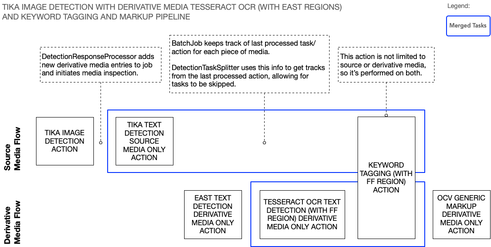

**NOTICE:** This software (or technical data) was produced for the U.S. Government under contract, and is subject to the
Rights in Data-General Clause 52.227-14, Alt. IV (DEC 2007). Copyright 2021 The MITRE Corporation. All Rights Reserved.

# Introduction

The simplest, and most common, use case is to execute a pipeline on a single piece of media. This guide will cover a different use case where a component in one of the initial stages of the pipeline generates one or more derivative (aka child) media from the source (aka parent) media. A common scenario is to extract images from PDFs or other document formats. Once extracted, the Workflow Manager (WFM) can perform the subsequent pipeline stages on the source media (if necessary) as well as the derivative media.

Component actions can be configured to only be performed on source media or derivative media. This is often necessary because the source media has a different media type than the derivative media, and therefore different actions are required to process each type of media. For example, PDFs are assigned the `UNKNOWN` media type (since the WFM is not designed to handle them in any special way), while the images extracted from a PDF are assigned the `IMAGE` media type. An action for the TikaTextDetection component can process the `UNKNOWN` source media to generate `TEXT` tracks by detecting the embedded raw character data in the PDF itself, while an action for the TesseractOCRTextDetection component can process the `IMAGE` derivative media to generate `TEXT` tracks by detecting text in the image data.

# Text Detection Example

Consider the following diagram which depicts a pipeline to accomplish generating `TEXT` tracks for PDFs which contain embedded raw character data and embedded images with text:



Each block represents a single action performed in that stage of the pipeline. (Technically, a pipeline consists of tasks executed in sequence, but in this case each task consists of only one action, so we just show the actions.) Actions that have `SOURCE MEDIA ONLY` in their name have the `SOURCE_MEDIA_ONLY` property set to `TRUE`, which will result in completely skipping that action for derivative media. The component associated with the action will not receive sub-job messages and there will be no representation of the action being executed on derivative media in the JSON output object.

Similarly, actions that have `DERIVATIVE MEDIA ONLY` in their name have the `DERIVATIVE_MEDIA_ONLY` property set to `TRUE`,  which will result in completely skipping that action for source media. Note that setting both properties to `TRUE` will result in skipping the action for both derivative and source media, which means it will never be executed. Not setting either property will result in executing the action on both source and derivative media, as you see in the diagram with the `KEYWORD TAGGING` action.

Note that the actions shown in the source media flow and derivative media flow are **not** executed at the same time. The flows are shown in different rows in the diagram to illustrate the logical separation, not to illustrate concurrency. To be clear, each action in the pipeline is executed sequentially. If an action is missing from a flow it just means that no sub-job messages are generated for that kind of media during that stage of the pipeline. If an action is shown in both flows then sub-jobs will be performed on both the source and derivative media during that stage.

To break down each stage of this pipeline:

- `TIKA IMAGE DETECTION ACTION`: The TikaImageDetection component will extract images from PDFs (or other document formats) and place them in `$MPF_HOME/share/derivatives/<job-id>`. One `MEDIA` track will be generated for each image and it will have `DERIVATIVE_MEDIA_PATH` and `PAGE_NUM` track properties.
    - If remote storage is enabled, the WFM will upload the objects to the object store after this action is performed. Refer to the [Object Storage Guide](Object-Storage-Guide/index.html) for more information.
    - The WFM will perform media inspection on the images at this time.
    - Each piece of derivative media will have a parent media id set to the media id value of the source media. It will appear as `media.parentMediaId` in the JSON output object. For source media the value will be -1.
    - Each piece of derivative media will have a `media.mediaMetadata` property of `IS_DERIVATIVE_MEDIA` set to `TRUE`. The metadata will also contain the `PAGE_NUM` property.
<br/><br/>
- `TIKA TEXT DETECTION SOURCE MEDIA ONLY ACTION`: The TikaTextDetection component will generate `TEXT` tracks by detecting the embedded raw character data in the PDF.
<br/><br/>
- `EAST TEXT DETECTION DERIVATIVE MEDIA ONLY ACTION`: The EastTextDetection component will generate `TEXT REGION` tracks for each text region in the extracted images.
<br/><br/>
- `TESSERACT OCR TEXT DETECTION (WITH FF REGION) DERIVATIVE MEDIA ONLY ACTION`: The TesseractOCRTextDetection component will generate `TEXT` tracks by performing OCR on the text regions passed forward from the previous EAST action.
<br/><br/>
- `KEYWORD TAGGING (WITH FF REGIONS) ACTION`: The KeywordTagging component will take the `TEXT` tracks from the previous `TIKA TEXT` and `TESSERACT OCR` actions and perform keyword tagging. This will add the `TAGS`, `TRIGGER_WORDS`, and `TRIGGER_WORDS_OFFSET` properties to each track.
<br/><br/>
- `OCV GENERIC MARKUP DERIVATIVE MEDIA ONLY ACTION`: The Markup component will take the keyword-tagged `TEXT` tracks for the derivative media and draw bounding boxes on the extracted images.

## Task Merging

The large blue rectangles in the diagram represent tasks that are merged together. The purpose of task merging is to consolidate how tracks are represented in the JSON output object by hiding redundant track information, and to make it appear that the behaviors of two or more actions are the result of a single algorithm.

For example, keyword tagging behavior is supplemental to the text detection behavior. It's more important that `TEXT` tracks are associated with the algorithm that performed text detection than the `KEYWORDTAGGING` algorithm. Note that in our pipeline only the `KEYWORD TAGGING` action has the `OUTPUT_MERGE_WITH_PREVIOUS_TASK` property set to `TRUE`. It has a similar effect in the source media flow and derivative media flow.

In the source media flow the `TIKA TEXT` action is at the start of the merge chain while the `KEYWORD TAGGING` action is at the end of the merge chain. The tracks generated by the action at the end of the merge chain inherit the algorithm and track type from the tracks at the beginning of the merge chain. The effect is that in the JSON output object the tracks from the `TIKA TEXT` action will not be shown. Instead that action will be listed under `TRACKS MERGED`. The tracks from the `KEYWORD TAGGING` action will be shown with the `TIKATEXT` algorithm and `TEXT` track type:

```json
"output": {
   "TRACKS MERGED": [
      {
         "source": "+#TIKA IMAGE DETECTION ACTION#TIKA TEXT DETECTION SOURCE MEDIA ONLY ACTION",
         "algorithm": "TIKATEXT"
      }
   ],
   "MEDIA": [
      {
         "source": "+#TIKA IMAGE DETECTION ACTION",
         "algorithm": "TIKAIMAGE",
         "tracks": [ ... ]
      }
   ],
   "TEXT": [
      {
         "source": "+#TIKA IMAGE DETECTION ACTION#TIKA TEXT DETECTION SOURCE MEDIA ONLY ACTION#KEYWORD TAGGING (WITH FF REGION) ACTION",
         "algorithm": "TIKATEXT",
         "tracks": [ ... ]
      }
   ]
}
```

In the derivative media flow the `TESSERACT OCR` action is at the start of the merge chain while the `KEYWORD TAGGING` action is at the end of the merge chain. The effect is that in the JSON output object the tracks from the `TESSERACT OCR` action will not be shown. The tracks from the `KEYWORD TAGGING` action will be shown with the `TESSERACTOCR` algorithm and `TEXT` track type:

```json
"output": {
   "NO TRACKS": [
      {
         "source": "+#EAST TEXT DETECTION DERIVATIVE MEDIA ONLY ACTION#TESSERACT OCR TEXT DETECTION (WITH FF REGION) DERIVATIVE MEDIA ONLY ACTION#KEYWORD TAGGING (WITH FF REGION) ACTION#OCV GENERIC MARKUP DERIVATIVE MEDIA ONLY ACTION",
         "algorithm": "MARKUPCV"
      }
   ],
   "TRACKS MERGED": [
      {
         "source": "+#EAST TEXT DETECTION DERIVATIVE MEDIA ONLY ACTION#TESSERACT OCR TEXT DETECTION (WITH FF REGION) DERIVATIVE MEDIA ONLY ACTION",
         "algorithm": "TESSERACTOCR"
      }
   ],
   "TEXT": [
      {
         "source": "+#EAST TEXT DETECTION DERIVATIVE MEDIA ONLY ACTION#TESSERACT OCR TEXT DETECTION (WITH FF REGION) DERIVATIVE MEDIA ONLY ACTION#KEYWORD TAGGING (WITH FF REGION) ACTION",
         "algorithm": "TESSERACTOCR",
         "tracks": [ ... ]
      }
   ],
   "TEXT REGION": [
      {
         "source": "+#EAST TEXT DETECTION DERIVATIVE MEDIA ONLY ACTION",
         "algorithm": "EAST",
         "tracks": [ ... ]
      }
   ]
}
```

Note that a `MARKUP` action will never generate new tracks. It simply fills out the `media.markupResult` field in the JSON output object (not shown above).

## Output Last Task Only

If you want to omit all tracks from the JSON output object but the respective `TEXT` tracks for the source and derivative media, then in you can also set the `OUTPUT_LAST_TASK_ONLY` job property to `TRUE`. Note that the WFM only considers tasks that use `DETECTION` algorithms as the final task, so `MARKUP` is ignored. Setting this property will result in the following JSON for the source media:

```json
"output": {
   "TRACKS SUPPRESSED": [
      {
         "source": "+#TIKA IMAGE DETECTION ACTION",
         "algorithm": "TIKAIMAGE"
      },
      {
         "source": "+#TIKA IMAGE DETECTION ACTION#TIKA TEXT DETECTION SOURCE MEDIA ONLY ACTION",
         "algorithm": "TIKATEXT"
      }
   ],
   "TEXT": [
      {
         "source": "+#TIKA IMAGE DETECTION ACTION#TIKA TEXT DETECTION SOURCE MEDIA ONLY ACTION#KEYWORD TAGGING (WITH FF REGION) ACTION",
         "algorithm": "TIKATEXT", 
         "tracks": [ ... ]
      }
   ]
}
```

And the following JSON for the derivative media:

```json
"output": {
   "NO TRACKS": [
      {
         "source": "+#EAST TEXT DETECTION DERIVATIVE MEDIA ONLY ACTION#TESSERACT OCR TEXT DETECTION (WITH FF REGION) DERIVATIVE MEDIA ONLY ACTION#KEYWORD TAGGING (WITH FF REGION) ACTION#OCV GENERIC MARKUP DERIVATIVE MEDIA ONLY ACTION",
         "algorithm": "MARKUPCV"
      }
   ],
   "TRACKS SUPPRESSED": [
      {
         "source": "+#EAST TEXT DETECTION DERIVATIVE MEDIA ONLY ACTION",
         "algorithm": "EAST"
      },
      {
         "source": "+#EAST TEXT DETECTION DERIVATIVE MEDIA ONLY ACTION#TESSERACT OCR TEXT DETECTION (WITH FF REGION) DERIVATIVE MEDIA ONLY ACTION",
         "algorithm": "TESSERACTOCR"
      }
   ],
   "TEXT": [
      {
         "source": "+#EAST TEXT DETECTION DERIVATIVE MEDIA ONLY ACTION#TESSERACT OCR TEXT DETECTION (WITH FF REGION) DERIVATIVE MEDIA ONLY ACTION#KEYWORD TAGGING (WITH FF REGION) ACTION",
         "algorithm": "TESSERACTOCR",
         "tracks": [ ... ]
      }
   ]
}
```

# Developing Media Extraction Components

The WFM is not limited to working only with the TikaImageDetection component. Any component can be designed to generate derivative media. The requirement is that it must generate `MEDIA` tracks. One piece of derivative media per track. Minimally, each track must have a `DERIVATIVE_MEDIA_PATH` property set to the location of the media. The media must be placed in `$MPF_HOME/share/derivatives/<job-id>`. 

Specifically, TikaImageDetection uses paths of the form `$MPF_HOME/share/derivatives/<job-id>/tika-extracted/<guid>/image<index>.<ext>`. The `<job-id>` part ensures that the results of two separate OpenMPF jobs do not conflict with each either. The `<guid>` part ensures that the results of two different actions executed within the same job on the same source media, or actions executed within the same job on different source media files, do not conflict with each other. A new `<guid>` is generated for each invocation of `GetDetections()` on the component.

Your media extraction component can optionally include other track properties. These will get added to the derivative media metadata. For example, TikaImageDetection adds the `PAGE_NUM` property.

Note that although this guide only talks about derivative images, your component can generate any kind of media. Be sure that components in the subsequent pipeline stages can handle the media type detected by WFM media inspection.

# Default Pipelines

OpenMPF comes with some default pipelines for detecting text in documents and other pipelines for detecting faces in documents. Refer to the TikaImageDetection [`descriptor.json`](https://github.com/openmpf/openmpf-components/blob/master/java/TikaImageDetection/plugin-files/descriptor/descriptor.json).