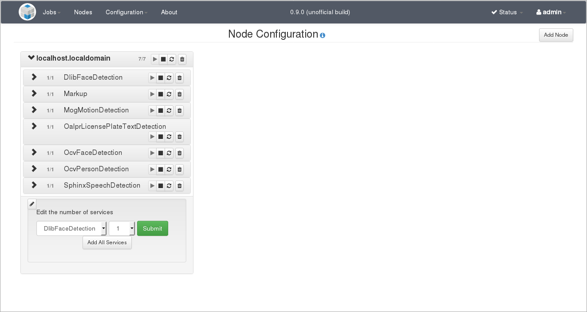
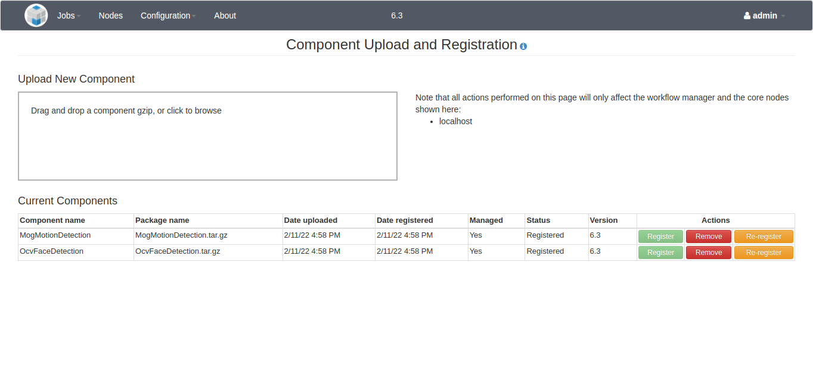
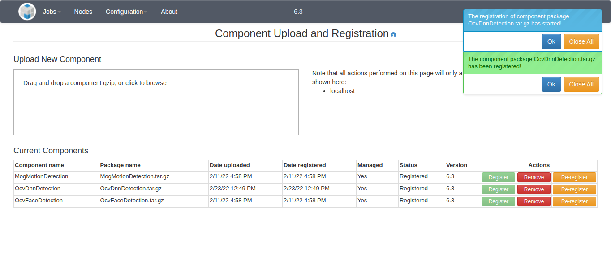

**NOTICE:** This software (or technical data) was produced for the U.S. Government under contract, and is subject to the
Rights in Data-General Clause 52.227-14, Alt. IV (DEC 2007). Copyright 2021 The MITRE Corporation. All Rights Reserved.

<div style="background-color:orange"><p style="color:white; padding:5px">
    <b>WARNING:</b> 
    For most component developers, these steps are not necessary. Instead, 
    refer to the 
    <a href="https://github.com/openmpf/openmpf-docker/blob/master/components/cpp_executor/README.md#overview">C++</a>, 
    <a href="https://github.com/openmpf/openmpf-docker/blob/master/components/python/README.md#overview">Python</a>, or 
    <a href="https://github.com/openmpf/openmpf-docker/blob/master/components/java_executor/README.md#overview">Java</a> 
    README for developing a Docker component in your desired language.
</p></div>

<div style="background-color:orange"><p style="color:white; padding:5px">
    <b>WARNING:</b> This guide is a work in progress and may not be completely 
    accurate or comprehensive.
</p></div>


# Overview

The following instructions are for setting up an environment for building and
running OpenMPF outside of Docker. They serve as a reference for developers who
want to develop the Workflow Manager web application itself and perform end-to-
end integration testing.


# Setup VM

- Download "Ubuntu 20.04.3 LTS" from <https://ubuntu.com/download/desktop>.

- Create an Ubuntu VM using the downloaded iso. This part is different based on 
  what VM software you are using.
    - Use mpf as your username.
    - During the initial install, the VM window was small and didn't stretch to
      fill up the screen, but this may be fixed automatically after the installation
      finishes, or there may be additional steps necessary to install tools or
      configure settings based on your VM software.
  
- After completing the installation, you will likely be prompted to update 
  software. You should install the updates.

- Optionally, shutdown the VM and take a snapshot. This will enable you to revert back
  to a clean Ubuntu install in case anything goes wrong.

- Open a terminal and run `sudo apt update`

- Run `sudo apt install gnupg2 unzip xz-utils cmake make g++ libgtest-dev mediainfo libssl-dev liblog4cxx-dev libboost-dev file openjdk-11-jdk libprotobuf-dev protobuf-compiler libprotobuf-java python3.8-dev python3-pip python3.8-venv libde265-dev libopenblas-dev liblapacke-dev libavcodec-dev libavcodec-extra libavformat-dev libavutil-dev libswscale-dev libavresample-dev libharfbuzz-dev libfreetype-dev ffmpeg git git-lfs redis postgresql-12 curl ansible`

- Run `sudo ln --symbolic /usr/include/x86_64-linux-gnu/openblas-pthread/cblas.h /usr/include/cblas.h` 

- Run `sudo ln --symbolic /usr/bin/cmake /usr/bin/cmake3`

- Run `sudo ln --symbolic /usr/bin/protoc /usr/local/bin/protoc`

- Follow instructions to install Docker: 
  <https://docs.docker.com/engine/install/ubuntu/#install-using-the-repository>

- Optionally, configure Docker to use socket activation. The advantage of socket activation is
  that systemd will automatically start the Docker daemon when you use `docker` commands:
```bash
sudo systemctl disable docker.service;
sudo systemctl stop docker.service;
sudo systemctl enable docker.socket;
```

- Follow instructions so that you can run Docker without sudo: 
  <https://docs.docker.com/engine/install/linux-postinstall/#manage-docker-as-a-non-root-user>

- Install Docker Compose:
```
sudo apt update
sudo apt install docker-compose-plugin
```

- Optionally, stop redis from starting automatically:
  `sudo systemctl disable redis`

- Optionally, stop postgresql from starting automatically:
  `sudo systemctl disable postgresql`

- Initialize Postgres (use "password" when prompted for a password):
```bash
sudo -i -u postgres createuser -P mpf
sudo -i -u postgres createdb -O mpf mpf
```

- Build and install OpenCV:
```bash
mkdir /tmp/opencv-contrib;
wget -O- 'https://github.com/opencv/opencv_contrib/archive/4.5.5.tar.gz' \
    | tar --extract --gzip --directory /tmp/opencv-contrib;
mkdir /tmp/opencv;
cd  /tmp/opencv;
wget -O- 'https://github.com/opencv/opencv/archive/4.5.5.tar.gz' \
    | tar --extract --gzip;
cd opencv-4.5.5;
mkdir build;
cd build;
export OpenBLAS_HOME=/usr/lib/x86_64-linux-gnu/openblas-pthread; \
cmake -DCMAKE_INSTALL_PREFIX:PATH='/opt/opencv-4.5.5' \
    -DWITH_IPP=false \
    -DBUILD_EXAMPLES=false \
    -DBUILD_TESTS=false \
    -DBUILD_PERF_TESTS=false \
    -DWITH_CUBLAS=true \
    -DOPENCV_EXTRA_MODULES_PATH=/tmp/opencv-contrib/opencv_contrib-4.5.5/modules \
    ..;
sudo make --jobs "$(nproc)" install;
sudo ln --symbolic '/opt/opencv-4.5.5/include/opencv4/opencv2' /usr/local/include/opencv2;
sudo sh -c 'echo /opt/opencv-4.5.5/lib > /etc/ld.so.conf.d/mpf.conf'
sudo ldconfig;
sudo rm -rf /tmp/opencv-contrib /tmp/opencv;
```

- Build and install the ActiveMQ C++ library:
```bash
mkdir /tmp/activemq-cpp;
cd /tmp/activemq-cpp;
wget -O- https://dlcdn.apache.org/activemq/activemq-cpp/3.9.5/activemq-cpp-library-3.9.5-src.tar.gz \
    | tar --extract --gzip;
cd activemq-cpp-library-3.9.5;
./configure;
sudo make --jobs "$(nproc)" install;
sudo rm -rf /tmp/activemq-cpp;
```

- Install NotoEmoji font for markup:
```bash
mkdir /tmp/noto;
cd /tmp/noto;
wget https://noto-website-2.storage.googleapis.com/pkgs/NotoEmoji-unhinted.zip;
unzip NotoEmoji-unhinted.zip;
sudo mkdir --parents /usr/share/fonts/google-noto-emoji;
sudo cp NotoEmoji-Regular.ttf /usr/share/fonts/google-noto-emoji/;
sudo chmod a+r /usr/share/fonts/google-noto-emoji/NotoEmoji-Regular.ttf;
rm -rf /tmp/noto;
```

- Build and install PNG Defry:
```bash
mkdir /tmp/pngdefry;
cd /tmp/pngdefry;
wget -O- 'https://github.com/openmpf/pngdefry/archive/v1.2.tar.gz' \
    | tar --extract --gzip;
cd pngdefry-1.2;
sudo gcc pngdefry.c -o /usr/local/bin/pngdefry;
rm -rf /tmp/pngdefry;
```

- Install Maven:
```bash
wget -O- 'https://archive.apache.org/dist/maven/maven-3/3.3.3/binaries/apache-maven-3.3.3-bin.tar.gz' \
        | sudo tar --extract --gzip --directory /opt; 
sudo ln --symbolic /opt/apache-maven-3.3.3/bin/mvn /usr/local/bin;
```

- Build and install libheif:
```bash
mkdir /tmp/libheif;
cd /tmp/libheif;
wget -O- https://github.com/strukturag/libheif/archive/refs/tags/v1.12.0.tar.gz \
    | tar --extract --gzip;
cd libheif-1.12.0;
mkdir build;
cd build;
cmake3 -DCMAKE_INSTALL_PREFIX=/usr -DWITH_EXAMPLES=false ..;
sudo make --jobs "$(nproc)" install;
cd;
sudo rm -rf /tmp/libheif;
```


- Install ActiveMQ:
```bash
wget -O- https://archive.apache.org/dist/activemq/5.16.4/apache-activemq-5.16.4-bin.tar.gz \
| sudo tar --extract --gzip --directory /opt;
sudo ln --symbolic /opt/apache-activemq-5.16.4 /opt/activemq;
```

- In `/opt/activemq/conf/activemq.xml` change line 40 from <br />
  `<broker xmlns="http://activemq.apache.org/schema/core" brokerName="localhost" dataDirectory="${activemq.data}">`
  <br /> to <br />
  `<broker xmlns="http://activemq.apache.org/schema/core" brokerName="localhost" dataDirectory="${activemq.data}" persistent="false">`

- In `/opt/activemq/conf/activemq.xml` (line 44) under the line: 
  `<policyEntries>`, add <br />
  `<policyEntry queue=">" prioritizedMessages="true" useCache="false" expireMessagesPeriod="0" queuePrefetch="1" />`

- In `/opt/activemq/conf/activemq.xml` (line 72, after making the above addition), 
  change the line: `<managementContext createConnector="false"/>`
  <br /> to <br />
  `<managementContext createConnector="true"/>`.

- In `/opt/activemq/conf/log4j.properties` (line 52), change the line <br />
  `log4j.appender.logfile.layout.ConversionPattern=%d | %-5p | %m | %c | %t%n%throwable{full}` 
  <br /> to  <br />
  `log4j.appender.logfile.layout.ConversionPattern=%d %p [%t] %c - %m%n`

- Install Tomcat:
```bash
wget -O- 'http://archive.apache.org/dist/tomcat/tomcat-8/v8.5.78/bin/apache-tomcat-8.5.78.tar.gz' \
        | sudo tar --extract --gzip --directory /opt;
sudo ln --symbolic /opt/apache-tomcat-8.5.78 /opt/apache-tomcat;
sudo sed --in-place '24s/.*/    <WatchedResource>$\{catalina\.ba\se\}\/conf\/web.xml<\/WatchedResource>\n    <Resources cachingAllowed="true" cacheMaxSize="100000" \/>/' \
    /opt/apache-tomcat/conf/context.xml;
sudo chmod -R 777 /opt/apache-tomcat;
```

- From your home directory run: 
```bash
git clone https://github.com/openmpf/openmpf-projects.git --recursive;
cd openmpf-projects;
git checkout develop;
git submodule foreach git checkout develop;
```

- Run: `pip install openmpf-projects/openmpf/trunk/bin/mpf-scripts`

- Add `PATH="$HOME/.local/bin:$PATH"` to `~/.bashrc` 

- Run `mkdir -p openmpf-projects/openmpf/trunk/install/share/logs`

- Run `sudo cp openmpf-projects/openmpf/trunk/mpf-install/src/main/scripts/mpf-profile.sh /etc/profile.d/mpf.sh`

- Run `sudo sh -c 'echo /home/mpf/mpf-sdk-install/lib >> /etc/ld.so.conf.d/mpf.conf'`

- Run `sudo cp openmpf-projects/openmpf/trunk/node-manager/src/scripts/node-manager.service /etc/systemd/system/node-manager.service`

- Run `cd ~/openmpf-projects/openmpf/trunk/workflow-manager/src/main/resources/properties/; cp mpf-private-example.properties mpf-private.properties`

- Run `sudo sh -c 'echo "[mpf-child]\nlocalhost" >> /etc/ansible/hosts'`

- Run `mkdir -p ~/.m2/repository/; tar -f /home/mpf/openmpf-projects/openmpf-build-tools/mpf-maven-deps.tar.gz --extract --gzip --directory ~/.m2/repository/`

- Reboot the VM.

At this point you may wish to install additional dependencies so that you can
build specific OpenMPF components. Refer to the commands in the `Dockerfile`
for each component you're interested in.


# Configure Users

To change the default user password settings, modify 
`openmpf-projects/openmpf/trunk/workflow-manager/src/main/resources/properties/user.properties`. 
Note that the default settings are public knowledge, which could be a security 
risk.

Note that `mpf remove-user` and `mpf add-user` commands explained in the 
[Command Line Tools](#command-line-tools) section do not modify the 
`user.properties` file. If you remove a user using the `mpf remove-user` 
command, the changes will take effect at runtime, but an entry may still exist 
for that user in the `user.properties` file. If so, then the user account will 
be recreated the next time the Workflow Manager is restarted.


# Build and Run the OpenMPF Workflow Manager Web Application

- Build OpenMPF:
```bash
rm -rf /opt/apache-tomcat/webapps/workflow-manager*;
cd ~/openmpf-projects/openmpf;
mvn clean install \
    -DskipTests -Dmaven.test.skip=true \
    -DskipITs \
    -Dcargo.maven.skip=true \
    -Dcomponents.build.components=openmpf-components/cpp/OcvFaceDetection \
    -Dstartup.auto.registration.skip=false;
cp trunk/workflow-manager/target/workflow-manager.war /opt/apache-tomcat/webapps/workflow-manager.war
```

- Start OpenMPF with `mpf start`. To view the Workflow Manager logs you can 
  also run `tail -f /opt/apache-tomcat/logs/catalina.out` in another terminal.

The web application should start running in the background as a daemon.
Look for this log message in the Tomcat
log (`/opt/apache-tomcat/logs/catalina.out`) with a time value indicating the
Workflow Manager has finished starting:

```
INFO: Server startup in 39030 ms
```

After startup, the Workflow Manager will be available at
<http://localhost:8080/workflow-manager>.
Browse to this URL using Firefox or Chrome.

If you want to test regular user capabilities, log in as the "mpf" user with
the "mpf123" password. Please see the
[OpenMPF User Guide](User-Guide/index.html) for more information.
Alternatively, if you want to test admin capabilities then log in as "admin"
user with the "mpfadm" password. Please see the
[OpenMPF Admin Guide](Admin-Guide/index.html) for more information.
When finished using OpenMPF, run `mpf stop`.

The preferred method to start and stop services for OpenMPF is with the
`mpf start` and `mpf stop` commands. For additional information on these
commands, please see the
[Command Line Tools](#command-line-tools) section.
These will start and stop the ActiveMQ, PostgreSQL, Redis, Node Manager,
and Tomcat system processes.

For debugging purposes, it may be helpful to manually start the Tomcat service
in a separate terminal window to display the log output. To do that, use
`mpf start --xtc` to start ActiveMQ, PostgreSQL, Redis, and the Node Manager
without starting Tomcat. Then, in another terminal windows run:

```
/opt/apache-tomcat/bin/catalina.sh run
```

Press `ctrl-c` in the Tomcat window to stop Tomcat.


# Known Issues

**o.m.m.m.c.JobController - Failure creating job. supplier.get()**

If you see an error message similar to:
```
2022-02-07 17:17:30,538 ERROR [http-nio-8080-exec-1] o.m.m.m.c.JobController - Failure creating job. supplier.get()
java.lang.NullPointerException: supplier.get()
    at java.util.Objects.requireNonNull(Objects.java:246) ~[?:?]
    at java.util.Objects.requireNonNullElseGet(Objects.java:321) ~[?:?]
    at org.mitre.mpf.wfm.util.PropertiesUtil.getHostName(PropertiesUtil.java:267) ~[classes/:?]
    at org.mitre.mpf.wfm.util.PropertiesUtil.getExportedJobId(PropertiesUtil.java:285) ~[classes/:?]
```
Open `/etc/profile.d/mpf.sh` and change `export HOSTNAME` to
`export HOSTNAME=$(hostname)`. Then, restart the VM.


# **Appendices**

# Command Line Tools

OpenMPF installs command line tools that can be accessed through a terminal 
on the development machine. All of the tools take the form of actions: 
`mpf <action> [options ...]`. 

Execute `mpf --help` for general documentation and `mpf <action> --help` for 
documentation about a specific action.

- **Start / Stop Actions**: Actions for starting and stopping the OpenMPF 
  system dependencies, including PostgreSQL, ActiveMQ, Redis, Tomcat, and the 
  node managers on the various nodes in the OpenMPF cluster.
    - `mpf status`: displays a message indicating whether each of the system 
       dependencies is running or not
    - `mpf start`: starts all of the system dependencies
    - `mpf stop`: stops all of the system dependencies
    - `mpf restart` : stops and then starts all of the system dependencies
- **User Actions**: Actions for managing Workflow Manager user accounts. If 
  changes are made to an existing user then that user will need to log off or 
  the Workflow Manager will need to be restarted for the changes to take effect.
    - `mpf list-users` : lists all of the existing user accounts and their role 
       (non-admin or admin)
    - `mpf add-user <username> <role>`: adds a new user account; will be 
       prompted to enter the account password
    - `mpf remove-user <username>` : removes an existing user account
    - `mpf change-role <username> <role>` : change the role (non-admin to admin 
      or vice versa) for an existing user
    - `mpf change-password <username>`: change the password for an existing 
      user; will be prompted to enter the new account password
- **Clean Actions**: Actions to remove old data and revert the system to a 
  new install state. User accounts, registered components, as well as custom 
  actions, tasks, and pipelines, are preserved.
    - `mpf clean`: cleans out old job information and results, pending job 
      requests, marked up media files, and ActiveMQ data, but preserves log 
      files and uploaded media
    - `mpf clean --delete-logs --delete-uploaded-media`: the same as `mpf clean` 
      but also deletes log files and uploaded media
- **Node Action**: Actions for managing node membership in the OpenMPF cluster.
    - `mpf list-nodes`: If the Workflow Manager is running, get the current 
      JGroups view; otherwise, list the core nodes


## Packaging a Component

In a non-Docker deployment, admin users can register component packages through 
the web UI. Refer to [Component Registration](#component-registration).

Once the descriptor file is complete, as described in 
[Component Descriptor Reference](Component-Descriptor-Reference/index.html), 
the next step is to compile your component source code, and finally, create a 
.tar.gz package containing the descriptor file, component library, and all 
other necessary files.

The package should contain a top-level directory with a unique name that will 
not conflict with existing component packages that have already been developed. 
The top-level directory name should be the same as the `componentName`.

Within the top-level directory there must be a directory named “descriptor” 
with the descriptor JSON file in it. The name of the file must be 
“descriptor.json”.

Example:
```
//sample-component-1.0.0-tar.gz contents
SampleComponent/
  config/
  descriptor/
    descriptor.json
  lib/
```

### Installing and registering a component
The Component Registration web page, located in the Admin section of the 
OpenMPF web user interface, can be used to upload and register the component.

Drag and drop the .tar.gz file containing the component onto the dropzone area 
of that page. The component will automatically be uploaded and registered.

Upon successful registration, the component will be available for deployment 
onto OpenMPF nodes via the Node Configuration web page and 
`/rest/nodes/config` end point.

If the descriptor contains custom actions, tasks, or pipelines, then they will 
be automatically added to the system upon registration.

>**NOTE:** If the descriptor does not contain custom actions, tasks, 
> or pipelines, then a default action, task, and pipeline will be generated 
> and added to the system.
>
> The default action will use the component’s algorithm with its default 
> property value settings.
> The default task will use the default action.
> The default pipeline will use the default task. This will only be generated 
> if the algorithm does not specify any `requiresCollection` states.


### Unregistering a component
A component can be unregistered by using the remove button on the Component 
Registration page.

During unregistration, all services, algorithms, actions, tasks, and pipelines 
associated with the component are deleted. Additionally, all actions, tasks, 
and pipelines that depend on these elements are removed.


# Web UI

The following sections will cover some additional functionality permitted to 
admin users in a non-Docker deployment.

## Node Configuration and Status

This page provides a list of all of the services that are configured to run on 
the OpenMPF cluster:



Each node shows information about the current status of each service, if it is 
unlaunchable due to an underlying error, and how many services are running for 
each node. If a service is unlaunchable, it will be indicated using a red 
status icon (not shown). Note that services are grouped by component type. 
Click the chevron ">" to expand a service group to view the individual services.

An admin user can start, stop, or restart them on an individual basis. If a 
non-admin user views this page, the "Action(s)" column is not displayed. This 
page also enables an admin user to edit the configuration for all nodes in the 
OpenMPF cluster. A non-admin user can only view the existing configuration.

An admin user can add a node by using the "Add Node" button and selecting a 
node in the OpenMPF cluster from the drop-down list. You can also select to add 
all services at this time. A node and all if its configured services can be 
removed by clicking the trash can to the right of the node's hostname.

An admin user can add services individually by selecting the node edit button 
at the bottom of the node. The number of service instances can be increased or 
decreased by using the drop-down. Click the "Submit" button to save the changes.

When making changes, please be aware of the following:

- It may take a minute for the configuration to take effect on the server.
- If you remove an existing service from a node, any job that service is 
  processing will be stopped, and you will need to resubmit that job.
- If you create a new node, its configuration will not take effect until the 
  OpenMPF software is properly installed and started on the associated host.
- If you delete a node, you will need to manually turn off the hardware running 
  that node (deleting a node does not shut down the machine).

## Component Registration

This page allows an admin user to add and remove non-default components to and 
from the system:



A component package takes the form of a tar.gz file. An admin user can either 
drag and drop the file onto the "Upload a new component" dropzone area or click 
the dropzone area to open a file browser and select the file that way. 
In either case, the component will begin to be uploaded to the system. If the 
admin user dragged and dropped the file onto the dropzone area then the upload 
progress will be shown in that area. Once uploaded, the workflow manager will 
automatically attempt to register the component. Notification messages will 
appear in the upper right side of the screen to indicate success or failure if 
an error occurs. The "Current Components" table will display the component 
status.



If for some reason the component package upload succeeded but the component 
registration failed then the admin user will be able to click the "Register" 
button again to try to another registration attempt. For example, the admin 
user may do this after reviewing the workflow manager logs and resolving any 
issues that prevented the component from successfully registering the first 
time. One reason may be that a component with the same name already exists on 
the system. Note that an error will also occur if the top-level directory of 
the component package, once extracted, already exists in the `/opt/mpf/plugins`
directory on the system.

Once registered, an admin user has the option to remove the component. This 
will unregister it and completely remove any configured services, as well as 
the uploaded file and its extracted contents, from the system. Also, the 
component algorithm as well as any actions, tasks, and pipelines specified in 
the component's descriptor file will be removed when the component is removed.
