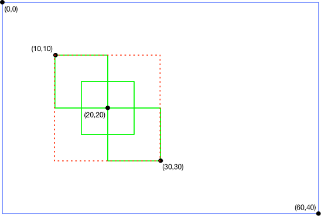

**NOTICE:** This software (or technical data) was produced for the U.S. Government under contract, and is subject to the
Rights in Data-General Clause 52.227-14, Alt. IV (DEC 2007). Copyright 2024 The MITRE Corporation. All Rights Reserved.

# Introduction

Feed forward is an optional behavior of OpenMPF that allows tracks from one detection stage of the pipeline to be
directly “fed into” the next stage. It differs from the default segmenting behavior in the following major ways:

1. The next stage will only look at the frames that had detections in the previous stage. The default segmenting
   behavior results in “filling the gaps” so that the next stage looks at all the frames between the start and end
   frames of the feed forward track, regardless of whether a detection was actually found in those frames.

2. The next stage can be configured to only look at the detection regions for the frames in the feed forward track. The
   default segmenting behavior does not pass the detection region information to the next stage, so the next stage looks
   at the whole frame region for every frame in the segment.

3. The next stage will process one sub-job per track generated in the previous stage. If the previous stage generated
   more than one track in a frame, say 3 tracks, then the next stage will process that frame a total of 3 times. Feed
   forward can be configured such that only the detection regions for those tracks are processed. If they are
   non-overlapping then there is no duplication of work. The default segmenting behavior will result in one sub-job that
   captures the frame associated with all 3 tracks.


# Motivation

Consider using feed forward for the following reasons:

1. You have an algorithm that isn’t capable of breaking down a frame into regions of interest. For example, face
   detection can take a whole frame and generate a separate detection region for each face in the frame. On the other
   hand, performing classification with the OpenCV Deep Neural Network (DNN) component will take that whole frame and
   generate a single detection that’s the size of the frame’s width and height. The OpenCV DNN component will produce
   better results if it operates on smaller regions that only capture the desired object to be classified. Using feed
   forward, you can create a pipeline so that OpenCV DNN component only processes regions with motion in them.

2. You wish to reduce processing time by creating a pipeline in which algorithms are chained from fastest to slowest.
   For example, a pipeline that starts with motion detection will only feed regions with motion to the next stage, which
   may be a compute-intensive face detection algorithm. Reducing the amount of data that algorithm needs to process will
   speed up run times.

> **NOTE:** Enabling feed forward results in more sub-jobs and more message passing between the Workflow Manager and
> components than the default segmenting behavior. Generally speaking, the more feed forward tracks, the greater the
> overhead cost. The cost may be outweighed by how feed forward can “filter out” pixel data that doesn’t need to be
> processed. Often, the greater the media resolution, the more pixel data is filtered out, and the greater the benefit.

The output of a feed forward pipeline is the intersection of each stage's output. For example, running a feed forward
pipeline that contains a motion detector and a face detector will ultimately output detections where motion was detected
in the first stage and a face was detected in the second stage.


# First Stage and Combining Properties

When feed forward is enabled on a job, there is no change in behavior for the first stage of the pipeline because there
is no track to feed in. In other words, the first stage will process the media file as though feed forward was not
enabled. The tracks generated by the first stage will be passed to the second stage which will then be able to take
advantage of the feed forward behavior.

> **NOTE:** When `FEED_FORWARD_TYPE` is set to anything other than `NONE`, the following properties will be ignored:
> `FRAME_INTERVAL`, `USE_KEY_FRAMES`, `SEARCH_REGION_*`.

If you wish to use the above properties, then you can configure them for the first stage of the pipeline, making sure
that `FEED_FORWARD_TYPE` is set to `NONE`, or not specified, for the first stage. You can then configure each subsequent
stage to use feed forward. Because only the frames with detections, and those detection regions, are passed forward from
the first stage, the subsequent stages will inherit the effects of those properties set on the first stage.  


# Feed Forward Properties

Components that support feed forward have three algorithm properties that control the feed forward behavior:
`FEED_FORWARD_TYPE`, `FEED_FORWARD_TOP_QUALITY_COUNT`, and `FEED_FORWARD_BEST_DETECTION_PROP_NAMES_LIST`.

`FEED_FORWARD_TYPE` can be set to the following values:

- `NONE`: Feed forward is disabled (default setting).
- `FRAME`: For each detection in the feed forward track, search the entire frame associated with that detection. The
  track's  detection regions are ignored.
- `SUPERSET_REGION`: Using the feed forward track, generate a superset region (minimum area rectangle) that captures all
  of the detection regions in that track across all of the frames in that track. Refer to the [Superset
  Region](#superset-region) section for more details. For each detection in the feed forward track, search the superset
  region.
- `REGION`: For each detection in the feed forward track, search the exact detection region.

> **NOTE:** When using `REGION`, the location of the region within the frame, and the size of the region, may be
> different for each detection in the feed forward track. Thus, `REGION` should not be used by algorithms that perform
> region tracking and require a consistent coordinate space from detection to detection. For those algorithms, use
> `SUPERSET_REGION` instead. That will ensure that each detection region is relative to the upper right corner of the
> superset region for that track.

`FEED_FORWARD_TOP_QUALITY_COUNT` allows you to drop low quality detections from feed forward tracks. Setting the
property to a value less than or equal to 0 has no effect. In that case all detections in the feed forward track will be
processed.

When `FEED_FORWARD_TOP_QUALITY_COUNT` is set to a number greater than 0, say 5, then the top 5 highest quality
detections in the feed forward track will be processed. Determination of quality is based on the job property
`QUALITY_SELECTION_PROPERTY`, which defaults to `CONFIDENCE`, but may be set to a different detection property. Refer to
the [Quality Selection Guide](Quality-Selection-Guide/index.html). If the track contains less than 5 detections then all
of the detections in the track will be processed. If one or more detections have the same quality value, then the
detection(s) with the lower frame index take precedence.

`FEED_FORWARD_BEST_DETECTION_PROP_NAMES_LIST` allows you to include detections based on properties in addition to those
from the `QUALITY_SELECTION_PROPERTY`. To do this, you need to set the property `BEST_DETECTION_PROPERTY_NAME_LIST` in the
previous stage of processing. This property is a string composed of a semi-colon separated list of detection properties.
For example, if you want to use something other than `CONFIDENCE` for the `QUALITY_SELECTION_PROPERTY`, but you also want
to include the detection with the highest confidence in your feed-forward track, then you can set the
`BEST_DETECTION_PROPERTY_NAME_LIST` property to `"CONFIDENCE"` in the first stage, and then set the
`FEED_FORWARD_BEST_DETECTION_PROP_NAMES_LIST` property to `"BEST_CONFIDENCE"`.


# Superset Region

A “superset region” is the smallest region of interest that contains all of the detections for all of the frames in a
track. This is also known as a “union” or [“minimum bounding
rectangle"](https://en.wikipedia.org/wiki/Minimum_bounding_rectangle).



For example, consider a track representing a person moving from the upper left to the lower right. The track consists of
3 frames that have the following detection regions:

- Frame 0: `(x = 10, y = 10, width = 10, height = 10)`
- Frame 1: `(x = 15, y = 15, width = 10, height = 10)`
- Frame 2: `(x = 20, y = 20, width = 10, height = 10)`

Each detection region is drawn with a solid green line in the above diagram. The blue line represents the full frame
region. The superset region for the track is `(x = 10, y = 10, width = 20, height = 20)`, and is drawn with a dotted red
line.

The major advantage of using a superset region is constant size. Some algorithms require the search space in each frame
to be a constant size in order to successfully track objects.

A disadvantage is that the superset region will often be larger than any specific detection region, so the search space
is not restricted to the smallest possible size in each frame; however, in many cases the search space will be
significantly smaller than the whole frame.

In the worst case, a feed forward track might, for example, capture a person moving from the upper left corner of a
video to the lower right corner. In that case the superset region will be the entire width and height of the frame, so
`SUPERSET_REGION` devolves into `FRAME`.

In a more typical case, a feed forward track might capture a person moving in the upper left quadrant of a video. In
that case `SUPERSET_REGION` is able to filter out 75% of the rest of the frame data. In the example shown in the above
diagram, `SUPERSET_REGION` is able to filter out 83% of the rest of the frame data.

<div>
  <video width="700" controls>
    <source src="../vid/superset_region.mp4" type="video/mp4">
    <p><b>Your browser does not support the embedded video tag.</b>
    <a href="../vid/superset_region.mp4">Click here to download the video.</a></p>
  </video>
</div>

The above video shows three faces. For each face there is an inner bounding box that moves and an outer bounding box
that does not. The inner bounding box represents the face detection in that frame, while the outer bounding box
represents the superset region for the track associated with that face. Note that the bounding box for each face uses a
different color. The colors are not related to those used in the above diagram.

# MPFVideoCapture and MPFImageReader Tools

When developing a component, the [C++ Batch Component API](CPP-Batch-Component-API/index.html) and [Python Batch
Component API](Python-Batch-Component-API/index.html) include utilities that make it easier to support feed forward in
your components. They work similarly, but only the C++ tools will be discussed here. The `MPFVideoCapture` class is a
wrapper around OpenCV's `cv::VideoCapture` class. `MPFVideoCapture` works very similarly to `cv::VideoCapture`, except
that it might modify the video frames based on job properties. From the point of view of someone using
`MPFVideoCapture`, these modifications are mostly transparent. `MPFVideoCapture` makes it look like you are reading the
original video file.

Conceptually, consider generating a new video from a feed forward track. The new video would have fewer frames (unless
there was a detection in every frame) and possibly a smaller frame size.

For example, the original video file might be 30 frames long with 640x480 resolution. If the feed forward track found
detections in frames 4, 7, and 10, then `MPFVideoCapture` will make it look like the video only has those 3 frames. If
the feed forward type is `SUPERSET_REGION` or `REGION,` and each detection is 30x50 pixels, then `MPFVideoCapture` will
make it look like the video's original resolution was 30x50 pixels.

One issue with this approach is that the detection frame numbers and bounding box will be relative to the modified
video, not the original. To make the detections relative to the original video the
`MPFVideoCapture::ReverseTransform(MPFVideoTrack &videoTrack)` function must be used.

The general pattern for using `MPFVideoCapture` is as follows:

```
std::vector<MPFVideoTrack> OcvDnnDetection::GetDetections(const MPFVideoJob &job) {

std::vector<MPFVideoTrack> tracks;
    MPFVideoCapture video_cap(job);

    cv::Mat frame;
    while (video_cap.Read(frame)) {
        // Process frames and detections to tracks vector
    }

    for (MPFVideoTrack &track : tracks) {
        video_cap.ReverseTransform(track);
    }

    return tracks;
}
```

`MPFVideoCapture` makes it look like the user is processing the original video, when in reality they are processing a
modified version. To avoid confusion, this means that `MPFVideoCapture` should always be returning frames that are the
same size because most users expect each frame of a video to be the same size.

When using `SUPERSET_REGION` this is not an issue, since one bounding box is used for the entire track. However, when
using `REGION`, each detection can be a different size, so it is not possible for `MPFVideoCapture` to return frames
that are always the same size. Since this is a deviation from the expected behavior, and breaks the transparency of
`MPFVideoCapture`, `SUPERSET_REGION` should usually be preferred over `REGION`. The `REGION` setting should only be used
with components that explicitly state they support it (e.g. OcvDnnDetection). Those components may not perform region
tracking, so processing frames of various sizes is not a problem.

The `MPFImageReader` class is similar to `MPFVideoCapture`, but it works on images instead of videos. `MPFImageReader`
makes it look like the user is processing an original image, when in reality they are processing a modified version
where the frame region is generated based on a detection (`MPFImageLocation`) fed forward from the previous stage of a
pipeline. Note that `SUPERSET_REGION` and `REGION` have the same effect when working with images. `MPFImageReader` also
has a reverse transform function.


# OpenCV DNN Component Tracking

The OpenCV DNN component does not generate detection regions of its own when performing classification. Its tracking
behavior depends on whether feed forward is enabled or not. When feed forward is disabled, the component will process
the entire region of each frame of a video. If one or more consecutive frames has the same highest confidence
classification, then a new track is generated that contains those frames.

When feed forward is enabled, the OpenCV DNN component will process the region of each frame of feed forward track
according to the `FEED_FORWARD_TYPE`. It will generate one track that contains the same frames as the feed forward
track. If `FEED_FORWARD_TYPE` is set to `REGION` then the OpenCV DNN track will contain (inherit) the same detection
regions as the feed forward track. In any case, the `detectionProperties` map for the detections in the OpenCV DNN track
will include the `CLASSIFICATION` entries and possibly other OpenCV DNN component properties.


# Feed Forward Pipeline Examples

<b>GoogLeNet Classification with MOG Motion Detection and Feed Forward Region</b>

First, create the following action:

```
CAFFE GOOGLENET DETECTION (WITH FEED FORWARD REGION) ACTION
+ Algorithm: DNNCV
+ MODEL_NAME: googlenet
+ SUBTRACT_BLUE_VALUE: 104.0
+ SUBTRACT_GREEN_VALUE: 117.0
+ SUBTRACT_RED_VALUE: 123.0
+ FEED_FORWARD_TYPE: REGION
```

Then create the following task:

```
CAFFE GOOGLENET DETECTION (WITH FEED FORWARD REGION) TASK
+ CAFFE GOOGLENET DETECTION (WITH FEED FORWARD REGION) ACTION
```

Then create the following pipeline:

```
CAFFE GOOGLENET DETECTION (WITH MOG MOTION TRACKING AND FEED FORWARD REGION) PIPELINE
+ MOG MOTION DETECTION (WITH TRACKING) TASK
+ CAFFE GOOGLENET DETECTION (WITH FEED FORWARD REGION) TASK
```

Running this pipeline will result in OpenCV DNN tracks that contain detections where there was MOG motion. Each
detection in each track will have an OpenCV DNN `CLASSIFICATION` entry. Each track has a 1-to-1 correspondence with a
MOG motion track.

Refer to `runMogThenCaffeFeedForwardExactRegionTest()` in the
[`TestSystemOnDiff`](https://github.com/openmpf/openmpf/blob/master/trunk/mpf-system-tests/src/test/java/org/mitre/mpf/mst/TestSystemOnDiff.java)
class for a system test that demonstrates this behavior. Refer to `runMogThenCaffeFeedForwardSupersetRegionTest()` in
that class for a system test that uses `SUPERSET_REGION` instead. Refer to `runMogThenCaffeFeedForwardFullFrameTest()`
for a system test that uses `FRAME` instead.

> **NOTE:** Short and/or spurious MOG motion tracks will result in more overhead work when performing feed forward. To
> mitigate this, consider setting the `MERGE_TRACKS`, `MIN_GAP_BETWEEN_TRACKS`, and `MIN_TRACK_LENGTH` properties to
> generate longer motion tracks and discard short and/or spurious motion tracks.

> **NOTE:** It doesn’t make sense to use `FEED_FORWARD_TOP_QUALITY_COUNT` on a pipeline stage that follows a MOG or
> SuBSENSE motion detection stage. That’s because those motion detectors don’t generate tracks with confidence values
> (`CONFIDENCE` being the default value for the `QUALITY_SELECTION_PROPERTY` job property). Instead,
> `FEED_FORWARD_TOP_QUALITY_COUNT` could potentially be used when feeding person tracks into a face detector, for
> example, if the detections in those person tracks have the requested `QUALITY_SELECTION_PROPERTY` set.


<b>OCV Face Detection with MOG Motion Detection and Feed Forward Superset Region</b>

First, create the following action:

```
OCV FACE DETECTION (WITH FEED FORWARD SUPERSET REGION) ACTION
+ Algorithm: FACECV
+ FEED_FORWARD_TYPE: SUPERSET_REGION
```

Then create the following task:

```
OCV FACE DETECTION (WITH FEED FORWARD SUPERSET REGION) TASK
+ OCV FACE DETECTION (WITH FEED FORWARD SUPERSET REGION) ACTION
```

Then create the following pipeline:

```
OCV FACE DETECTION (WITH MOG MOTION TRACKING AND FEED FORWARD SUPERSET REGION) PIPELINE
+ MOG MOTION DETECTION (WITH TRACKING) TASK
+ OCV FACE DETECTION (WITH FEED FORWARD SUPERSET REGION) TASK
```

Running this pipeline will result in OCV face tracks that contain detections where there was MOG motion. Each track has
a 1-to-1 correspondence with a MOG motion track.

Refer to `runMogThenOcvFaceFeedForwardRegionTest()` in the
[`TestSystemOnDiff`](https://github.com/openmpf/openmpf/blob/master/trunk/mpf-system-tests/src/test/java/org/mitre/mpf/mst/TestSystemOnDiff.java)
class for a system test that demonstrates this behavior.
