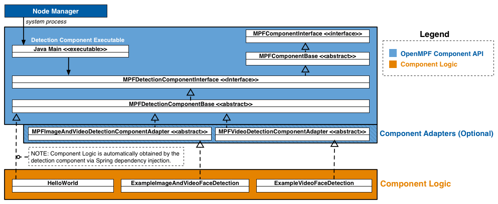

**NOTICE:** This software (or technical data) was produced for the U.S. Government under contract, and is subject to the
Rights in Data-General Clause 52.227-14, Alt. IV (DEC 2007). Copyright 2021 The MITRE Corporation. All Rights Reserved.

# API Overview

In OpenMPF, a **component** is a plugin that receives jobs (containing media), processes that  media, and returns results.

The OpenMPF Batch Component API currently supports the development of **detection components**, which are used to detect objects in image, video, audio, or other (generic) files that reside on disk.

Using this API, detection components can be built to provide:

* Detection (Localizing an object)
* Tracking (Localizing an object across multiple frames)
* Classification (Detecting the type of object and optionally localizing that object)
* Transcription (Detecting speech and transcribing it into text)

## How Components Integrate into OpenMPF

Components are integrated into OpenMPF through the use of OpenMPF's **Component Executor**. Developers create component libraries that encapsulate the component detection logic. Each instance of the Component Executor loads one of these libraries and uses it to service job requests sent by the OpenMPF Workflow Manager (WFM).

The Component Executor:

1. Receives and parses job requests from the WFM
2. Invokes methods on the component library to obtain detection results
3. Populates and sends the respective responses to the WFM

The basic pseudocode for the Component Executor is as follows:
```java
component.setRunDirectory(...)
component.init()
while (true) {
    job = ReceiveJob()
    if (component.supports(job.dataType))
        component.getDetections(...) // Component does the work here
    }
component.close()
```

Each instance of a Component Executor runs as a separate process.

The Component Executor receives and parses requests from the WFM, invokes methods on the Component Logic to get detection objects, and subsequently populates responses with the component output and sends them to the WFM.

A component developer implements a detection component by extending [`MPFDetectionComponentBase`](#detection-component-interface).

As an alternative to extending [`MPFDetectionComponentBase`](#detection-component-interface) directly, a developer may extend one of several convenience adapter classes provided by OpenMPF. See [Convenience Adapters](#convenience-adapters) for more information.


## Getting Started

The quickest way to get started with the Java Batch Component API is to first read the [OpenMPF Component API Overview](Component-API-Overview/index.html) and then [review the source](https://github.com/openmpf/openmpf-java-component-sdk/tree/master/detection/examples) for example OpenMPF Java detection components.

Detection components are implemented by:

1. Extending [`MPFDetectionComponentBase`](#detection-component-interface).
2. Building the component into a jar. (See [HelloWorldComponent pom.xml](https://github.com/openmpf/openmpf-java-component-sdk/blob/master/detection/examples/HelloWorldComponent/pom.xml)).
3. Creating a component Docker image. (See the [README](https://github.com/openmpf/openmpf-docker/tree/master/components/java_executor#overview)).

# API Specification

The figure below presents a high-level component diagram of the Java Batch Component API:



The Node Manager is only used in a non-Docker deployment. In a Docker deployment the Component Executor is started by the Docker container itself.

The API consists of *Component Interfaces*, which provide interfaces and abstract classes for developing components; *Job Definitions*, which define the work to be performed by a component; *Job Results*, which define the results generated by the component; and [*Component Adapters*](#convenience-adapters), which provide default implementations of several of the [`MPFDetectionComponentInterface`](#detection-component-interface) methods (See the [MPFAudioAndVideoDetectionComponentAdapter](https://github.com/openmpf/openmpf-java-component-sdk/blob/master/detection/java-component-api/src/test/java/org/mitre/mpf/component/api/adapters/MPFAudioAndVideoDetectionComponentAdapterTest.java) for an example; *TODO: implement those shown in the diagram*). In the future, the API will also include [*Component Utilities*](#utility-classes), which perform actions such as image flipping, rotation, and cropping.

**Component Interfaces**

* [`MPFComponentInterface`](#component-interface) - Interface for all Java components that perform batch processing.
* `MPFComponentBase` - An abstract baseline for components. Provides default implementations for [`MPFComponentInterface`](#component-interface).

**Detection Component Interfaces**

* [`MPFDetectionComponentInterface`](#detection-component-interface) - Baseline interface for detection components.
* `MPFDetectionComponentBase` - An abstract baseline for detection components. Provides default implementations for  [`MPFDetectionComponentInterface`](#detection-component-interface).

**Job Definitions**

The following classes define the details about a specific job (work unit):

* [`MPFImageJob`](#mpfimagejob) extends [`MPFJob`](#mpfjob)
* [`MPFVideoJob`](#mpfvideojob) extends [`MPFJob`](#mpfjob)
* [`MPFAudioJob`](#mpfaudiojob) extends [`MPFJob`](#mpfjob)
* [`MPFGenericJob`](#mpfgenericjob) extends [`MPFJob`](#mpfjob)

**Job Results**

The following classes define detection results:

* [`MPFImageLocation`](#mpfimagelocation)
* [`MPFVideoTrack`](#mpfvideotrack)
* [`MPFAudioTrack`](#mpfaudiotrack)
* [`MPFGenericTrack`](#mpfgenerictrack)

## Component Interface

The OpenMPF Component class structure consists of:

* `MPFComponentInterface` - Interface for all OpenMPF Java components that perform batch processing.
* `MPFComponentBase` - An abstract baseline for components. Provides default implementations for `MPFComponentInterface`.

>**IMPORTANT:** This interface and abstract class should not be directly implemented because no mechanism exists for launching components based off of it. Instead, it defines the contract that components must follow. Currently, the only supported type of batch component is "DETECTION". Those components should extend `MPFDetectionComponentBase`

**[See the latest source here.](https://github.com/openmpf/openmpf-java-component-sdk/tree/master/detection/java-component-api/src/main/java/org/mitre/mpf/component/api)**

### setRunDirectory(String)

Sets the value to the full path of the parent folder above where the component is installed.

* Method Definition:
```java
public void setRunDirectory(String runDirectory);
```

* Parameters:

| Parameter  | Data Type  | Description  |
|---|---|---|
| runDirectory  | `String`  | Full path of the parent folder above where the component is installed. |

* Returns: none

>**IMPORTANT:** `setRunDirectory` is called by the Component Executor to set the correct path. It is not necessary to call this method in your component implementation.

### getRunDirectory()

Returns the full path of the parent folder above where the component is installed.

* Method Definition:
```java
public String getRunDirectory()
```

* Parameters: none

* Returns: (`String`) Full path of the parent folder above where the component is installed.

### init()

Performs any necessary startup tasks for the component. This will be executed once by the Component Executor, on component startup, before the first job, after `setRunDirectory`.

* Method Definition:
```java
public void init()
```

* Parameters: none

* Returns: none

* Example:
```java
public void init() {
    // Setup logger, Load data models, etc.
}
```

### close()

Performs any necessary shutdown tasks for the component. This will be executed once by the Component Executor, on component shutdown, usually after the last job.

* Method Definition:
```java
public void close()
```

* Parameters: none

* Returns: none

* Example:
```java
public void close() {
    // Close file handlers, etc.
}
```

### getComponentType()

Allows the Component API to determine the component "type." Currently `DETECTION` is the only supported component type.

* Method Definition:
```java
public MPFComponentType getComponentType()
```

* Parameters: none

* Returns: (`MPFComponentType`) Currently, `DETECTION` is the only supported return value.

* Example:
```java
public MPFComponentType getComponentType() {
    return MPFComponentType.DETECTION;
}
```

## Detection Component Interface

The `MPFDetectionComponentInterface` must be utilized by all OpenMPF Java detection components that perform batch processing.

Every batch detection component must define a *component* class which implements the MPFComponentInterface. This is typically performed by extending `MPFDetectionComponentBase`, which extends `MPFComponentBase` and implements `MPFDetectionComponentInterface`.

To designate the component class, every batch detection component should include an applicationContext.xml which defines the `component` bean.  The `component` bean class must implement `MPFDetectionComponentInterface`.

>**IMPORTANT:** Each batch detection component must implement all of the `getDetections()` methods or extend from a superclass which provides implementations for them (see [convenience adapters](#convenience-adapters)).
>
>If your component does not support a particular data type, it should simply:
>
>`throw new MPFComponentDetectionError(MPFDetectionError.MPF_UNSUPPORTED_DATA_TYPE);`


### Convenience Adapters

As an alternative to extending `MPFDetectionComponentBase` directly, developers may extend a convenience adapter classes provided by OpenMPF.

These adapters provide default implementations of several methods in [`MPFDetectionComponentInterface`](#detection-component-interface) and ensure that the component's logic properly extends from the Component API. This enables developers to concentrate on implementation of the detection algorithm.

The following adapter is provided:

* Audio And Video Detection Component Adapter ([source](https://github.com/openmpf/openmpf-java-component-sdk/blob/master/detection/java-component-api/src/test/java/org/mitre/mpf/component/api/adapters/MPFAudioAndVideoDetectionComponentAdapterTest.java))

>**Example: Using Adaptors to Provide Simple AudioVisual Handling:**
>Many components designed to work on audio files, such as speech detection, are relevant to video files as well.  Some of the tools for these components, however, only function on audio files (such as .wav, .mp3) and not video files (.avi, .mov, etc).
>
>The `MPFAudioAndVideoDetectionComponentAdapter` adapter class implements the `getDetections(MPFVideoJob)` method by translating the video request into an audio request.  It builds a temporary audio file by ripping the audio from the video media input, translates the `MPFVideoJob` into an `MPFAudioJob`, and invokes `getDetections(MPFAudioJob)` on the generated file.  Once processing is done, the adapter translates the `MPFAudioTrack` list into an `MPFVideoTrack` list.
>
>Since only audio and video files are relevant to this adapter, it provides a default implementation of the `getDetections(MPFImageJob)` method which throws `new MPFComponentDetectionError(MPFDetectionError.MPF_UNSUPPORTED_DATA_TYPE)`.
>
>The Sphinx speech detection component uses this adapter to run Sphinx speech detection on video files.  Other components that need to process video files as audio may also use the adapter.

#### supports(MPFDataType)

Returns the supported data types of the component.

* Method Definition:
```java
public boolean supports(MPFDataType dataType)
```

* Parameters:

| Parameter  | Data Type  | Description  |
|---|---|---|
| dataType| `MPFDataType`  | Return true if the component supports IMAGE, VIDEO, AUDIO, and/or UNKNOWN (generic) processing. |

* Returns: (`boolean`) True if the component supports the data type, otherwise false.

* Example:
```java
// Sample Component that supports only image and video files
public boolean supports(MPFDataType dataType) {
    return dataType == MPFDataType.IMAGE || dataType == MPFDataType.VIDEO;
}
```

#### getDetectionType()

Returns the type of object detected by the component.

* Method Definition:
```java
public String getDetectionType()
```

* Parameters: none

* Returns: (`String`) The type of object detected by the component. Should be in all CAPS. Examples include: `FACE`, `MOTION`, `PERSON`, `SPEECH`, `CLASS` (for object classification), or `TEXT`.

* Example:
```java
public String getDetectionType() {
    return "FACE";
}
```

### getDetections(MPFImageJob)

Used to detect objects in image files. The MPFImageJob class contains the URI specifying the location of the image file.

Currently, the dataUri is always a local file path. For example, "/opt/mpf/share/remote-media/test-file.jpg". This is because all media is copied to the OpenMPF server before the job is executed.

* Method Definition:
```java
public List<MPFImageLocation> getDetections(MPFImageJob job)
  throws MPFComponentDetectionError;
```

* Parameters:

| Parameter  | Data Type  | Description  |
|---|---|---|
|  job | `MPFImageJob`  | Class containing details about the work to be performed. See [`MPFImageJob`](#mpfimagejob) |

* Returns: (`List<MPFImageLocation>`) The [`MPFImageLocation`](#mpfimagelocation) data for each detected object.

* Example:
```java
public List<MPFImageLocation> getDetections(MPFImageJob job)
  throws MPFComponentDetectionError {
	// Component logic to generate image locations
}
```

### getDetections(MPFVideoJob)

Used to detect objects in a video.

Prior to being sent to the component, videos are split into logical "segments" of video data and each segment (containing a range of frames) is assigned to a different job. Components are not guaranteed to receive requests in any order. For example, the first request processed by a component might receive a request for frames 300-399 of a Video A, while the next request may cover frames 900-999 of a Video B.

* Method Definition:
```java
public List<MPFVideoTrack> getDetections(MPFVideoJob job)
  throws MPFComponentDetectionError;
```

* Parameters:

| Parameter  | Data Type  | Description  |
|---|---|---|
| job  | `MPFVideoJob`  |  Class containing details about the work to be performed. See [`MPFVideoJob`](#mpfvideojob) |

* Returns: (`List<MPFVideoTrack>`) The [`MPFVideoTrack`](#mpfvideotrack) data for each detected object.

* Example:
```java
public List<MPFVideoTrack> getDetections(MPFVideoJob job)
  throws MPFComponentDetectionError {
	// Component logic to generate video tracks
}
```

### getDetections(MPFAudioJob)

Used to detect objects in audio files. Currently, audio files are not logically segmented, so a job will contain the entirety of the audio file.

* Method Definition:
```java
public List<MPFAudioTrack> getDetections(MPFAudioJob job)
  throws MPFComponentDetectionError;
```

* Parameters:

| Parameter  | Data Type  | Description  |
|---|---|---|
| job  | `MPFAudioJob`  | Class containing details about the work to be performed. See [`MPFAudioJob`](#mpfaudiojob) |

* Returns: (`List<MPFAudioTrack>`) The [`MPFAudioTrack`](#mpfaudiotrack) data for each detected object.

* Example:
```java
public List<MPFAudioTrack> getDetections(MPFAudioJob job)
  throws MPFComponentDetectionError {
	// Component logic to generate audio tracks
}
```

### getDetections(MPFGenericJob)

Used to detect objects in files that aren't video, image, or audio files. Such files are of the UNKNOWN type and handled generically. These files are not logically segmented, so a job will contain the entirety of the file.

* Method Definition:
```java
public List<MPFGenericTrack> getDetections(MPFGenericJob job)
  throws MPFComponentDetectionError;
```

* Parameters:

| Parameter  | Data Type  | Description  |
|---|---|---|
| job  | `MPFGenericJob`  | Class containing details about the work to be performed. See [`MPFGenericJob`](#mpfgenericjob) |

* Returns: (`List<MPFGenericTrack>`) The [`MPFGenericTrack`](#mpfgenerictrack) data for each detected object.

* Example:
```java
public List<MPFGenericTrack> getDetections(MPFGenericJob job)
  throws MPFComponentDetectionError {
	// Component logic to generate generic tracks
}
```

### MPFComponentDetectionError

An exception that occurs in a component.  The exception must contain a reference to a valid [`MPFDetectionError`](#mpfdetectionerror).

* Constructor(s):
```java
public MPFComponentDetectionError (
  MPFDetectionError error,
  String msg,
  Exception e
)
```

* Parameters:

| Parameter  | Data Type  | Description  |
|---|---|---|
| error  | `MPFDetectionError`  | The type of error generated by the component. See [`MPFDetectionError`](#mpfdetectionerror). |
| msg  | `String`  |  The detail message (which is saved for later retrieval by the `Throwable.getMessage()` method). |
| e  | `Exception`  | The cause (which is saved for later retrieval by the `Throwable.getCause()` method). A null value is permitted. |

### Detection Job Classes

The following classes contain details about a specific job (work unit):

* [`MPFImageJob`](#mpfimagejob) extends [`MPFJob`](#mpfjob)
* [`MPFVideoJob`](#mpfvideojob) extends [`MPFJob`](#mpfjob)
* [`MPFAudioJob`](#mpfaudiojob) extends [`MPFJob`](#mpfjob)
* [`MPFGenericJob`](#mpfgenericjob) extends [`MPFJob`](#mpfjob)

The following classes define detection results:

* [`MPFImageLocation`](#mpfimagelocation)
* [`MPFVideoTrack`](#mpfvideotrack)
* [`MPFAudioTrack`](#mpfaudiotrack)
* [`MPFGenericTrack`](#mpfgenerictrack)

#### MPFJob

Class containing data used for detection of objects.

* Constructor(s):
```java
protected MPFJob(
  String jobName,
  String dataUri,
  final Map<String, String> jobProperties,
  final Map<String, String> mediaProperties
)
```

* Members:

| Member  | Data Type  | Description  |
|---|---|---|
| jobName <a name="job-name"></a> | `String`  | A specific name given to the job by the OpenMPF Framework. This value may be used, for example, for logging and debugging purposes.  |
| dataUri <a name="data-uri"></a> | `String`  | The URI of the input media file to be processed. Currently, this is a file path. For example, "/opt/mpf/share/remote-media/test-file.avi".  |
| jobProperties <a name="job-properties"></a> | `Map<String, String>`  | The key corresponds to the property name specified in the component descriptor file described in "Installing and Registering a Component". Values are determined by an end user when creating a pipeline. <br/><br/> Note: Only those property values specified by the user will be in the jobProperties map; for properties not contained in the map, the component must use a default value. |
| mediaProperties <a name="media-properties"></a> | `Map<String, String>` | Metadata about the media associated with the job. The key is the property name and value is the property value. The entries in the map vary depend on the job type. They are defined in the specific Job's API description. |


Job properties can also be set through environment variables prefixed with `MPF_PROP_`. This allows
users to set job properties in their
[docker-compose files.](https://github.com/openmpf/openmpf-docker/blob/32d072c9578441f2a07ec2da3bc3765aa1ff9cce/docker-compose.components.yml#L96)
These will take precedence over all other property types (job, algorithm, media, etc). It is not
possible to change the value of properties set via environment variables at runtime and therefore
they should only be used to specify properties that will not change throughout the entire lifetime
of the service (e.g. Docker container).


#### MPFImageJob
Extends [`MPFJob`](#mpfjob)

Class containing data used for detection of objects in image files.

* Constructor(s):
```java
public MPFImageJob(
  String jobName,
  String dataUri,
  final Map<String, String> jobProperties,
  final Map <String, String> mediaProperties)
```
```java
public MPFImageJob(
  String jobName,
  String dataUri,
  final Map<String, String> jobProperties,
  final Map <String, String> mediaProperties,
  MPFImageLocation location)
```

* Members:

<table>
  <thead>
    <tr>
      <th>Member</th>
      <th>Data Type</th>
      <th>Description</th>
    </tr>
  </thead>
  <tbody>
    <tr>
      <td>jobName</td>
      <td><code>String</code></td>
      <td>See <a href="#job-name">MPFJob.jobName</a> for description.</td>
    </tr>
    <tr>
      <td>dataUri</td>
      <td><code>String</code></td>
      <td>See <a href="#data-uri">MPFJob.dataUri</a> for description.</td>
    </tr>
    <tr>
      <td>jobProperties</td>
      <td><code>Map&ltString, String&gt</code></td>
      <td>See <a href="#job-properties">MPFJob.jobProperties</a> for description.</td>
    </tr>
    <tr>
      <td>mediaProperties</td>
      <td><code>Map&ltString, String&gt</code></td>
      <td>
        See <a href="#media-properties">MPFJob.mediaProperties</a> for description.
        <br/><br/>
        Includes the following key-value pairs:
        <ul>
          <li><code>MIME_TYPE</code> : the MIME type of the media</li>
          <li><code>FRAME_WIDTH</code> : the width of the image in pixels</li>
          <li><code>FRAME_HEIGHT</code> : the height of the image in pixels</li>
        </ul>
        May include the following key-value pairs:
        <ul>
          <li><code>ROTATION</code> : A floating point value in the interval <code>[0.0, 360.0)</code> indicating the orientation of the media in degrees in the counter-clockwise direction. In order to view the media in the upright orientation, it must be rotated the given number of degrees in the clockwise direction.</li>
          <li><code>HORIZONTAL_FLIP</code> : true if the image is mirrored across the Y-axis, otherwise false</li>
          <li><code>EXIF_ORIENTATION</code> : the standard EXIF orientation tag; a value between 1 and 8</li>
        </ul>
      </td>
    </tr>
    <tr>
      <td>location</td>
      <td><code>MPFImageLocation</code></td>
      <td>An <a href="#mpfimagelocation"><code>MPFImageLocation</code></a> from the previous pipeline stage. Provided when feed forward is enabled. See <a href="../Feed-Forward-Guide/index.html">Feed Forward Guide</a>.</td>
    </tr>
  </tbody>
</table>

#### MPFVideoJob
Extends [`MPFJob`](#mpfjob)

Class containing data used for detection of objects in video files.

* Constructor(s):
```java
public MPFVideoJob(
  String jobName,
  String dataUri,
  final Map<String, String> jobProperties,
  final Map<String, String> mediaProperties,
  int startFrame,
  int stopFrame)
```
```java
public MPFVideoJob(
  String jobName,
  String dataUri,
  final Map<String, String> jobProperties,
  final Map<String, String> mediaProperties,
  int startFrame,
  int stopFrame,
  MPFVideoTrack track)
```

* Members:

<table>
  <thead>
    <tr>
      <th>Member</th>
      <th>Data Type</th>
      <th>Description</th>
    </tr>
  </thead>
  <tbody>
    <tr>
      <td>jobName</td>
      <td><code>String</code></td>
      <td>See <a href="#job-name">MPFJob.jobName</a> for description.</td>
    </tr>
    <tr>
      <td>dataUri</td>
      <td><code>String</code></td>
      <td>See <a href="#data-uri">MPFJob.dataUri</a> for description.</td>
    </tr>
    <tr>
      <td>startFrame</td>
      <td><code>int</code></td>
      <td>The first frame number (0-based index) of the video that should be processed to look for detections.</td>
    </tr>
    <tr>
      <td>stopFrame</td>
      <td><code>int</code></td>
      <td>The last frame number (0-based index) of the video that should be processed to look for detections.</td>
    </tr>        
    <tr>
      <td>jobProperties</td>
      <td><code>Map&ltString, String&gt</code></td>
      <td>See <a href="#job-properties">MPFJob.jobProperties</a> for description.</td>
    </tr>
    <tr>
      <td>mediaProperties</td>
      <td><code>Map&ltString, String&gt</code></td>
      <td>
        See <a href="#media-properties">MPFJob.mediaProperties</a> for description.
        <br/><br/>
        Includes the following key-value pairs:
        <ul>
          <li><code>DURATION</code> : length of video in milliseconds</li>
          <li><code>FPS</code> : frames per second (averaged for variable frame rate video)</li>
          <li><code>FRAME_COUNT</code> : the number of frames in the video</li>
          <li><code>MIME_TYPE</code> : the MIME type of the media</li>
          <li><code>FRAME_WIDTH</code> : the width of a frame in pixels</li>
          <li><code>FRAME_HEIGHT</code> : the height of a frame in pixels</li>
        </ul>
        May include the following key-value pair:
        <ul>
          <li><code>ROTATION</code> : A floating point value in the interval <code>[0.0, 360.0)</code> indicating the orientation of the media in degrees in the counter-clockwise direction. In order to view the media in the upright orientation, it must be rotated the given number of degrees in the clockwise direction.</li>
        </ul>
      </td>
    </tr>
    <tr>
      <td>track</td>
      <td><code>MPFVideoTrack</code></td>
      <td>An <a href="#mpfvideotrack"><code>MPFVideoTrack</code></a> from the previous pipeline stage. Provided when feed forward is enabled. See <a href="../Feed-Forward-Guide/index.html">Feed Forward Guide</a>.</td>
    </tr>
  </tbody>
</table>

>**IMPORTANT:** `FRAME_INTERVAL` is a common job property that many components support. For frame intervals greater than 1, the component must look for detections starting with the first frame, and then skip frames as specified by the frame interval, until or before it reaches the stop frame. For example, given a start frame of 0, a stop frame of 99, and a frame interval of 2, then the detection component must look for objects in frames numbered 0, 2, 4, 6, ..., 98.


#### MPFAudioJob
Extends [`MPFJob`](#mpfjob)

Class containing data used for detection of objects in audio files.

* Constructor(s):
```java
public MPFAudioJob(
  String jobName,
  String dataUri,
  final Map<String, String> jobProperties,
  final Map<String, String> mediaProperties,
  int startTime,
  int stopTime)
```
```java
public MPFAudioJob(
  String jobName,
  String dataUri,
  final Map<String, String> jobProperties,
  final Map<String, String> mediaProperties,
  int startTime,
  int stopTime,
  MPFAudioTrack track)
```

* Members:

<table>
  <thead>
    <tr>
      <th>Member</th>
      <th>Data Type</th>
      <th>Description</th>
    </tr>
  </thead>
  <tbody>
    <tr>
      <td>jobName</td>
      <td><code>String</code></td>
      <td>See <a href="#job-name">MPFJob.jobName</a> for description.</td>
    </tr>
    <tr>
      <td>dataUri</td>
      <td><code>String</code></td>
      <td>See <a href="#data-uri">MPFJob.dataUri</a> for description.</td>
    </tr>
    <tr>
      <td>startTime</td>
      <td><code>int</code></td>
      <td>The time (0-based index, in ms) associated with the beginning of the segment of the audio file that should be processed to look for detections.</td>
    </tr>
    <tr>
      <td>stopTime</td>
      <td><code>int</code></td>
      <td>The time (0-based index, in ms) associated with the end of the segment of the audio file that should be processed to look for detections.</td>
    </tr>        
    <tr>
      <td>jobProperties</td>
      <td><code>Map&ltString, String&gt</code></td>
      <td>See <a href="#job-properties">MPFJob.jobProperties</a> for description.</td>
    </tr>
    <tr>
      <td>mediaProperties</td>
      <td><code>Map&ltString, String&gt</code></td>
      <td>
        See <a href="#media-properties">MPFJob.mediaProperties</a> for description.
        <br/><br/>
        Includes the following key-value pairs:
        <ul>
          <li><code>DURATION</code> : length of audio file in milliseconds</li>
          <li><code>MIME_TYPE</code> : the MIME type of the media</li>
        </ul>
      </td>
    </tr>
    <tr>
      <td>track</td>
      <td><code>MPFAudioTrack</code></td>
      <td>An <a href="#mpfaudiotrack"><code>MPFAudioTrack</code></a> from the previous pipeline stage. Provided when feed forward is enabled. See <a href="../Feed-Forward-Guide/index.html">Feed Forward Guide</a>.</td>
    </tr>
  </tbody>
</table>

#### MPFGenericJob
Extends [`MPFJob`](#mpfjob)

Class containing data used for detection of objects in a file that isn't a video, image, or audio file. The file is of the UNKNOWN type and handled generically. The file is not logically segmented, so a job will contain the entirety of the file.

* Constructor(s):
```java
public MPGenericJob(
  String jobName,
  String dataUri,
  final Map<String, String> jobProperties,
  final Map<String, String> mediaProperties)
```
```java
public MPFGenericJob(
  String jobName,
  String dataUri,
  final Map<String, String> jobProperties,
  final Map <String, String> mediaProperties,
  MPFGenericTrack track) {
```

* Members:

<table>
  <thead>
    <tr>
      <th>Member</th>
      <th>Data Type</th>
      <th>Description</th>
    </tr>
  </thead>
  <tbody>
    <tr>
      <td>jobName</td>
      <td><code>String</code></td>
      <td>See <a href="#job-name">MPFJob.jobName</a> for description.</td>
    </tr>
    <tr>
      <td>dataUri</td>
      <td><code>String</code></td>
      <td>See <a href="#data-uri">MPFJob.dataUri</a> for description.</td>
    </tr>
    <tr>
      <td>startTime</td>
      <td><code>int</code></td>
      <td>The time (0-based index, in ms) associated with the beginning of the segment of the audio file that should be processed to look for detections.</td>
    </tr>
    <tr>
      <td>stopTime</td>
      <td><code>int</code></td>
      <td>The time (0-based index, in ms) associated with the end of the segment of the audio file that should be processed to look for detections.</td>
    </tr>        
    <tr>
      <td>jobProperties</td>
      <td><code>Map&ltString, String&gt</code></td>
      <td>See <a href="#job-properties">MPFJob.jobProperties</a> for description.</td>
    </tr>
    <tr>
      <td>mediaProperties</td>
      <td><code>Map&ltString, String&gt</code></td>
      <td>
        See <a href="#media-properties">MPFJob.mediaProperties</a> for description.
        <br/><br/>
        Includes the following key-value pair:
        <ul>
          <li><code>MIME_TYPE</code> : the MIME type of the media</li>
        </ul>
      </td>
    </tr>
    <tr>
      <td>track</td>
      <td><code>MPFGenericTrack</code></td>
      <td>An <a href="#mpfgenerictrack"><code>MPFGenericTrack</code></a> from the previous pipeline stage. Provided when feed forward is enabled. See <a href="../Feed-Forward-Guide/index.html">Feed Forward Guide</a>.</td>
    </tr>
  </tbody>
</table>

### Detection Job Result Classes


#### MPFImageLocation

Class used to store the location of detected objects in an image.

* Constructor(s):
```java
public MPFImageLocation(
  int xLeftUpper,
  int yLeftUpper,
  int width,
  int height,
  float confidence,
  Map<String, String> detectionProperties
)
```

* Members:

| Member  | Data Type  | Description  |
|---|---|---|
| xLeftUpper| `int` | Upper left X coordinate of the detected object. |
| yLeftUpper | `int` | Upper left Y coordinate of the detected object. |
| width | `int` | The width of the detected object. |
| height | `int` | The height of the detected object. |
| confidence | `float` | Represents the "quality" of the detection. The range depends on the detection algorithm. 0.0 is lowest quality. Higher values are higher quality. Using a standard range of [0.0 - 1.0] is advised. If the component is unable to supply a confidence value, it should return -1.0. |
| detectionProperties | `Map<String, String>` | Optional additional information about the detected object. There is no restriction on the keys or the number of entries that can be added to the properties map. For best practice, keys should be in all CAPS. |

* Example:

A component that performs generic object classification can add an entry to `detection_properties` where the key is `CLASSIFICATION` and the value is the type of object detected.

```java
Map<String, String> detectionProperties = new HashMap<String, String>();
detectionProperties.put("CLASSIFICATION", "backpack");
MPFImageLocation imageLocation = new MPFImageLocation(0, 0, 100, 100, 1.0, detectionProperties);
```

#### MPFVideoTrack

Class used to store the location of detected objects in an image.

* Constructor(s):
```java
public MPFVideoTrack(
  int startFrame,
  int stopFrame,
  Map<Integer, MPFImageLocation> frameLocations,
  float confidence,
  Map<String, String> detectionProperties
)
```

* Members:

| Member  | Data Type  | Description  |
|---|---|---|
| startFrame| `int` | The first frame number (0-based index) that contained the detected object. |
| stopFrame| `int` | The last frame number (0-based index) that contained the detected object. |
| frameLocations| `Map<Integer, MPFImageLocation>` | A map of individual detections. The key for each map entry is the frame number where the detection was generated, and the value is a [`MPFImageLocation`](#mpfimagelocation) calculated as if that frame was a still image. Note that a key-value pair is *not* required for every frame between the track start frame and track stop frame. In some cases, frames are deliberately skipped, as when a FRAME_INTERVAL > 1 is specified |
| confidence | `float` | Represents the "quality" of the detection. The range depends on the detection algorithm. 0.0 is lowest quality. Higher values are higher quality. Using a standard range of [0.0 - 1.0] is advised. If the component is unable to supply a confidence value, it should return -1.0. |
| detectionProperties | `Map<String, String>` | Optional additional information about the detected object. There is no restriction on the keys or the number of entries that can be added to the properties map. For best practice, keys should be in all CAPS. |

* Example:

>**NOTE:** Currently, `MPFVideoTrack.detectionProperties` do not show up in the JSON output object or are used by the WFM in any way.

A component that detects text could add an entry to `detectionProperties` where the key is `TRANSCRIPT` and the value is a string representing the text found in the video segment.

```java
Map<String, String> detectionProperties = new HashMap<String, String>();
detectionProperties.put("TRANSCRIPT", "RE5ULTS FR0M A TEXT DETECTER");
MPFVideoTrack videoTrack = new MPFVideoTrack(0, 5, frameLocations, 1.0, detectionProperties);
```

#### MPFAudioTrack

Class used to store the location of detected objects in an image.

* Constructor(s):
```java
public MPFAudioTrack(
  int startTime,
  int stopTime,
  float confidence,
  Map<String, String> detectionProperties
)
```

* Members:

| Member  | Data Type  | Description  |
|---|---|---|
| startTime| `int` | The time (0-based index, in ms) when the audio detection event started.  |
| stopTime| `int` | The time (0-based index, in ms) when the audio detection event stopped. |
| confidence | `float` | Represents the "quality" of the detection. The range depends on the detection algorithm. 0.0 is lowest quality. Higher values are higher quality. Using a standard range of [0.0 - 1.0] is advised. If the component is unable to supply a confidence value, it should return -1.0. |
| detectionProperties | `Map<String, String>` | Optional additional information about the detection. There is no restriction on the keys or the number of entries that can be added to the properties map. For best practice, keys should be in all CAPS. |

>**NOTE:** Currently, `MPFAudioTrack.detectionProperties` do not show up in the JSON output object or are used by the WFM in any way.

#### MPFGenericTrack

Class used to store the location of detected objects in a file that is not a video, image, or audio file. The file is of the UNKNOWN type and handled generically.

* Constructor(s):
```java
public MPFGenericTrack(
  float confidence,
  Map<String, String> detectionProperties
)
```

* Members:

| Member  | Data Type  | Description  |
|---|---|---|
| confidence | `float` | Represents the "quality" of the detection. The range depends on the detection algorithm. 0.0 is lowest quality. Higher values are higher quality. Using a standard range of [0.0 - 1.0] is advised. If the component is unable to supply a confidence value, it should return -1.0. |
| detectionProperties | `Map<String, String>` | Optional additional information about the detection. There is no restriction on the keys or the number of entries that can be added to the properties map. For best practice, keys should be in all CAPS. |


### Enumeration Types

#### MPFDetectionError

Enum used to indicate the status of `getDetections` in a [`MPFComponentDetectionError`](#mpfcomponentdetectionerror). A component is not required to support all error types.

|  ENUM  |   Description  |
|---|---|
| MPF_DETECTION_SUCCESS | The component function completed successfully. |
| MPF_OTHER_DETECTION_ERROR_TYPE | The component method has failed for a reason that is not captured by any of the other error codes. |
| MPF_DETECTION_NOT_INITIALIZED | The initialization of the component, or the initialization of any of its dependencies, has failed for any reason. |
| MPF_UNSUPPORTED_DATA_TYPE | The job passed to a component requests processing of a job of an unsupported type. For instance, a component that is only capable of processing audio files should return this error code if a video or image job request is received. |
| MPF_COULD_NOT_OPEN_DATAFILE | The data file to be processed could not be opened for any reason, such as a permissions failure, or an unreachable URI. <br><br>Use MPF_COULD_NOT_OPEN_MEDIA for media files. |
| MPF_COULD_NOT_READ_DATAFILE | There is a failure reading data from a successfully opened input data file. <br><br>Use MPF_COULD_NOT_READ_MEDIA for media files. |
| MPF_FILE_WRITE_ERROR | The component received a failure for any reason when attempting to write to a file. |
| MPF_BAD_FRAME_SIZE | The frame data retrieved has an incorrect or invalid frame size.  |
| MPF_DETECTION_FAILED | General failure of a detection algorithm.  This does not indicate a lack of detections found in the media, but rather a break down in the algorithm that makes it impossible to continue to try to detect objects. |
| MPF_INVALID_PROPERTY | The component received a property that is unrecognized or has an invalid/out-of-bounds value. |
| MPF_MISSING_PROPERTY | The component received a job that is missing a required property. |
| MPF_GPU_ERROR | The job was configured to execute on a GPU, but there was an issue with the GPU or no GPU was detected. |
| MPF_NETWORK_ERROR | The component failed to communicate with an external system over the network. The system may not be available or there may have been a timeout. |
| MPF_COULD_NOT_OPEN_MEDIA | The media file to be processed could not be opened for any reason, such as a permissions failure, or an unreachable URI. |
| MPF_COULD_NOT_READ_MEDIA | There is a failure reading data from a successfully opened media file. |

### Utility Classes

*TODO: Implement Java utility classes*


# Java Component Build Environment
A Java Component must be built using a version of the Java SDK that is compatible with the one used to build the Java Component Executor. The OpenMPF Java Component Executor is currently built using OpenJDK 11.0.11. In general, the Java SDK is backwards compatible.

Components should be supplied as a tar file, which includes not only the component library, but any other libraries or files needed for execution. This includes all other non-standard libraries used by the component (aside from the standard Linux and Java SDK libraries), and any configuration or data files.

# Component Development Best Practices

## Single-threaded Operation

Implementations are encouraged to operate in single-threaded mode. OpenMPF will parallelize components through multiple instantiations of the component, each running as a separate service.

## Stateless Behavior
OpenMPF components should be stateless in operation and give identical output for a provided input (i.e. when processing the same `MPFJob`).

## Component Structure for non-Docker Deployments
It is recommended that Java components are organized according to the following directory structure:

```
componentName
├── config - Other component-specific configuration
├── descriptor
│   └── descriptor.json
└── lib - All libraries required by the component
└── libComponentName.jar - Compiled component library
```

Once built, components should be packaged into a .tar.gz containing the contents of the directory shown above.

## Logging

It is recommended to use [slf4j](http://www.slf4j.org/) with [log4j2](https://logging.apache.org/log4j/2.x/) for OpenMPF Java Component logging. Multiple instances of the same component can log to the same file. Logging content can span multiple lines.

Log files should be output to:
`${MPF_LOG_PATH}/${THIS_MPF_NODE}/log/<componentName>.log`

Each log statement must take the form:
`DATE TIME LEVEL CONTENT`

 The following log LEVELs are supported:
 `FATAL, ERROR, WARN,  INFO,  DEBUG, TRACE`.

For example:
`2016-02-09 13:42:42,341 INFO - Starting sample-component: [  OK  ]`

The following log4j2 configuration can be used to match the format of other OpenMPF logs:
```xml
<Configuration status="WARN"> <!-- status="WARN" is the logging level for configuration issues in this file. -->

    <Properties>
        <Property name="sampleComponentLogFile">${env:MPF_LOG_PATH}/${env:THIS_MPF_NODE}/log/sample-component-detection.log</Property>
        <Property name="layoutPattern">%date %level [%thread] %logger{1.} - %msg%n</Property>
    </Properties>

    <Appenders>
        <Console name="STDOUT">
            <PatternLayout pattern="${layoutPattern}"/>
        </Console>

        <RollingFile name="SAMPLE_COMPONENT_FILE" fileName="${sampleComponentLogFile}"
                     filePattern="${sampleComponentLogFile}.%date{yyyy-MM-dd}.%i">
            <PatternLayout pattern="${layoutPattern}"/>
            <Policies>
                <!-- Causes a rollover once the date/time pattern specified in filePattern no longer applies to the
                     active file. -->
                <TimeBasedTriggeringPolicy />
                <SizeBasedTriggeringPolicy size="50MB"/>
            </Policies>
        </RollingFile>

    </Appenders>

    <Loggers>
        <!-- To change the verbosity of MPF's own logging, change the level in the XML element below. -->
        <Logger name="org.mitre" level="INFO" />

        <Root level="INFO">
            <AppenderRef ref="STDOUT"/>
            <AppenderRef ref="SAMPLE_COMPONENT_FILE"/>
        </Root>
    </Loggers>
</Configuration>
```
