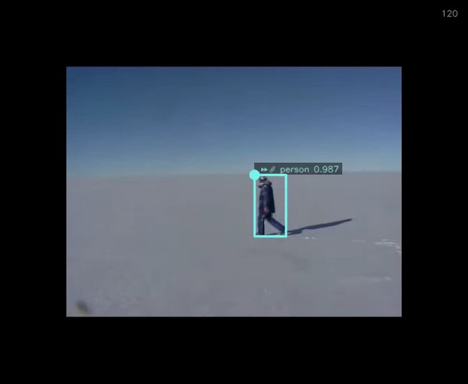

> **NOTICE:** This software (or technical data) was produced for the U.S. Government under contract, 
> and is subject to the Rights in Data-General Clause 52.227-14, Alt. IV (DEC 2007). 
> Copyright 2021 The MITRE Corporation. All Rights Reserved.

# Overview

OpenMPF provides a Markup component that can be used to draw bounding boxes and labels on images and videos. The
component provides one task called `OCV GENERIC MARKUP TASK` that can be added to the end of any image and/or video
pipeline. By default, many other OpenMPF components provide `* (WITH MARKUP)` pipelines that use this task. Note that
the Markup component will not appear in the list of components in the Component Registration web UI because it's a core
feature of OpenMPF.

# Configuration

The following properties can be set as job properties or algorithm properties on the `MARKUPCV` algorithm. Also, the
default values can be changed be setting the system property listed for each:

- `MARKUP_LABELS_ENABLED`
    - System property: `markup.labels.enabled`
    - Default value: `true`  
    - If true, add a label to each detection box.
- `MARKUP_LABELS_ALPHA`
    - System property: `markup.labels.alpha`
    - Default value: `0.5`
    - Value in range [0.0, 1.0] that specifies how transparent the labels and frame number overlay should be. 0.0 is invisible (not recommended) and 1.0 is fully opaque.
- `MARKUP_LABELS_FROM_DETECTIONS`
    - System property: `markup.labels.from.detections`
    - Default value: `false`
    - If true, use detection-level details to populate the bounding box labels. Otherwise, use track-level details.
- `MARKUP_LABELS_TEXT_PROP_TO_SHOW`
    - System property: `markup.labels.text.prop.to.show`
    - Default value: `CLASSIFICATION`
    - Name of the text property to show in the label before the numeric property. If using track-level details, and this property is not present at the track level, then the detection property for the track's exemplar will be used. Leave empty to omit.
    - At most 10 characters of the text value will be displayed in the label.
- `MARKUP_LABELS_NUMERIC_PROP_TO_SHOW`
    - System property: `markup.labels.numeric.prop.to.show`
    - Default value: `CONFIDENCE`
    - Name of the numeric property to show in the label after the text property. If using track-level details, and this property is not present at the track level, then the detection property for the track's exemplar will be used. Leave empty to omit. Set to CONFIDENCE to use the confidence value.
    - Numeric values are displayed with a precision of 3 decimal places in the label.
- `MARKUP_LABELS_CHOOSE_SIDE_ENABLED`
    - System property: `markup.labels.choose.side.enabled`
    - Default value: `true`
    - Labels will always snap to the top-most corner of the box. If true, snap the label to the side of the corner that produces the least amount of overhang. If false, always show the label on the right side of the corner.
- `MARKUP_BORDER_ENABLED`
    - System property: `markup.border.enabled`
    - Default value: `false`
    - If true, generate the marked-up frame with a black border. Can be useful if boxes or labels extend beyond frame boundaries.
- `MARKUP_VIDEO_EXEMPLAR_ICONS_ENABLED`
    - System property: `markup.video.exemplar.icons.enabled`
    - Default value: `true`
    - If true, and labels are enabled, use an icon to indicate the exemplar detection for each track.
    - The icons are only used in video markup. This is because every detection is an exemplar in image markup.
- `MARKUP_VIDEO_BOX_SOURCE_ICONS_ENABLED`
    - System property: `markup.video.box.source.icons.enabled`
    - Default value: `false`
    - If true, and labels are enabled, use icons to indicate the source of each bounding box. For example, if the box is the result of an algorithm detection, tracking performing gap fill, or Workflow Manager animation.
- `MARKUP_VIDEO_MOVING_OBJECT_ICONS_ENABLED`
    - System property: `markup.video.moving.object.icons.enabled`
    - Default value: `false`
    - If true, and labels are enabled, use icons to indicate if the object is considered moving or stationary. If using track-level details, and the `MOVING` property is not present at the track level, then the property for the track's exemplar will be used.
- `MARKUP_VIDEO_FRAME_NUMBERS_ENABLED`
    - System property: `markup.video.frame.numbers.enabled`
    - Default value: `true`
    - If true, add the frame number to each marked-up frame. This setting is independent of `MARKUP_LABELS_ENABLED`.
- `MARKUP_VIDEO_ENCODER`
    - System property: `markup.video.encoder`
    - Default value: `vp9`
    - Use `vp9` to generate VP9-encoded `.webm` video files. Use `h264` to generate H.264-encoded `.mp4` files. Use `mjpeg` to generate MJPEG-encoded `.avi` files. The `.webm` and `.mp4` files can display in most browsers, but take longer to generate.
    - Please review the [Usage Royalties](Distribution-And-Licensing.md#usage-royalties) section of the Distribution and Licensing page before using the H.264 encoder for commercial purposes.
- `MARKUP_VIDEO_VP9_CRF`
    - System property: `markup.video.vp9.crf`
    - Default value: `31`
    - The CRF value can be from 0-63. Lower values mean better quality. Recommended values range from 15-35, with 31 being recommended for 1080p HD video. This property is only used if generating VP9-encoded `.webm` files

# Video Markup Icons

| Icon | Meaning | Setting |
|---|---|---|
|  | Track exemplar | `MARKUP_VIDEO_EXEMPLAR_ICONS_ENABLED` |
|  | Track or detection is moving | `MARKUP_VIDEO_MOVING_OBJECT_ICONS_ENABLED` |
|  | Track or detection is stationary | `MARKUP_VIDEO_MOVING_OBJECT_ICONS_ENABLED` |
|  | Detection is the direct result of a component detection algorithm | `MARKUP_VIDEO_BOX_SOURCE_ICONS_ENABLED`
|  | Detection is the result of a component performing tracking in an attempt to fill in the gaps between algorithm detections | `MARKUP_VIDEO_BOX_SOURCE_ICONS_ENABLED` |
|  | Detection is the result of the Workflow Manager interpolating (animating) the size and position of the bounding box to fill gaps between detections in the track | `MARKUP_VIDEO_BOX_SOURCE_ICONS_ENABLED` |

# Video Markup Examples

Above we show frame 94 of a marked up video. Frame numbers are enabled so the frame number is shown in the top-right corner. Exemplar icons are enabled, and since this detection is the track exemplar a star icon is shown in the label. Also, the label shows the track's `CLASSIFICATION` property followed by the track confidence. All of the examples shown in this section will display track-level information because `MARKUP_LABELS_FROM_DETECTIONS=false`. The circle represents the top-left corner of the detection. See [this section](CPP-Batch-Component-API.md#rotation-and-horizontal-flip) of the C++ Batch Component API for more information on flip and rotation.

Above we show frame 25 of the marked up video. This time we configured markup to show a black border around the video frame. This is useful when the label extends beyond the edge of the original video frame, as shown here. Also, this time we configured markup to show icons indicating if the track is moving or stationary. The fast-forward icon at the start of the label indicates that this track is moving. Additionally, this time we configured markup to show icons indicating the bounding box source. The magnifying glass icon after the fast-forward icon indicates that this detection is a direct result of the component's detection algorithm. Note that the magnifying glass icon will be replaced with the star icon for exemplars.

The frame above shows a movie camera icon to indicate that the detection is the result of the Workflow Manager (WFM) interpolating (animating) the size and position of the bounding box to fill gaps between detections in the track. Considering how blurry the person appears in this frame, it's not surprising that the algorithm could not detect him. If you perform a job with `FRAME_INTERVAL` greater than one, or otherwise perform frame skipping, then all bounding boxes in skipped frames will be the result of WFM animation. Note that the classification and confidence values are simply carried over from the last detection that was not the result of WFM animation.

The frame above shows a paper clip icon to indicate that the detection is the result of the component performing tracking in an attempt to fill in the gaps between algorithm detections. In general, these detections are more trustworthy than the ones resulting from WFM animation, but not as trustworthy as the ones directly resulting from the detection algorithm.

The frame above shows the person detection in addition to a new skis detection. The confidence for the latter is lower, which is good considering the algorithm misclassified the person's shadow as skis. The skis track is only a few frames long, so the WFM determined it was a non-moving (stationary) track. This is represented by the anchor icon at the start of the label. Also, notice that the labels are semi-transparent. This allows you to read labels and see frame content that would otherwise be hidden if the labels were completely opaque. Note that you may want to set `MARKUP_LABELS_ALPHA` to `0.75` or greater when using the `mjpeg` encoder.
  
# Video Encoder Considerations

Performing markup on an image will always generate a `.png` file. Performing markup on a video will generate a video file based on the value of `MARKUP_VIDEO_ENCODER`. The `vp9`, `h264`, and `mjpg` encoders are supported. 

The `vp9` and `h264` encoders serve the same purpose in that both formats can be played in the WFM web UI in most web browsers, while the `.avi` files resulting from the `mjpeg` format must be downloaded and played using a separate program like [VLC](https://www.videolan.org/vlc/index.html) or [mpv](https://mpv.io/). In general, `h264` encoding is much faster than `vp9` encoding, so you may want to use it instead of `vp9`. Please be aware that you may be required to pay [Usage Royalties](Distribution-And-Licensing.md#usage-royalties) when using the `h264` encoder for commercial purposes.

The `mjpeg` encoder is faster than both the `vp9` and `h264` encoders. You may want to use it when developing components or marking up large video files.

To give you a sense of performance, here are the results of a very limited batch of tests. Note that if you choose to use the `vp9` encoder, you can increase the CRF value to reduce processing time at the cost of reduced video quality.

**input media: 23 frames @ 3840x2160:**

| Encoder | CRF | Time (secs) | Notes |
|---|---|---|---|
| mjpeg | | 6.94 | |
| h264 | | 9.478 | |
| vp9 | 60 | 13.194 | |
| vp9 | 31 | 21.431 | |

**input media: 509 frames @ 640x480:**

| Encoder | CRF | Time (secs) | Notes |
|---|---|---|---|
| mjpeg | | 6.927 | alpha 0.5 is hard to read when blended with dark background; 0.75 does better |
| h264 | | 11.259 | |
| vp9 | 60 | 35.945 | text not acceptable due to low resolution |
| vp9 | 31 | 52.178 | |
