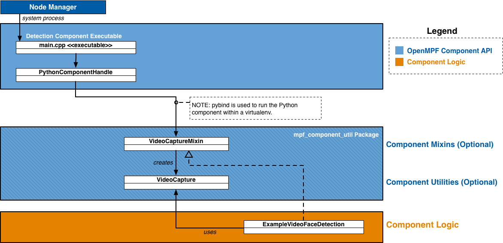

> **NOTICE:** This software (or technical data) was produced for the U.S. Government under contract, and is subject to
> the Rights in Data-General Clause 52.227-14, Alt. IV (DEC 2007).
> Copyright 2020 The MITRE Corporation. All Rights Reserved.

# API Overview

In OpenMPF, a **component** is a plugin that receives jobs (containing media), processes that  media, and returns results.

The OpenMPF Batch Component API currently supports the development of **detection components**, which are used detect
objects in image, video, audio, or other (generic) files that reside on disk.

Using this API, detection components can be built to provide:

* Detection (Localizing an object)
* Tracking (Localizing an object across multiple frames)
* Classification (Detecting the type of object and optionally localizing that object)
* Transcription (Detecting speech and transcribing it into text)

## How Components Integrate into OpenMPF

Components are integrated into OpenMPF through the use of OpenMPF's **Component Executable**.
Developers create component libraries that encapsulate the component detection logic.
Each instance of the Component Executable loads one of these libraries and uses it to service job requests
sent by the OpenMPF Workflow Manager (WFM).

The Component Executable:

1. Receives and parses job requests from the WFM
2. Invokes methods on the component library to obtain detection results
3. Populates and sends the respective responses to the WFM

The basic psuedocode for the Component Executable is as follows:
```python
component_cls = locate_component_class()
component = component_cls()
detection_type = component.detection_type

while True:
    job = receive_job()

    if is_image_job(job) and hasattr(component, 'get_detections_from_image'):
        detections = component.get_detections_from_image(job)
        send_job_response(detections)

    elif is_video_job(job) and hasattr(component, 'get_detections_from_video'):
        detections = component.get_detections_from_video(job)
        send_job_response(detections)

    elif is_audio_job(job) and hasattr(component, 'get_detections_from_audio'):
        detections = component.get_detections_from_audio(job)
        send_job_response(detections)

    elif is_generic_job(job) and hasattr(component, 'get_detections_from_generic'):
        detections = component.get_detections_from_generic(job)
        send_job_response(detections)
```

Each instance of a Component Executable runs as a separate process.

The Component Executable receives and parses requests from the WFM, invokes methods on the Component Logic to get
detection objects, and subsequently populates responses with the component output and sends them to the WFM.

A component developer implements a detection component by creating a class that defines one or more of the
get_detections_from_* methods and has a [`detection_type`](#componentdetection_type) field.
See the [API Specification](#api-specification) for more information.

The figures below present high-level component diagrams of the Python Batch Component API.
This figure shows the basic structure:


The figure above shows the Node Manager starting the Detection Component Executable.
The Detection Component Executable determines that it is running a Python component so it creates an instance of the
[`PythonComponentHandle`](https://github.com/openmpf/openmpf/blob/master/trunk/detection/executor/cpp/batch/PythonComponentHandle.h)
class. The `PythonComponentHandle` class creates an instance of the component class and calls one of the
[get_detections_from_*](#componentget_detections_from_42-methods) methods on the component instance. The example
above is an image component, so `PythonComponentHandle` calls `ExampleImageFaceDetection.get_detections_from_image`
on the component instance. The component instance creates an instance of
[`mpf_component_util.ImageReader`](#mpf_component_utilimagereader) to access the image. Components that support video
would implement `get_detections_from_video` and use
[`mpf_component_util.VideoCapture`](#mpf_component_utilvideocapture) instead.


This figure show the structure when the mixin classes are used:



The figure above shows a video component, `ExampleVideoFaceDetection`, that extends the
[`mpf_component_util.VideoCaptureMixin`](#mpf_component_utilvideocapturemixin) class. `PythonComponentHandle` will
call `get_detections_from_video` on an instance of `ExampleVideoFaceDetection`. `ExampleVideoFaceDetection` does not
implement `get_detections_from_video`, so the implementation inherited from `mpf_component_util.VideoCaptureMixin`
gets called. `mpf_component_util.VideoCaptureMixin.get_detections_from_video` creates an instance of
[`mpf_component_util.VideoCapture`](#mpf_component_utilvideocapture) and calls
`ExampleVideoFaceDetection.get_detections_from_video_capture`, passing in the `mpf_component_util.VideoCapture` it
just created. `ExampleVideoFaceDetection.get_detections_from_video_capture` is where the component reads the video
using the passed-in `mpf_component_util.VideoCapture` and attempts to find detections. Components that support images
would extend [`mpf_component_util.ImageReaderMixin`](#mpf_component_utilimagereadermixin), implement
`get_detections_from_image_reader`, and access the image using the passed-in
[`mpf_component_util.ImageReader`](#mpf_component_utilimagereader).


During component registration a [virtualenv](http://virtualenv.pypa.io) is created for each component.
The virtualenv has access to the built-in Python libraries, but does not have access to any third party packages
that might be installed on the system. When creating the virtualenv for a setuptools-based component the only packages
that get installed are the component itself and any dependencies specified in the setup.py
file (including their transitive dependencies). When creating the virtualenv for a basic Python component the only
package that gets installed is `mpf_component_api`. `mpf_component_api` is the package containing the job classes
(e.g. [`mpf_component_api.ImageJob`](#mpf_component_apiimagejob),
[`mpf_component_api.VideoJob`](#mpf_component_apivideojob)) and detection result classes
(e.g. [`mpf_component_api.ImageLocation`](#mpf_component_apiimagelocation),
[`mpf_component_api.VideoTrack`](#mpf_component_apivideotrack)).


# How to Create a Python Component
There are two types of Python components that are supported, setuptools-based components and basic Python components.
Basic Python components are quicker to set up, but have no built-in support for dependency management.
All dependencies must be handled by the developer. Setuptools-based components are recommended since they use
setuptools and pip for dependency management.

## Get openmpf-python-component-sdk
In order to create a Python component you will need to clone the
[openmpf-python-component-sdk repository](https://github.com/openmpf/openmpf-python-component-sdk) if you don't
already have it. While not technically required, it is recommended to also clone the
[openmpf-build-tools repository](https://github.com/openmpf/openmpf-build-tools).
The rest of the steps assume you cloned openmpf-python-component-sdk to
`~/openmpf-projects/openmpf-python-component-sdk`. The rest of the steps also assume that if you cloned the
openmpf-build-tools repository, you cloned it to `~/openmpf-projects/openmpf-build-tools`.


## Setup Python Component Libraries
The component packaging steps require that wheel files for `mpf_component_api`, `mpf_component_util`, and
their dependencies are available in the `~/mpf-sdk-install/python/wheelhouse` directory.

If you have openmpf-build-tools, then you can run:
```bash
~/openmpf-projects/openmpf-build-tools/build-openmpf-components/build_components.py -psdk ~/openmpf-projects/openmpf-python-component-sdk
```
To setup the libraries manually you can run:
```bash
pip3 wheel -w ~/mpf-sdk-install/python/wheelhouse ~/openmpf-projects/openmpf-python-component-sdk/detection/api
pip3 wheel -w ~/mpf-sdk-install/python/wheelhouse ~/openmpf-projects/openmpf-python-component-sdk/detection/component_util
```


## How to Create a Setuptools-based Python Component
In this example we create a setuptools-based video component named "MyComponent". An example of a setuptools-based
Python component can be found
[here](https://github.com/openmpf/openmpf-python-component-sdk/tree/master/detection/examples/PythonOcvComponent).

This is the recommended project structure:
```
ComponentName
├── setup.py
├── component_name
│   ├── __init__.py
│   └── component_name.py
└── plugin-files
    ├── descriptor
    │   └── descriptor.json
    └── wheelhouse  # optional
        └── my_prebuilt_lib-0.1-py3-none-any.whl
```

**1\. Create directory structure:**
```bash
mkdir MyComponent
mkdir MyComponent/my_component
mkdir -p MyComponent/plugin-files/descriptor
touch MyComponent/setup.py
touch MyComponent/my_component/__init__.py
touch MyComponent/my_component/my_component.py
touch MyComponent/plugin-files/descriptor/descriptor.json
```

**2\. Create setup.py file in project's top-level directory:**

Example of a minimal setup.py file:
```python
import setuptools

setuptools.setup(
    name='MyComponent',
    version='0.1',
    packages=setuptools.find_packages(),
    install_requires=(
        'mpf_component_api>=0.1',
        'mpf_component_util>=0.1'
    ),
    entry_points={
        'mpf.exported_component': 'component = my_component.my_component:MyComponent'
    }

)
```
The `name` parameter defines the distribution name. Typically the distribution name matches the component name.

Any dependencies that component requires should be listed in the `install_requires` field.

The component executor looks in the `entry_points` element and uses the `mpf.exported_component` field to determine
the component class. The right hand side of `component = ` should be the dotted module name, followed by a `:`,
followed by the name of the class. The general pattern is
`'mpf.exported_component': 'component = <package_name>.<module_name>:<class_name>'`. In the above example,
`MyComponent` is the class name. The module is listed as `my_component.my_component` because the `my_component`
package contains the `my_component.py` file and the `my_component.py` file contains the `MyComponent` class.


**3\. Create descriptor.json file in MyComponent/plugin-files/descriptor:**

The `batchLibrary` field should match the distribution name from the setup.py file. In this example the
field should be: `"batchLibrary" : "MyComponent"`.
See [Packaging and Registering a Component](Packaging-and-Registering-a-Component/index.html) for details about
the descriptor format.


**4\. Implement your component class:**

Below is an example of the structure of a simple component. This component extends
[`mpf_component_util.VideoCaptureMixin`](#mpf_component_utilvideocapturemixin) to simplify the use of
[`mpf_component_util.VideoCapture`](#mpf_component_utilvideocapture). You would replace the call to
`run_detection_algorithm_on_frame` with your component-specific logic.
```python
import mpf_component_api as mpf
import mpf_component_util as mpf_util

logger = mpf.configure_logging('my-component.log', __name__ == '__main__')

class MyComponent(mpf_util.VideoCaptureMixin, object):
    detection_type = 'FACE'

    @staticmethod
    def get_detections_from_video_capture(video_job, video_capture):
        logger.info('[%s] Received video job: %s', video_job.job_name, video_job)
        # If frame index is not required, you can just loop over video_capture directly
        for frame_index, frame in enumerate(video_capture):
            for result_track in run_detection_algorithm_on_frame(frame_index, frame):
                # Alternatively, while iterating through the video, add tracks to a list. When done, return that list.
                yield result_track
```


**5\. Optional: Add prebuilt wheel files if not available on PyPi:**

If your component depends on Python libraries that are not available on PyPi, the libraries can be manually added to
your project. The prebuilt libraries must be placed in your project's `plugin-files/wheelhouse` directory.
The prebuilt library names must be listed in your `setup.py` file's `install_requires` field.
If any of the prebuilt libraries have transitive dependencies that are not available on PyPi, then those libraries
must also be added to your project's `plugin-files/wheelhouse` directory.


**6\. Create the plugin package:**

The directory structure of the .tar.gz file will be:
```
MyComponent
├── descriptor
│   └── descriptor.json
└── wheelhouse
    ├── MyComponent-0.1-py3-none-any.whl
    ├── mpf_component_api-0.1-py3-none-any.whl
    ├── mpf_component_util-0.1-py3-none-any.whl
    ├── numpy-1.18.4-cp38-cp38-manylinux1_x86_64.whl
    └── opencv_python-4.2.0.34-cp38-cp38-manylinux1_x86_64.whl
```

To create the plugin packages you can run the build script as follows:
```
~/openmpf-projects/openmpf-build-tools/build-openmpf-components/build_components.py -psdk ~/openmpf-projects/openmpf-python-component-sdk -c MyComponent
```

The plugin package can also be built manually using the following commands:
```bash
mkdir -p plugin-packages/MyComponent/wheelhouse
cp -r MyComponent/plugin-files/* plugin-packages/MyComponent/
pip3 wheel -w plugin-packages/MyComponent/wheelhouse -f ~/mpf-sdk-install/python/wheelhouse -f plugin-packages/MyComponent/wheelhouse ./MyComponent/
cd plugin-packages
tar -zcf MyComponent.tar.gz MyComponent
```

## How to Create a Basic Python Component
In this example we create a basic Python component that supports video. An example of a basic Python component can be
found
[here](https://github.com/openmpf/openmpf-python-component-sdk/tree/master/detection/examples/PythonTestComponent).

This is the recommended project structure:
```
ComponentName
├── component_name.py
├── dependency.py
└── descriptor
    └── descriptor.json
```

**1\. Create directory structure:**
```bash
mkdir MyComponent
mkdir MyComponent/descriptor
touch MyComponent/descriptor/descriptor.json
touch MyComponent/my_component.py
```

**2\. Create descriptor.json file in MyComponent/descriptor:**

The `batchLibrary` field should be the full path to the Python file containing your component class.
In this example the field should be: `"batchLibrary" : "${MPF_HOME}/plugins/MyComponent/my_component.py"`.
See [Packaging and Registering a Component](Packaging-and-Registering-a-Component/index.html) for details about
the descriptor format.


**3\. Implement your component class:**

Below is an example of the structure of a simple component that does not use
[`mpf_component_util.VideoCaptureMixin`](#mpf_component_utilvideocapturemixin). You would replace the call to
`run_detection_algorithm` with your component-specific logic.
```python
import mpf_component_api as mpf

logger = mpf.configure_logging('my-component.log', __name__ == '__main__')

class MyComponent(object):
    detection_type = 'FACE'

    @staticmethod
    def get_detections_from_video(video_job):
        logger.info('[%s] Received video job: %s', video_job.job_name, video_job)
        return run_detection_algorithm(video_job)

EXPORT_MPF_COMPONENT = MyComponent
```
The component executor looks for a module-level variable named `EXPORT_MPF_COMPONENT` to specify which class
is the component.

**4\. Create the plugin package:**

The directory structure of the .tar.gz file will be:
```
ComponentName
├── component_name.py
├── dependency.py
└── descriptor
    └── descriptor.json
```  
To create the plugin packages you can run the build script as follows:
```
~/openmpf-projects/openmpf-build-tools/build-openmpf-components/build_components.py -c MyComponent
```

The plugin package can also be built manually using the following command:
```bash
tar -zcf MyComponent.tar.gz MyComponent
```


# API Specification

An OpenMPF Python component is a class that defines one or more of the get_detections_from_\* methods and has a
`detection_type` field.


#### component.get_detections_from_\* methods
All get_detections_from_\* methods are invoked through an instance of the component class. The only parameter passed
in is an appropriate job object (e.g. `mpf_component_api.ImageJob`, `mpf_component_api.VideoJob`). Since the methods
are invoked through an instance, instance methods and class methods end up with two arguments, the first is either the
instance or the class, respectively. All get_detections_from_\* methods can be implemented either as an instance method,
a static method, or a class method.
For example:

instance method:
```python
class MyComponent(object):
    def get_detections_from_image(self, image_job):
        return [mpf_component_api.ImageLocation(...), ...]
```

static method:
```python
class MyComponent(object):
    @staticmethod
    def get_detections_from_image(image_job):
        return [mpf_component_api.ImageLocation(...), ...]
```

class method:
```python
class MyComponent(object):
    @classmethod
    def get_detections_from_image(cls, image_job):
        return [mpf_component_api.ImageLocation(...), ...]
```

All get_detections_from_\* methods must return an iterable of the appropriate detection type
(e.g. `mpf_component_api.ImageLocation`, `mpf_component_api.VideoTrack`). The return value is normally a list or generator,
but any iterable can be used.


#### component.detection_type
* `str` field describing the type of object that is detected by the component. Should be in all CAPS.
Examples include: `FACE`, `MOTION`, `PERSON`, `SPEECH`, `CLASS` (for object classification), or `TEXT`.
* Example:
```python
class MyComponent(object):
    detection_type = 'FACE'

```


## Image API

#### component.get_detections_from_image(image_job)

Used to detect objects in an image file.

* Method Definition:
```python
class MyComponent(object):
    def get_detections_from_image(self, image_job):
        return [mpf_component_api.ImageLocation(...), ...]
```

`get_detections_from_image`, like all get_detections_from_\* methods, can be implemented either as an instance method,
a static method, or a class method.

* Parameters:

| Parameter | Data Type                    | Description |
|-----------|------------------------------|-------------|
| image_job | `mpf_component_api.ImageJob` | Object containing details about the work to be performed.

* Returns: An iterable of `mpf_component_api.ImageLocation`

#### mpf_component_api.ImageJob

Class containing data used for detection of objects in an image file.

* Members:

<table>
  <thead>
    <tr>
      <th>Member</th>
      <th>Data Type</th>
      <th>Description</th>
    </tr>
  </thead>
  <tbody>
    <tr>
      <td>job_name</td>
      <td><code>str</code></td>
      <td>A specific name given to the job by the OpenMPF framework. This value may be used, for example, for logging and debugging purposes.</td>
    </tr>
    <tr>
      <td>data_uri</td>
      <td><code>str</code></td>
      <td>The URI of the input media file to be processed. Currently, this is a file path. For example, "/opt/mpf/share/remote-media/test-file.jpg".</td>
    </tr>
    <tr>
      <td>job_properties</td>
      <td><code>dict[str, str]</code></td>
      <td>
        Contains a dict with keys and values of type <code>str</code> which represent the property name and the property value. The key corresponds to the property name specified in the component descriptor file described in <a href="../Packaging-and-Registering-a-Component/index.html">Packaging and Registering a Component</a>. Values are determined when creating a pipeline or when submitting a job.
        <br/><br/>
        Note: The job_properties dict may not contain the full set of job properties. For properties not contained in the dict, the component must use a default value.
      </td>
    </tr>
    <tr>
      <td>media_properties</td>
      <td><code>dict[str, str]</code></td>
      <td>
        Contains a dict with keys and values of type <code>str</code> of metadata about the media associated with the job.
        <br/><br/>
        Includes the following key-value pairs:
        <ul>
          <li><code>MIME_TYPE</code> : the MIME type of the media</li>
          <li><code>FRAME_WIDTH</code> : the width of the image in pixels</li>
          <li><code>FRAME_HEIGHT</code> : the height of the image in pixels</li>
        </ul>
        May include the following key-value pairs:
        <ul>
          <li><code>ROTATION</code> : A floating point value in the interval <code>[0.0, 360.0)</code> indicating the orientation of the media in degrees in the counter-clockwise direction. In order to view the media in the upright orientation, it must be rotated the given number of degrees in the clockwise direction.</li>
          <li><code>HORIZONTAL_FLIP</code> : true if the image is mirrored across the Y-axis, otherwise false</li>
          <li><code>EXIF_ORIENTATION</code> : the standard EXIF orientation tag; a value between 1 and 8</li>
        </ul>
      </td>
    </tr>
    <tr>
      <td>feed_forward_location</td>
      <td><code>None</code> or <code>mpf_component_api.ImageLocation</code></td>
      <td>An <code>mpf_component_api.ImageLocation</code> from the previous pipeline stage. Provided when feed forward is enabled. See <a href="../Feed-Forward-Guide/index.html">Feed Forward Guide</a>.</td>
    </tr>
  </tbody>
</table>


Job properties can also be set through environment variables prefixed with `MPF_PROP_`. This allows
users to set job properties in their
[docker-compose files.](https://github.com/openmpf/openmpf-docker/blob/32d072c9578441f2a07ec2da3bc3765aa1ff9cce/docker-compose.components.yml#L96)
These will take precedence over all other property types (job, algorithm, media, etc). It is not
possible to change the value of properties set via environment variables at runtime and therefore
they should only be used to specify properties that will not change throughout the entire lifetime
of the service (e.g. Docker container).


#### mpf_component_api.ImageLocation
Class used to store the location of detected objects in a image file.

* Constructor:
```python
def __init__(self, x_left_upper, y_left_upper, width, height, confidence=-1.0, detection_properties=None):
    ...
```

* Members:

| Member               | Data Type | Description |
|----------------------|-----------|-------------|
| x_left_upper         | `int`     | Upper left X coordinate of the detected object. |
| y_left_upper         | `int`     | Upper left Y coordinate of the detected object. |
| width                | `int`     | The width of the detected object. |
| height               | `int`     | The height of the detected object. |
| confidence           | `float`   | Represents the "quality" of the detection. The range depends on the detection algorithm. 0.0 is lowest quality. Higher values are higher quality. Using a standard range of [0.0 - 1.0] is advised. If the component is unable to supply a confidence value, it should return -1.0. |
| detection_properties | `dict[str, str]` | A dict with keys and values of type `str` containing optional additional information about the detected object. For best practice, keys should be in all CAPS. |

[See here for information about rotation and horizontal flipping.](CPP-Batch-Component-API.md#rotation-flip-info)

* Example:

A component that performs generic object classification can add an entry to `detection_properties` where the key is
`CLASSIFICATION` and the value is the type of object detected.
```python
mpf_component_api.ImageLocation(0, 0, 100, 100, 1.0, {'CLASSIFICATION': 'backpack'})
```


#### mpf_component_util.ImageReader
`mpf_component_util.ImageReader` is a utility class for accessing images. It is the image equivalent to
`mpf_component_util.VideoCapture`. Like [`mpf_component_util.VideoCapture`](#mpf_component_utilvideocapture),
it may modify the read-in frame data based on job_properties. From the point of view of someone using
`mpf_component_util.ImageReader`, these modifications are mostly transparent. `mpf_component_util.ImageReader` makes
it look like you are reading the original image file as though it has already been rotated, flipped, cropped, etc.

One issue with this approach is that the detection bounding boxes will be relative to the
modified frame data, not the original. To make the detections relative to the original image
the `mpf_component_util.ImageReader.reverse_transform(image_location)` method must be called on each
`mpf_component_api.ImageLocation`. Since the use of `mpf_component_util.ImageReader` is optional, the framework
cannot automatically perform the reverse transform for the developer.

The general pattern for using `mpf_component_util.ImageReader` is as follows:
```python
class MyComponent(object):

    @staticmethod
    def get_detections_from_image(image_job):
        image_reader = mpf_component_util.ImageReader(image_job)
        image = image_reader.get_image()
        # run_component_specific_algorithm is a placeholder for this example.
        # Replace run_component_specific_algorithm with your component's detection logic
        result_image_locations = run_component_specific_algorithm(image)
        for result in result_image_locations:
            image_reader.reverse_transform(result)
            yield result
```

Alternatively, see the documentation for `mpf_component_util.ImageReaderMixin` for a more concise way to use
`mpf_component_util.ImageReader` below.


#### mpf_component_util.ImageReaderMixin
A mixin class that can be used to simplify the usage of `mpf_component_util.ImageReader`.
`mpf_component_util.ImageReaderMixin` takes care of initializing a `mpf_component_util.ImageReader` and
performing the reverse transform.

There are some requirements to properly use `mpf_component_util.ImageReaderMixin`:

* The component must extend `mpf_component_util.ImageReaderMixin`.
* The component must implement `get_detections_from_image_reader(image_job, image_reader)`.
* The component must read the image using the `mpf_component_util.ImageReader`
  that is passed in to `get_detections_from_image_reader(image_job, image_reader)`.
* The component must NOT implement `get_detections_from_image(image_job)`.
* The component must NOT call `mpf_component_util.ImageReader.reverse_transform`.

The general pattern for using `mpf_component_util.ImageReaderMixin` is as follows:
```python
class MyComponent(mpf_component_util.ImageReaderMixin, object):

    @staticmethod # Can also be a regular instance method or a class method
    def get_detections_from_image_reader(image_job, image_reader):
        image = image_reader.get_image()

        # run_component_specific_algorithm is a placeholder for this example.
        # Replace run_component_specific_algorithm with your component's detection logic
        return run_component_specific_algorithm(image)
```

`mpf_component_util.ImageReaderMixin` is a mixin class so it is designed in a way that does not prevent the subclass
from extending other classes. If a component supports both videos and images, and it uses
[`mpf_component_util.VideoCaptureMixin`](#mpf_component_utilvideocapturemixin), it should also use
`mpf_component_util.ImageReaderMixin`.


## Video API

#### component.get_detections_from_video(video_job)

Used to detect objects in a video file. Prior to being sent to the component, videos are split into logical "segments"
of video data and each segment (containing a range of frames) is assigned to a different job. Components are not
guaranteed to receive requests in any order. For example, the first request processed by a component might receive a
request for frames 300-399 of a Video A, while the next request may cover frames 900-999 of a Video B.

* Method Definition:
```python
class MyComponent(object):
    def get_detections_from_video(self, video_job):
        return [mpf_component_api.VideoTrack(...), ...]
```

`get_detections_from_video`, like all get_detections_from_\* methods, can be implemented either as an instance method,
a static method, or a class method.

* Parameters:

| Parameter | Data Type                    | Description |
|-----------|------------------------------|-------------|
| video_job | `mpf_component_api.VideoJob` | Object containing details about the work to be performed.

* Returns: An iterable of `mpf_component_api.VideoTrack`


#### mpf_component_api.VideoJob
Class containing data used for detection of objects in a video file.

* Members:

<table>
  <thead>
    <tr>
      <th>Member</th>
      <th>Data Type</th>
      <th>Description</th>
    </tr>
  </thead>
  <tbody>
    <tr>
      <td>job_name</td>
      <td><code>str</code></td>
      <td>A specific name given to the job by the OpenMPF framework. This value may be used, for example, for logging and debugging purposes.</td>
    </tr>
    <tr>
      <td>data_uri</td>
      <td><code>str</code></td>
      <td>The URI of the input media file to be processed. Currently, this is a file path. For example, "/opt/mpf/share/remote-media/test-file.avi".</td>
    </tr>
    <tr>
      <td>start_frame</td>
      <td><code>int</code></td>
      <td>The first frame number (0-based index) of the video that should be processed to look for detections.</td>
    </tr>    
    <tr>
      <td>stop_frame</td>
      <td><code>int</code></td>
      <td>The last frame number (0-based index) of the video that should be processed to look for detections.</td>
    </tr>    
    <tr>
      <td>job_properties</td>
      <td><code>dict[str, str]</code></td>
      <td>
        Contains a dict with keys and values of type <code>str</code> which represent the property name and the property value. The key corresponds to the property name specified in the component descriptor file described in <a href="../Packaging-and-Registering-a-Component/index.html">Packaging and Registering a Component</a>. Values are determined when creating a pipeline or when submitting a job.
        <br/><br/>
        Note: The job_properties dict may not contain the full set of job properties. For properties not contained in the dict, the component must use a default value.
      </td>
    </tr>
    <tr>
      <td>media_properties</td>
      <td><code>dict[str, str]</code></td>
      <td>
        Contains a dict with keys and values of type <code>str</code> of metadata about the media associated with the job.
        <br/><br/>
        Includes the following key-value pairs:
        <ul>
          <li><code>DURATION</code> : length of video in milliseconds</li>
          <li><code>FPS</code> : frames per second (averaged for variable frame rate video)</li>
          <li><code>FRAME_COUNT</code> : the number of frames in the video</li>
          <li><code>MIME_TYPE</code> : the MIME type of the media</li>
          <li><code>FRAME_WIDTH</code> : the width of a frame in pixels</li>
          <li><code>FRAME_HEIGHT</code> : the height of a frame in pixels</li>
        </ul>
        May include the following key-value pair:
        <ul>
          <li><code>ROTATION</code> : A floating point value in the interval <code>[0.0, 360.0)</code> indicating the orientation of the media in degrees in the counter-clockwise direction. In order to view the media in the upright orientation, it must be rotated the given number of degrees in the clockwise direction.</li>
        </ul>
      </td>
    </tr>
    <tr>
      <td>feed_forward_track</td>
      <td><code>None</code> or <code>mpf_component_api.VideoTrack</code></td>
      <td>An <code>mpf_component_api.VideoTrack</code> from the previous pipeline stage. Provided when feed forward is enabled. See <a href="../Feed-Forward-Guide/index.html">Feed Forward Guide</a>.</td>
    </tr>
  </tbody>
</table>

> **IMPORTANT:** `FRAME_INTERVAL` is a common job property that many components support.
> For frame intervals greater than 1, the component must look for detections starting with the first
> frame, and then skip frames as specified by the frame interval, until or before it reaches the stop frame.
> For example, given a start frame of 0, a stop frame of 99, and a frame interval of 2, then the detection component
> must look for objects in frames numbered 0, 2, 4, 6, ..., 98.

Job properties can also be set through environment variables prefixed with `MPF_PROP_`. This allows
users to set job properties in their
[docker-compose files.](https://github.com/openmpf/openmpf-docker/blob/32d072c9578441f2a07ec2da3bc3765aa1ff9cce/docker-compose.components.yml#L96)
These will take precedence over all other property types (job, algorithm, media, etc). It is not
possible to change the value of properties set via environment variables at runtime and therefore
they should only be used to specify properties that will not change throughout the entire lifetime
of the service (e.g. Docker container).


#### mpf_component_api.VideoTrack
Class used to store the location of detected objects in a video file.

* Constructor:
```python
def __init__(self, start_frame, stop_frame, confidence=-1.0, frame_locations=None, detection_properties=None):
    ...
```

* Members:

| Member               | Data Type | Description |
|----------------------|-----------|-------------|
| start_frame          | `int`     | The first frame number (0-based index) that contained the detected object. |
| stop_frame           | `int`     | The last frame number (0-based index) that contained the detected object. |
| confidence           | `float`   | Represents the "quality" of the detection. The range depends on the detection algorithm. 0.0 is lowest quality. Higher values are higher quality. Using a standard range of [0.0 - 1.0] is advised. If the component is unable to supply a confidence value, it should return -1.0. |
| frame_locations      | `dict[int, mpf_component_api.ImageLocation]` |  A dict of individual detections. The key for each entry is the frame number where the detection was generated, and the value is a `mpf_component_api.ImageLocation` calculated as if that frame was a still image. Note that a key-value pair is *not* required for every frame between the track start frame and track stop frame. |
| detection_properties | `dict[str, str]` | A dict with keys and values of type `str` containing optional additional information about the detected object. For best practice, keys should be in all CAPS. |

> **NOTE:** Currently, `mpf_component_api.VideoTrack.detection_properties` do not show up in the JSON output object or
> are used by the WFM in any way.

* Example:

A component that performs generic object classification can add an entry to `detection_properties` where the key is
`CLASSIFICATION` and the value is the type of object detected.
```python
track = mpf_component_api.VideoTrack(0, 1)
track.frame_locations[0] = mpf_component_api.ImageLocation(0, 0, 100, 100, 0.75, {'CLASSIFICATION': 'backpack'})
track.frame_locations[1] = mpf_component_api.ImageLocation(10, 10, 110, 110, 0.95, {'CLASSIFICATION': 'backpack'})
track.confidence = max(il.confidence for il in track.frame_locations.itervalues())
```

#### mpf_component_util.VideoCapture
`mpf_component_util.VideoCapture` is a utility class for reading videos. `mpf_component_util.VideoCapture` works very
similarly to `cv2.VideoCapture`, except that it might modify the video frames based on job properties. From the point
of view of someone using `mpf_component_util.VideoCapture`, these modifications are mostly transparent.
`mpf_component_util.VideoCapture` makes it look like you are reading the original video file as though it has already
been rotated, flipped, cropped, etc. Also, if frame skipping is enabled, such as by setting the value of the
`FRAME_INTERVAL` job property, it makes it look like you are reading the video as though it never contained the
skipped frames.


One issue with this approach is that the detection frame numbers and bounding box will be relative to the
modified video, not the original. To make the detections relative to the original video
the `mpf_component_util.VideoCapture.reverse_transform(video_track)` method must be called on each
`mpf_component_api.VideoTrack`. Since the use of `mpf_component_util.VideoCapture` is optional, the framework
cannot automatically perform the reverse transform for the developer.

The general pattern for using `mpf_component_util.VideoCapture` is as follows:
```python
class MyComponent(object):

    @staticmethod
    def get_detections_from_video(video_job):
        video_capture = mpf_component_util.VideoCapture(video_job)
        # If frame index is not required, you can just loop over video_capture directly
        for frame_index, frame in enumerate(video_capture):
            # run_component_specific_algorithm is a placeholder for this example.
            # Replace run_component_specific_algorithm with your component's detection logic
            result_tracks = run_component_specific_algorithm(frame_index, frame)
            for track in result_tracks:
                video_capture.reverse_transform(track)
                yield track
```

Alternatively, see the documentation for `mpf_component_util.VideoCaptureMixin` for a more concise way to use
`mpf_component_util.VideoCapture` below.


#### mpf_component_util.VideoCaptureMixin
A mixin class that can be used to simplify the usage of `mpf_component_util.VideoCapture`.
`mpf_component_util.VideoCaptureMixin` takes care of initializing a `mpf_component_util.VideoCapture` and
performing the reverse transform.

There are some requirements to properly use `mpf_component_util.VideoCaptureMixin`:

* The component must extend `mpf_component_util.VideoCaptureMixin`.
* The component must implement `get_detections_from_video_capture(video_job, video_capture)`.
* The component must read the video using the `mpf_component_util.VideoCapture`
  that is passed in to `get_detections_from_video_capture(video_job, video_capture)`.
* The component must NOT implement `get_detections_from_video(video_job)`.
* The component must NOT call `mpf_component_util.VideoCapture.reverse_transform`.


The general pattern for using `mpf_component_util.VideoCaptureMixin` is as follows:
```python
class MyComponent(mpf_component_util.VideoCaptureMixin, object):

    @staticmethod # Can also be a regular instance method or a class method
    def get_detections_from_video_capture(video_job, video_capture):
        # If frame index is not required, you can just loop over video_capture directly
        for frame_index, frame in enumerate(video_capture):
            # run_component_specific_algorithm is a placeholder for this example.
            # Replace run_component_specific_algorithm with your component's detection logic
            result_tracks = run_component_specific_algorithm(frame_index, frame)
            for track in result_tracks:
                # Alternatively, while iterating through the video, add tracks to a list. When done, return that list.
                yield track
```

`mpf_component_util.VideoCaptureMixin` is a mixin class so it is designed in a way that does not prevent the subclass
from extending other classes. If a component supports both videos and images, and it uses
`mpf_component_util.VideoCaptureMixin`, it should also use
[`mpf_component_util.ImageReaderMixin`](#mpf_component_utilimagereadermixin).
For example:
```python
class MyComponent(mpf_component_util.VideoCaptureMixin, mpf_component_util.ImageReaderMixin, object):

    @staticmethod
    def get_detections_from_video_capture(video_job, video_capture):
        ...

    @staticmethod
    def get_detections_from_image_reader(image_job, image_reader):
       ...
```


## Audio API

#### component.get_detections_from_audio(audio_job)

Used to detect objects in an audio file.

* Method Definition:
```python
class MyComponent(object):
    def get_detections_from_audio(self, audio_job):
        return [mpf_component_api.AudioTrack(...), ...]
```

`get_detections_from_audio`, like all get_detections_from_\* methods, can be implemented either as an instance method,
a static method, or a class method.

* Parameters:

| Parameter | Data Type                    | Description |
|-----------|------------------------------|-------------|
| audio_job | `mpf_component_api.AudioJob` | Object containing details about the work to be performed.

* Returns: An iterable of `mpf_component_api.AudioTrack`


#### mpf_component_api.AudioJob

Class containing data used for detection of objects in an audio file.
Currently, audio files are not logically segmented, so a job will contain the entirety of the audio file.

* Members:

<table>
  <thead>
    <tr>
      <th>Member</th>
      <th>Data Type</th>
      <th>Description</th>
    </tr>
  </thead>
  <tbody>
    <tr>
      <td>job_name</td>
      <td><code>str</code></td>
      <td>A specific name given to the job by the OpenMPF framework. This value may be used, for example, for logging and debugging purposes.</td>
    </tr>
    <tr>
      <td>data_uri</td>
      <td><code>str</code></td>
      <td>The URI of the input media file to be processed. Currently, this is a file path. For example, "/opt/mpf/share/remote-media/test-file.mp3".</td>
    </tr>
    <tr>
      <td>start_time</td>
      <td><code>int</code></td>
      <td>The time (0-based index, in milliseconds) associated with the beginning of the segment of the audio file that should be processed to look for detections.</td>
    </tr>
    <tr>
      <td>stop_time</td>
      <td><code>int</code></td>
      <td>The time (0-based index, in milliseconds) associated with the end of the segment of the audio file that should be processed to look for detections.</td>
    </tr>        
    <tr>
      <td>job_properties</td>
      <td><code>dict[str, str]</code></td>
      <td>
        Contains a dict with keys and values of type <code>str</code> which represent the property name and the property value. The key corresponds to the property name specified in the component descriptor file described in <a href="../Packaging-and-Registering-a-Component/index.html">Packaging and Registering a Component</a>. Values are determined when creating a pipeline or when submitting a job.
        <br/><br/>
        Note: The job_properties dict may not contain the full set of job properties. For properties not contained in the dict, the component must use a default value.
      </td>
    </tr>
    <tr>
      <td>media_properties</td>
      <td><code>dict[str, str]</code></td>
      <td>
        Contains a dict with keys and values of type <code>str</code> of metadata about the media associated with the job.
        <br/><br/>
        Includes the following key-value pairs:
        <ul>
          <li><code>DURATION</code> : length of audio file in milliseconds</li>
          <li><code>MIME_TYPE</code> : the MIME type of the media</li>
        </ul>
      </td>
    </tr>
    <tr>
      <td>feed_forward_track</td>
      <td><code>None</code> or <code>mpf_component_api.AudioTrack</code></td>
      <td>An <code>mpf_component_api.AudioTrack</code> from the previous pipeline stage. Provided when feed forward is enabled. See <a href="../Feed-Forward-Guide/index.html">Feed Forward Guide</a>.</td>
    </tr>
  </tbody>
</table>

Job properties can also be set through environment variables prefixed with `MPF_PROP_`. This allows
users to set job properties in their
[docker-compose files.](https://github.com/openmpf/openmpf-docker/blob/32d072c9578441f2a07ec2da3bc3765aa1ff9cce/docker-compose.components.yml#L96)
These will take precedence over all other property types (job, algorithm, media, etc). It is not
possible to change the value of properties set via environment variables at runtime and therefore
they should only be used to specify properties that will not change throughout the entire lifetime
of the service (e.g. Docker container).


#### mpf_component_api.AudioTrack

Class used to store the location of detected objects in an audio file.

* Constructor:
```python
def __init__(self, start_time, stop_time, confidence, detection_properties=None):
    ...
```

* Members:

| Member               | Data Type | Description |
|----------------------|-----------|-------------|
| start_time           | `int`     | The time (0-based index, in ms) when the audio detection event started. |
| stop_time            | `int`     | The time (0-based index, in ms) when the audio detection event stopped. |
| confidence           | `float`   | Represents the "quality" of the detection. The range depends on the detection algorithm. 0.0 is lowest quality. Higher values are higher quality. Using a standard range of [0.0 - 1.0] is advised. If the component is unable to supply a confidence value, it should return -1.0. |
| detection_properties | `dict[str, str]` | A dict with keys and values of type `str` containing optional additional information about the detected object. For best practice, keys should be in all CAPS. |

> **NOTE:** Currently, `mpf_component_api.AudioTrack.detection_properties` do not show up in the JSON output object or
> are used by the WFM in any way.


## Generic API

#### component.get_detections_from_generic(generic_job)

Used to detect objects in files that are not video, image, or audio files. Such files are of the UNKNOWN type and
handled generically.

* Method Definition:
```python
class MyComponent(object):
    def get_detections_from_generic(self, generic_job):
        return [mpf_component_api.GenericTrack(...), ...]
```

`get_detections_from_generic`, like all get_detections_from_\* methods, can be implemented either as an instance method,
a static method, or a class method.

* Parameters:

| Parameter   | Data Type                      | Description |
|-------------|--------------------------------|-------------|
| generic_job | `mpf_component_api.GenericJob` | Object containing details about the work to be performed.

* Returns: An iterable of `mpf_component_api.GenericTrack`


#### mpf_component_api.GenericJob

Class containing data used for detection of objects in a file that isn't a video, image, or audio file. The file is not
logically segmented, so a job will contain the entirety of the file.

* Members:

<table>
  <thead>
    <tr>
      <th>Member</th>
      <th>Data Type</th>
      <th>Description</th>
    </tr>
  </thead>
  <tbody>
    <tr>
      <td>job_name</td>
      <td><code>str</code></td>
      <td>A specific name given to the job by the OpenMPF framework. This value may be used, for example, for logging and debugging purposes.</td>
    </tr>
    <tr>
      <td>data_uri</td>
      <td><code>str</code></td>
      <td>The URI of the input media file to be processed. Currently, this is a file path. For example, "/opt/mpf/share/remote-media/test-file.txt".</td>
    </tr>
    <tr>
      <td>job_properties</td>
      <td><code>dict[str, str]</code></td>
      <td>
        Contains a dict with keys and values of type <code>str</code> which represent the property name and the property value. The key corresponds to the property name specified in the component descriptor file described in <a href="../Packaging-and-Registering-a-Component/index.html">Packaging and Registering a Component</a>. Values are determined when creating a pipeline or when submitting a job.
        <br/><br/>
        Note: The job_properties dict may not contain the full set of job properties. For properties not contained in the dict, the component must use a default value.
      </td>
    </tr>
    <tr>
      <td>media_properties</td>
      <td><code>dict[str, str]</code></td>
      <td>
        Contains a dict with keys and values of type <code>str</code> of metadata about the media associated with the job.
        <br/><br/>
        Includes the following key-value pair:
        <ul>
          <li><code>MIME_TYPE</code> : the MIME type of the media</li>
        </ul>
      </td>
    </tr>
    <tr>
      <td>feed_forward_track</td>
      <td><code>None</code> or <code>mpf_component_api.GenericTrack</code></td>
      <td>An <code>mpf_component_api.GenericTrack</code> from the previous pipeline stage. Provided when feed forward is enabled. See <a href="../Feed-Forward-Guide/index.html">Feed Forward Guide</a>.</td>
    </tr>
  </tbody>
</table>

Job properties can also be set through environment variables prefixed with `MPF_PROP_`. This allows
users to set job properties in their
[docker-compose files.](https://github.com/openmpf/openmpf-docker/blob/32d072c9578441f2a07ec2da3bc3765aa1ff9cce/docker-compose.components.yml#L96)
These will take precedence over all other property types (job, algorithm, media, etc). It is not
possible to change the value of properties set via environment variables at runtime and therefore
they should only be used to specify properties that will not change throughout the entire lifetime
of the service (e.g. Docker container).


#### mpf_component_api.GenericTrack

Class used to store the location of detected objects in a file that is not a video, image, or audio file.

* Constructor:
```python
def __init__(self, confidence=-1.0, detection_properties=None):
    ...
```

* Members:

| Member               | Data Type | Description |
|----------------------|-----------|-------------|
| confidence           | `float`   | Represents the "quality" of the detection. The range depends on the detection algorithm. 0.0 is lowest quality. Higher values are higher quality. Using a standard range of [0.0 - 1.0] is advised. If the component is unable to supply a confidence value, it should return -1.0. |
| detection_properties | `dict[str, str]` | A dict with keys and values of type `str` containing optional additional information about the detected object. For best practice, keys should be in all CAPS. |


# Python Component Build Environment
All Python components must work with CPython 3.8.2. Also, Python components must work with the Linux version that is
used by the OpenMPF Component Executable. At this writing, OpenMPF runs on CentOS 7.4.1708 (kernel version 3.10.0-693).
Pure Python code should work on any OS, but incompatibility issues can arise when using Python libraries that include
compiled extension modules. Python libraries are typically distributed as wheel files. The wheel format requires that
the file name follows the pattern of
`<dist_name>-<version>-<python_tag>-<abi_tag>-<platform_tag>.whl`. `<python_tag>-<abi_tag>-<platform_tag>` are called
[compatibility tags](https://www.python.org/dev/peps/pep-0425). For example, `mpf_component_api` is pure Python,
so the name of its wheel file is `mpf_component_api-0.1-py3-none-any.whl`. `py3` means it will work with any Python 3
implementation because it does not use any implementation-specific features. `none` means that it does not use the
Python ABI. `any` means it will work on any platform.

The following combinations of compatibility tags are supported:

* `cp32-abi3-linux_x86_64`
* `cp32-abi3-manylinux1_x86_64`
* `cp32-abi3-manylinux2010_x86_64`
* `cp32-abi3-manylinux2014_x86_64`
* `cp33-abi3-linux_x86_64`
* `cp33-abi3-manylinux1_x86_64`
* `cp33-abi3-manylinux2010_x86_64`
* `cp33-abi3-manylinux2014_x86_64`
* `cp34-abi3-linux_x86_64`
* `cp34-abi3-manylinux1_x86_64`
* `cp34-abi3-manylinux2010_x86_64`
* `cp34-abi3-manylinux2014_x86_64`
* `cp35-abi3-linux_x86_64`
* `cp35-abi3-manylinux1_x86_64`
* `cp35-abi3-manylinux2010_x86_64`
* `cp35-abi3-manylinux2014_x86_64`
* `cp36-abi3-linux_x86_64`
* `cp36-abi3-manylinux1_x86_64`
* `cp36-abi3-manylinux2010_x86_64`
* `cp36-abi3-manylinux2014_x86_64`
* `cp37-abi3-linux_x86_64`
* `cp37-abi3-manylinux1_x86_64`
* `cp37-abi3-manylinux2010_x86_64`
* `cp37-abi3-manylinux2014_x86_64`
* `cp38-abi3-linux_x86_64`
* `cp38-abi3-manylinux1_x86_64`
* `cp38-abi3-manylinux2010_x86_64`
* `cp38-abi3-manylinux2014_x86_64`
* `cp38-cp38-linux_x86_64`
* `cp38-cp38-manylinux1_x86_64`
* `cp38-cp38-manylinux2010_x86_64`
* `cp38-cp38-manylinux2014_x86_64`
* `cp38-none-any`
* `cp38-none-linux_x86_64`
* `cp38-none-manylinux1_x86_64`
* `cp38-none-manylinux2010_x86_64`
* `cp38-none-manylinux2014_x86_64`
* `py30-none-any`
* `py30-none-linux_x86_64`
* `py30-none-manylinux1_x86_64`
* `py30-none-manylinux2010_x86_64`
* `py30-none-manylinux2014_x86_64`
* `py31-none-any`
* `py31-none-linux_x86_64`
* `py31-none-manylinux1_x86_64`
* `py31-none-manylinux2010_x86_64`
* `py31-none-manylinux2014_x86_64`
* `py32-none-any`
* `py32-none-linux_x86_64`
* `py32-none-manylinux1_x86_64`
* `py32-none-manylinux2010_x86_64`
* `py32-none-manylinux2014_x86_64`
* `py33-none-any`
* `py33-none-linux_x86_64`
* `py33-none-manylinux1_x86_64`
* `py33-none-manylinux2010_x86_64`
* `py33-none-manylinux2014_x86_64`
* `py34-none-any`
* `py34-none-linux_x86_64`
* `py34-none-manylinux1_x86_64`
* `py34-none-manylinux2010_x86_64`
* `py34-none-manylinux2014_x86_64`
* `py35-none-any`
* `py35-none-linux_x86_64`
* `py35-none-manylinux1_x86_64`
* `py35-none-manylinux2010_x86_64`
* `py35-none-manylinux2014_x86_64`
* `py36-none-any`
* `py36-none-linux_x86_64`
* `py36-none-manylinux1_x86_64`
* `py36-none-manylinux2010_x86_64`
* `py36-none-manylinux2014_x86_64`
* `py37-none-any`
* `py37-none-linux_x86_64`
* `py37-none-manylinux1_x86_64`
* `py37-none-manylinux2010_x86_64`
* `py37-none-manylinux2014_x86_64`
* `py38-none-any`
* `py38-none-linux_x86_64`
* `py38-none-manylinux1_x86_64`
* `py38-none-manylinux2010_x86_64`
* `py38-none-manylinux2014_x86_64`
* `py3-none-any`
* `py3-none-linux_x86_64`
* `py3-none-manylinux1_x86_64`
* `py3-none-manylinux2010_x86_64`
* `py3-none-manylinux2014_x86_64`

Components should be supplied as a tar file, which includes not only the component library, but any other libraries or
files needed for execution. This includes all other non-standard libraries used by the component
(aside from the standard Python libraries), and any configuration or data files.


# Component Development Best Practices

## Single-threaded Operation

Implementations are encouraged to operate in single-threaded mode. OpenMPF will parallelize components through
multiple instantiations of the component, each running as a separate service.

## Stateless Behavior
OpenMPF components should be stateless in operation and give identical output for a provided input
(i.e. when processing the same job).


## Logging
It recommended that components use the logger returned from:
<br> `mpf_component_api.configure_logging(log_file_name, debug=False, replace_existing_config=True)`. 
The logger will write log messages to standard out. When `debug` is false, the log messages will also be written to `${MPF_LOG_PATH}/${THIS_MPF_NODE}/log/<log_file_name>.log` Note that multiple instances of the same component 
can log to the same file. Also, logging content can span multiple lines. The following log levels are supported: 
`FATAL, ERROR, WARN, INFO, DEBUG`.

The format of the log messages is:
```
DATE TIME LEVEL [SOURCE_FILE:LINE_NUMBER] - MESSAGE
```
For example:
```
2018-05-03 14:41:11,703 INFO  [test_component.py:44] - Logged message
```
