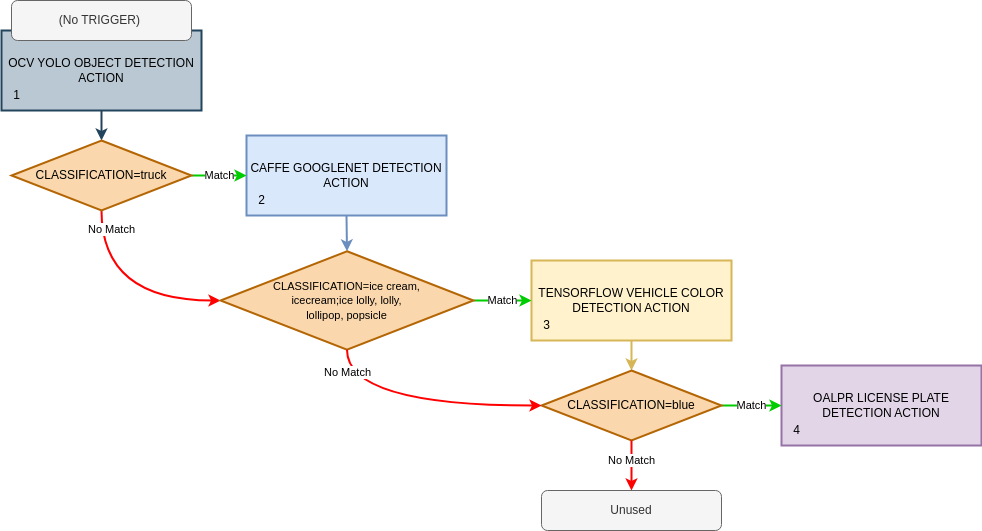

**NOTICE:** This software (or technical data) was produced for the U.S. Government under contract,
and is subject to the Rights in Data-General Clause 52.227-14, Alt. IV (DEC 2007). Copyright 2023
The MITRE Corporation. All Rights Reserved.


# Trigger Overview

The `TRIGGER` property enables pipelines that use [feed forward](Feed-Forward-Guide) to have
pipeline stages that only process certain tracks based on their track properties. It can be used
to select the best algorithm when there are multiple similar algorithms that each perform better
under certain circumstances. It can also be used to iteratively filter down tracks at each stage of
a pipeline.


# Syntax

The syntax for the `TRIGGER` property is: `<prop_name>=<prop_value1>[;<prop_value2>...]`.
The left hand side of the equals sign is the name of track property that will be used to determine
if a track matches the trigger. The right hand side specifies the required value for the specified
track property. More than one value can be specified by separating them with a semicolon. When
multiple properties are specified the track property must match any one of the specified values.
If the value should match a track property that contains a semicolon or backslash,
they must be escaped with a leading backslash. For example, `CLASSIFICATION=dog;cat` will match
"dog" or "cat". `CLASSIFICATION=dog\;cat` will match "dog;cat". `CLASSIFICATION=dog\\cat` will
match "dog\cat". When specifying a trigger in JSON it will need to [doubly escaped](#json-escaping).


# Algorithm Selection Using Triggers

The example pipeline below will be used to describe the way that the Workflow Manager uses the
`TRIGGER` property. Each task in the pipeline is composed of one action, so only the actions are
shown. Note that this is a hypothetical pipeline and not intended for use in a real deployment.

1. WHISPER SPEECH LANGUAGE DETECTION ACTION
    - (No TRIGGER)
2. SPHINX SPEECH DETECTION ACTION
    - TRIGGER: `ISO_LANGUAGE=eng`
    - FEED_FORWARD_TYPE: `REGION`
3. WHISPER SPEECH DETECTION ACTION
    - TRIGGER: `ISO_LANGUAGE=spa`
    - FEED_FORWARD_TYPE: `REGION`
4. ARGOS TRANSLATION ACTION
    - TRIGGER: `ISO_LANGUAGE=spa`
    - FEED_FORWARD_TYPE: `REGION`
5. KEYWORD TAGGING ACTION
    - (No TRIGGER)
    - FEED_FORWARD_TYPE: `REGION`

The pipeline can be represented as a flow chart:


The goal of this pipeline is to determine if someone in an audio file, or the audio of a video file,
says a keyword that the user is interested in. The complication is that the input file could either
be in English, Spanish, or another language the user is not interested in. Spanish audio must be
translated to English before looking for keywords.

We are going to pretend that Whisper language detection can return multiple tracks, one per language
detected in the audio, although in reality it is limited to detecting one language for the entire
piece of media. Also, the user wants to use Sphinx for transcribing English audio, because we are
pretending that Sphinx performs better than Whisper on English audio, and the user wants to use
Whisper for transcribing Spanish audio.

The first stage should not have a trigger condition. If one is set, it will be ignored. The
Workflow Manager will take all of the tracks generated by stage 1 and determine if the trigger
condition for stage 2 is met. This trigger condition is shown by the topmost orange diamond. In this
case, if stage 1 detected the language as English and set `ISO_LANGUAGE` to `eng`, then those
tracks are fed into the second stage. This is shown by the green arrow pointing to the stage 2 box.

If any of the Whisper tracks do not meet the condition for the stage 2, they are later considered
as possible inputs to stage 3. This is shown by the red arrow coming out of the stage 2 trigger
diamond pointing down to the stage 3 trigger diamond.

The Workflow Manager will take all of the tracks generated by stage 2, the
`SPHINX SPEECH DETECTION ACTION`, as well as the tracks that didn't satisfy the stage 2 trigger, and
determine if the trigger condition for stage 3 is met.

Note that the Sphinx component does not generate tracks with the `ISO_LANGUAGE` property, so
it's not possible for tracks coming out of stage 2 to satisfy the stage 3 trigger. They will later
flow down to the stage 4 trigger, and because it has the same condition as the stage 3 trigger, the
Sphinx tracks cannot satisfy that trigger either.

Even if the Sphinx component did generate tracks with the `ISO_LANGUAGE` property, it would be set
to `eng` and would not satisfy the `spa` condition (they are mutually exclusive). Either way,
eventually the tracks from stage 2 will flow into stage 5.

The Workflow Manager will take all of the tracks generated by stage 3, the
`WHISPER SPEECH DETECTION ACTION`, as well as the tracks that did not satisfy the stage 2 and 3
triggers, and determine if the trigger condition for stage 4 is met. All of the tracks produced by
stage 3 will have the `ISO_LANGUAGE` property set to `spa`, because the stage 3 trigger only
matched Spanish tracks and when Whisper performs transcription, it sets the `ISO_LANGUAGE` property.
Since the stage 4 trigger, like the stage 3 trigger, is `ISO_LANGUAGE=spa`, all of the tracks
produced by stage 3 will be fed in to stage 4.

The Workflow Manager will take all of the tracks generated by stage 4, the
`ARGOS TRANSLATION (WITH FF REGION) ACTION`, as well as the tracks that did not satisfy the stage 2,
3, or 4 triggers, and determine if the trigger condition for stage 5 is met. Stage 5 has no trigger
condition, so all of those tracks flow into stage 5 by default.

The above diagram can be simplified as follows:


In this diagram the trigger diamonds have been replaced with the orange boxes at the top of each
stage. Also, all of the arrows for flows that are not logically possible have been removed,
leaving only arrows that flow from one stage to another.

What remains shows that this pipeline has three main flows of execution:

1. English audio is transcribed by the Sphinx component and then processed by keyword tagging.
2. Spanish audio is transcribed by the Whisper component, translated by the Argos component, and
   then processed by keyword tagging.
3. All other languages are not transcribed and those tracks pass directly to keyword tagging. Since
   there is no transcript to look at, keyword tagging essentially ignores them.


## Further Understanding

In general, triggers work as a mechanism to decide which tracks are passed forward to later stages
of a pipeline. It is important to note that not only are the tracks from the previous stage
considered, but also tracks from stages that were not fed into any previous stage.

For example, if only the Sphinx tracks from stage 2 were passed to Whisper stage 3, then stage 3
would never be triggered. This is because Sphinx tracks don't have an `ISO_LANGUAGE` property. Even
if they did have that property, it would be set to `eng`, not `spa`, which would not satisfy the
stage 3 trigger. This is mutual exclusion is by design. Both stages perform speech-to-text. Tracks
from stage 1 should only be processed by one speech-to-text algorithm (i.e. one `SPEECH DETECTION`
stage). Both algorithms should be considered, but only one should be selected based on the language.
To accomplish this, tracks from stage 1 that don't trigger stage 2 are considered as possible inputs
to stage 3.

Additionally, it's important to note that when a stage is triggered, the tracks passed into that
stage are no longer considered for later stages. Instead, the tracks generated by that stage can be
passed to later stages.

For example, the Argos algorithm in stage 4 should only accept tracks with Spanish transcripts. If
all of the tracks generated in prior stages could be passed to stage 4, then the `spa` tracks
generated in stage 1 would trigger stage 4. Since those have not passed through the Whisper
speech-to-text stage 3 they would not have a transcript to translate.


# Filtering Using Triggers

The pipeline in the previous section shows an example of how triggers can be used to conditionally
execute or skip stages in a pipeline. Triggers can also be useful when all stages get triggered. In
cases like that, the individual triggers are logically `AND`ed together. This allows you to produce
pipelines that search for very specific things.

Consider the example pipeline defined below. Again, each task in the pipeline is composed of one
action, so only the actions are shown. Also, note that this is a hypothetical pipeline and not
intended for use in a real real deployment:

1. OCV YOLO OBJECT DETECTION ACTION
    - (No TRIGGER)
2. CAFFE GOOGLENET DETECTION ACTION
    - TRIGGER: `CLASSIFICATION=truck`
    - FEED_FORWARD_TYPE: `REGION`
3. TENSORFLOW VEHICLE COLOR DETECTION ACTION
    - TRIGGER: `CLASSIFICATION=ice cream, icecream;ice lolly, lolly, lollipop, popsicle`
    - FEED_FORWARD_TYPE: `REGION`
4. OALPR LICENSE PLATE TEXT DETECTION ACTION
    - TRIGGER: `CLASSIFICATION=blue`
    - FEED_FORWARD_TYPE: `REGION`

The pipeline can be represented as a flow chart:



The goal of this pipeline is to extract the license plate numbers for all blue trucks that have
photos of ice cream or popsicles on their exterior.

Stage 2 and 3 do not generate new detection regions. Instead, they generate tracks using the same
detection regions in the feed-forward tracks. Specifically, if YOLO generates `truck` tracks in
stage 1, then those tracks will be fed into stage 2. In that stage, GoogLeNet will process the
truck region to determine the ImageNet class with the highest confidence. If that class corresponds
to ice cream or popsicle, those tracks will be fed into stage 3, which will operate on the same
truck region to determine the vehicle color. Tracks corresponding to `blue` trucks will be fed
into stage 4, which will try to detect the license plate region and text. OALPR will operate on
the same truck region passed forward all of the way from YOLO in stage 1.

Tracks generated by any stage in the pipeline that don't meet the three trigger criteria do not
flow into the final license plate detection stage, and are therefore unused.

It's important to note that the possible `CLASSIFICATION` values generated by stages 1, 2, and 3 are
mutually exclusive. This means, for example, that YOLO will not generate a `blue` track in stage 1
that will later satisfy the trigger for stage 4.

Also, note that stages 1, 2, and 3 can all accept an optional `WHITELIST_FILE` property that can be
used to discard tracks with a `CLASSIFICATION` not listed in that file. It is possible to recreate
the behavior of the above pipeline without using triggers and instead only using whitelist files to
ensure each of those stages can only generate the track types the user is interested in. The
disadvantage of the whitelist approach is that the final JSON output object will not contain all of
the YOLO tracks, only `truck` tracks. Using triggers is better when a user wants to know about those
other track types. Using triggers also enables a user to create a version of this pipeline where
`person` tracks from YOLO are fed into OpenCV face. `person` is just an example of one other type of
YOLO track a user might be interested in.


The above diagram can be simplified as follows:


Removing all of the flows that aren't logically possible, or result in unused tracks, only
leaves one flow that passes through all of the stages. Again, this flow essentially `AND`s the
trigger conditions together.


# JSON escaping

Many times job properties are defined using JSON and track properties appear in the JSON output
object. JSON also uses backslash as its escape character. Since the `TRIGGER` property and JSON both
use backslash as the escape character, when specifying the `TRIGGER` property in JSON, the string
must be doubly escaped.

If the job request contains this JSON fragment:
```json
{ "algorithmProperties": { "DNNCV": {"TRIGGER": "CLASS=dog;cat"} } }
```
it will match either "dog" or "cat", but not "dog;cat".


This JSON fragment:
```json
{ "algorithmProperties": { "DNNCV": {"TRIGGER": "CLASS=dog\\;cat"} } }
```
would only match "dog;cat".

This JSON fragment:
```json
{ "algorithmProperties": { "DNNCV": {"TRIGGER": "CLASS=dog\\\\cat"} } }
```
would only match "dog\cat". The track property in the JSON output object would appear as:
```json
{ "trackProperties": { "CLASSIFICATION": "dog\\cat" } }
```
