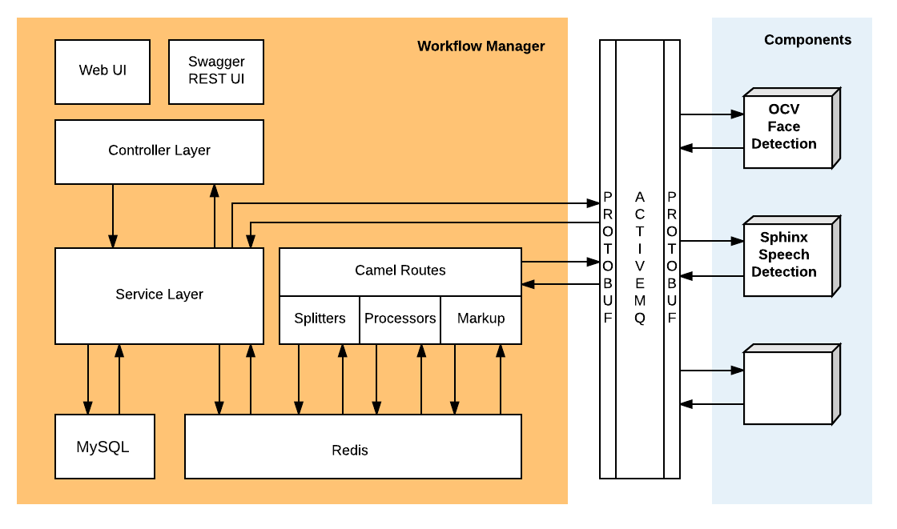

> **NOTICE:** This software (or technical data) was produced for the U.S. Government under contract, and is subject to the Rights in Data-General Clause 52.227-14, Alt. IV (DEC 2007). Copyright 2018 The MITRE Corporation. All Rights Reserved.

> **IMPORTANT:** This document describes the Workflow Manager architecture for batch processing. There is a separate architecture for stream processing that uses many of the same elements and concepts.

# Workflow Manager Overview

The OpenMPF consists of three major pieces:

1. A collection of **Components** which process media
2. A **Node Manager**, which launches and monitors running components in the system
3. The **Workflow Manager** (WFM), which allows for the creation of jobs and manages the flow through active components

These pieces are supported by a number of modules which provide shared functionality, as shown in the dependency diagram below:

There are three general functional areas in the WFM:

1. The **Controllers** are the primary entry point, accepting REST requests which trigger actions by the WFM
2. The **WFM Services**, which handle administrative tasks such as pipeline creation, node management, and log retrieval
3. **Job Management**, which uses Camel routes to pass a job through the levels of processing

There are two different databases used by the WFM:

1. A **MySQL database** stores persistent data about jobs. This data includes:
    * The job ID
    * The start and stop time of the job
    * The exit status of the job
    * Job priority
    * Job input/outputs
2. A **Redis database** for storing transient data that is only necessary while the job is being run. Some of this data is used to generate the output which will later be persisted in long-term storage, and some is a temporary duplication of previously persisted data in active memory to avoid race conditions. This data includes:
    * Job and media properties
    * Detections
    * Tracks
    * Pipeline/Track/Action/Algorithm data duplicated from the system at job start time
    * REST Callback information

The diagram below shows the functional areas of the WFM, the databases used by the WFM, and communication with components:

# Controllers / Services

The controllers are all located  [here](https://github.com/openmpf/openmpf/tree/master/trunk/workflow-manager/src/main/java/org/mitre/mpf/mvc/controller ).

Every controller provides a collection of REST endpoints which allow access either to a WFM service or to the job management flow. Only the JobController enters the job management flow.

## Basic Controllers

The table below lists the basic controllers:

| Controller Class | Description  |
|---|---|
| AdminLogsController | Accesses the log content via REST |
| AdminErrorsController | Gets admin errors |
| AdminPropertySettingsController | Allows access and modification of system properties |
| AdminStatisticsController | Generates job statistics |
| AtmosphereController | Uses Atmosphere to manage server-side push |
| BootoutController | Handles bootouts when a second session is opened by the same user |
| HomeController | Manages index page and version information |
| LoginController | Manages login/logout and authentication |
| ServerMediaController | Enables selection and deselection of files at a directory level |
| SystemMessageController | Manages system level messages, such as notifying users that a server restart is needed |
| TimeoutController | Manages session timeouts |

The following sections list the rest of the constrollers in more detail.

## AdminComponentRegistrationController

Components in the OpenMPF are uploaded as tar.gz packages containing all necessary component data. For more information on components, read [OpenMPF Component API Overview](Component-API-Overview/index.html).

The **AdminComponentRegistrationController** provides endpoints which allow:

1. Access to current component information
2. Upload of new components
3. Registration and unregistration of components (note that components must be registered to be included in pipelines)
4. Deletion of components

## JobController

A job is a specific pipeline's tasks and actions applied to a set of media. The **JobController** allows:

1. Access to information about jobs in the system
2. Creation of new jobs
3. Cancellation of existing jobs
4. Download of job output data
5. Resubmission of jobs (regardless of initial job status)

## MarkupController

Markup files are copies of the initial media input to a job with detections visually highlighted in the image or video frames. The **MarkupController** can provide lists of available Markup files, or it can download a specific file.

## MediaController

The **MediaController** enables upload and organization of media files within the WFM. It provides endpoints for media upload, and also for creation of folders to organize media files in the system. At this time, there are no endpoints which allow for deletion or reorganization of media files, since all media is shared by all users.

## NodeController

The OpenMPF uses multiple hosts to enable scalability and parallel processing. The **NodeController** provides access to host information and allows components to be deployed on nodes. One or more components can be installed on a node. The same component can be installed on multiple nodes. Each node can manage one or more services for each component.

The **NodeController** provides host information and component service deployment status. It also provides an endpoint to deploy a service on a node and an endpoint to stop a service.

For more information on nodes, please read the [Node Configuration and Status](Admin-Guide/index.html#node-configuration-and-status) section in the Admin Guide.

## PipelineController

The **Pipeline Controller** allows for the creation, retrieval, and deletion of pipelines or any of their constituent parts. While actions, tasks, and pipelines may not be directly modified, they may be deleted and recreated.

For more information on pipelines, please read the [Create Custom Pipelines](User-Guide/index.html#create-custom-pipelines) section in the User Guide.

# Job Management

The request to create a job begins at the [`JobController`](#jobcontroller). From there, it is transformed and passed through multiple flows on its way to the component services. These services process the job then return information to the WFM for JSON output generation.

The diagram below shows the sequence of WFM operations. It does not show the ActiveMQ messages that are sent to and from the component services.

After the job request is validated and saved to the MySQL database, it passes through multiple Apache Camel routes, each of which checks that the job is still valid (with no fatal errors or cancellations), and then invokes a series of transformations and processors specific to the route.

[Apache Camel](http://camel.apache.org/) is an open-source framework that allows developers to build rule-based routing engines. Within the OpenMPF, we use a [Java DSL](http://camel.apache.org/dsl.html) to define the routes. Every route functions independently, and communication between the routes is URI-based. The OpenMPF uses ActiveMQ to handle its message traffic.

## Job Creator Route

The **Job Creator Route** sets up the job in memory. By the time this route is invoked, the job has been persisted in the permanent MySQL database. The Job Creator Route sets up the transient objects in Redis that will be used for aggregating job data across pipeline stages. By the time this route exits, the particulars of the pipeline and job request will be stored in Redis.

## Media Retriever Route

The **Media Retriever Route** ensures that the media for the job can all be found and accessed. It stores the media information on the server to ensure continued access.

## Media Inspection Route

The **Media Inspection Route** splits a single job with multiple media inputs into separate messages, one for each piece of media. For each piece of media, it collects metadata about the media, including MIME type, duration, frame rate, and orientation data.

## Job Router Route

The **Job Router Route** uses the pipeline's flow to create the messages that are sent to the components. For large media files, it splits the job into smaller sub-jobs by logically breaking the media up into segments. Each segment has a start point and an end point (specified as a frame or time offset).

This route compiles properties for the job, media, and algorithm, and determines the next component that needs to be invoked. It then marshals the job into a serialized protobuf format and sends the message off to the component for processing.

Unlike Job Creation, Media Retriever, and Media Inspection, this route may be invoked multiple times as future routes redirect back to the Job Router so that the job can be processed by the next component in the pipeline.

## Detection Response Route

The **Detection Response Route** is the re-entry point to the WFM. It unmarshals the protobuf responses, converts them into the Track and Detection objects used within the WFM, and stores them in the Redis database. Over multiple calls to the DetectionResponseProcessor, all data is eventually added into the transient Job object.

## Stage Response Aggregation Route

The **Stage Response Aggregation Route** is the exit point for the response processors. It waits until all the sub-job responses have been retrieved for the current stage of the pipeline, then it invokes the Job Router Route to see if any additional processing needs to be done.

## Markup Response Route

Markup files are copies of the initial media input to a job with any detections visually highlighted in the image. The **Markup Response Route** persists the locations of these markup files in the MySQL database.

## Job Completed Route

Once the Job is completed, the **Job Completed Route** converts the aggregated transient data structure into a JSON output format. It then clears out any lingering transient objects, updates the final job status, and sends the output object to anything that needs to access it.
